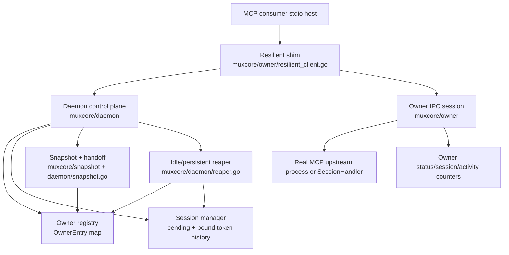

# ADR 011 -- Proofing to Muxcore Production Port

Status: Proposed

Date: 2026-05-19

## Context

Project type: Go CLI plus Go library for MCP stdio multiplexing. This is
VERIFIED by `go.mod:1`, `AGENTS.md:1`, `AGENTS.md:3-6`, and the existing
`cmd/mcp-mux` + `muxcore` layout.

The `current-topology-poc` proofing ladder reached
`STOP_PRODUCTION_PORT`. Phases 6-9 passed in the standalone substrate:

- Phase 6: true concurrent dispatch and out-of-order response demux by JSON-RPC
  ID across daemon restart.
- Phase 7: refresh-token reconnect avoids fallback spawn when the restored
  owner is alive.
- Phase 8: generation-aware handoff evidence distinguishes predecessor,
  successor, restored owners, and retired old owner sockets.
- Phase 9: persistent/idle lifecycle classification reaps non-persistent idle
  owners, preserves active sessions, removes stale tickets for reaped owners,
  and restores persistent owners through restart.

ADR 010 decided the resilient shim reconnect contract. This ADR decides the
production port boundary: how to turn standalone proof evidence into real
`muxcore` tests and refactors without treating the PoC as production proof.

## Decision

We will port Phase 6-9 as production parity slices in `muxcore`, not as another
standalone PoC phase and not as a broad rewrite.

The production port must follow this order:

1. **Observability parity first**: expose or assert the minimum evidence needed
   to prove daemon generation/owner generation, handoff path, reconnect path,
   active sessions, reaped owners, and stale ticket cleanup.
2. **Contract tests before behavior changes**: for each phase, write a
   production test that fails for the specific missing invariant or records that
   production already satisfies it.
3. **Small production refactors only where tests fail**: keep changes in the
   owning layer; do not move lifecycle authority into the CLI or into the PoC.
4. **Runtime smoke after tests**: once production parity tests pass, run a real
   `mcp-mux` binary smoke against fresh-session attach and restart behavior.

The port target is `muxcore`, with `cmd/mcp-mux` used only for operator/runtime
smoke. The PoC remains a regression oracle and design artifact, not a dependency
or implementation source.

Reversibility: PARTIALLY REVERSIBLE. Tests and additive status fields are
reversible. Internal lifecycle refactors are reversible behind existing public
contracts. Public API/status fields that downstream operators begin to rely on
become Hyrum-sensitive and must be removed only through release notes and a
compatibility window.

## Architecture



## Component Map

| Component | Responsibility | Production owner | Port obligation |
| --- | --- | --- | --- |
| Resilient shim | Keep one stdio process alive; buffer stdin; replay initialize; refresh token; drain already-sent in-flight requests by ID | `muxcore/owner/resilient_client.go` | Phase 6/7 parity tests for out-of-order demux, refresh-before-fallback, and error-by-ID behavior |
| Owner runtime | Accept sessions; route downstream requests; track active sessions, pending requests, progress/busy work, activity, snapshots | `muxcore/owner/owner.go` | Phase 6/9 parity tests for multiple outstanding requests and active-session protection |
| Session manager | Own pending spawn tokens, bound reconnect history, inflight request ownership | `muxcore/session/session_manager.go` | Phase 7/9 parity tests for token refresh and stale token/ticket cleanup |
| Daemon control plane | Spawn/reuse owners; refresh tokens; expose status; coordinate graceful restart | `muxcore/daemon/daemon.go` | Phase 7/8 parity tests for fallback counters, handoff evidence, and status shape |
| Snapshot/handoff | Serialize/restore owner metadata and transfer live upstreams where possible | `muxcore/snapshot`, `muxcore/daemon/snapshot.go`, `muxcore/daemon/handoff*.go` | Phase 8/9 parity tests for restored owner identity and persistent classification |
| Reaper | Remove idle non-persistent owners while preserving active/persistent owners | `muxcore/daemon/reaper.go` | Phase 9 parity tests for TTL, active-session guard, stale ticket cleanup, and persistent restore |
| Runtime smoke | Prove the binary works with real MCP host behavior after library tests pass | `cmd/mcp-mux`, `scripts`, local MCP config | Fresh-session attach + restart smoke against real MCP upstreams |

## Legacy Seam Map

This is a replacement/coexistence change against a running system, so the seam
is production `muxcore`, not the PoC.

| Field | Seam decision |
| --- | --- |
| Legacy public surface | `mcp-mux` command wrapper, `mcp-mux serve`, control RPCs (`status`, `spawn`, `refresh-token`, `graceful-restart`, `list_owners`), `muxcore/engine` public API, and `muxcore` Go package contracts |
| Consumers | Claude Code/Codex MCP hosts through stdio shims; local operator tools (`mux_list`, `mux_restart`, `upgrade --restart`); library consumers such as `engram` and `aimux` using `muxcore` |
| Facade insertion point | Production parity tests wrap existing public/internal package seams. No new facade is inserted in front of the CLI. Runtime behavior remains `consumer -> shim -> daemon -> owner -> upstream` |
| Data/state stores | In-memory owner registry; per-owner session managers; reconnect token history; snapshot file; handoff token/socket; OS IPC paths and upstream process state |
| At-risk Hyrum behaviors | Exact JSON-RPC error by ID for orphaned in-flight requests; status field names/types; fallback counter semantics; timing of idle reaper; owner socket path retirement; refresh-token failure reasons; log markers |

## Port Sequence

| Slice | Production test first | Allowed refactor | Stop condition |
| --- | --- | --- | --- |
| P6 concurrent demux | One shim/owner path handles two outstanding request IDs, out-of-order responses, and a restart boundary without duplicate or wrong-ID response | Share response demux helpers or strengthen owner/resilient-client tracking only if test fails | Test proves request IDs, response order, and successor/restored owner evidence |
| P7 refresh reconnect | Reconnect uses `HandleRefreshSessionToken`/`RegisterReconnect` with a different token and no fallback spawn when owner is alive | Adjust token history restore, refresh callback wiring, or fallback accounting only if test fails | Test proves `refresh_successes` increments and `shim_reconnect_fallback_spawned` does not |
| P8 generation handoff | Graceful restart evidence distinguishes predecessor daemon, successor daemon, restored owner count, and old owner socket retirement | Add additive status/debug fields or harness assertions; avoid public API churn unless necessary | Test can fail if handoff evidence is missing even when traffic succeeds |
| P9 persistent idle lifecycle | Short TTL test proves non-persistent idle reaps, active session blocks reaping, stale tickets for reaped owner are removed, persistent owner survives idle/restart, respawn gets new generation | Adjust `OwnerEntry`, reaper cleanup, session manager cleanup, snapshot restore, or status only where test fails | Test proves lifecycle state with counters/fields, not sleeps alone |
| Runtime smoke | Fresh `mcp-mux` binary handles fresh-session attach and restart against real MCP upstream | CLI/deploy script changes only after library parity passes | Real MCP host path starts without `initialize response` closure or listener/token race |

## Implementation Contract

The production port is complete only when the implementation advances through
bounded parity slices, not when a broad runtime smoke happens to pass once.

1. Start each slice with a failing production parity test, or document that an
   existing production test already proves the exact invariant.
2. Keep slice ownership local:
   - P6 lives in owner dispatch and resilient-client response/request tracking.
   - P7 lives in session token history, control refresh, and reconnect policy.
   - P8 lives in daemon snapshot/handoff/status evidence.
   - P9 lives in owner registry lifecycle, reaper cleanup, session-manager
     cleanup, and snapshot persistence.
3. Commit after each green slice when tests pass. Do not batch all P6-P9 changes
   into one opaque reliability commit.
4. Do not declare the workstation reliability bug fixed until production parity
   tests pass and a fresh binary smoke proves new-session attach plus restart
   with at least one real MCP upstream.

## Data and State Ownership

| State | Owner | Invariant |
| --- | --- | --- |
| Pending spawn tokens | `session.Manager` per owner | Token is one-shot; reaped owners must not leave usable pending tokens |
| Bound reconnect history | `session.Manager` per owner | Consumed tokens can mint a fresh token only while the owner is alive/accepting |
| Owner registry | `daemon.Daemon` | Registry entry must match a reachable/current owner or be replaced with a new generation |
| Persistent classification | `daemon.OwnerEntry` plus snapshot | Persistent owners skip idle eviction and preserve classification through restart |
| Active sessions/activity | `owner.Owner` plus `SessionCount`/`LastActivity` | Reaper must not close active sessions or owners with pending/progress/busy work |
| Handoff evidence | daemon snapshot/handoff/status | Tests must prove restored ownership without relying only on successful traffic |

## Non-Goals

- Do not import PoC code into `muxcore`.
- Do not change already-sent in-flight default retry semantics. ADR 010 keeps
  JSON-RPC error-by-ID as the safe default.
- Do not introduce a new launcher architecture in this porting ADR.
- Do not use real Claude/Codex sessions as the first proof layer. They are
  final smoke, not the unit of design.

## Reusability Awareness

No new reusable library extraction is authorized by this ADR. The reusable unit
already is `muxcore`; the port should improve its internal lifecycle contract
and tests rather than create another shared package.

## Domain Modeling

DDD evaluated -- not needed. The relevant domain is protocol/lifecycle
infrastructure with entities such as Owner, Session, Token, Snapshot, and
Handoff. These are already `muxcore` runtime concepts, not business aggregates
requiring a new bounded-context model.

## Verification Plan

Architecture/document checks:

```powershell
git diff --check
```

Production parity checks after implementation:

```powershell
Push-Location muxcore
go test ./owner -run "ResilientClient|Reconnect" -count=1
go test ./session -run "RegisterReconnect|DrainInflight|Sweep" -count=1
go test ./daemon -run "Handoff|Reaper|Persistent|Refresh|Status|Snapshot" -count=1
go test ./... -count=1
Pop-Location
go test ./... -count=1
.\scripts\run-current-topology-poc.ps1 -WatchSeconds 1
```

Runtime smoke after production parity:

- build a fresh `mcp-mux.exe`;
- run a controlled restart/attach smoke with at least one real MCP upstream;
- verify no fresh-session startup failure of the form
  `connection closed: initialize response`;
- verify status shows expected reconnect/handoff/lifecycle counters.

## Evidence Status

| Claim | Status | Evidence |
| --- | --- | --- |
| Project is Go CLI/library MCP infrastructure | VERIFIED | `go.mod:1`; `AGENTS.md:1`; `AGENTS.md:3-6`; `go.mod:14` local `muxcore` replace |
| Proofing reached production-port boundary | VERIFIED | `.agent/proofing/current-topology-poc/proofing.md:113`; `.agent/proofing/current-topology-poc/proofing.md:156-160`; `.agent/proofing/current-topology-poc/proofing.md:176` |
| ADR 010 keeps already-sent in-flight retry out of default behavior | VERIFIED | `.agent/arch/decisions/010-resilient-shim-reconnect-contract.md:39-42`; `.agent/arch/decisions/010-resilient-shim-reconnect-contract.md:80` |
| Resilient shim owns reconnect/buffer/inflight behavior | VERIFIED | `muxcore/owner/resilient_client.go:366`; `muxcore/owner/resilient_client.go:404`; `muxcore/owner/resilient_client.go:419`; `muxcore/owner/resilient_client.go:457`; `muxcore/owner/resilient_client.go:728`; `muxcore/owner/resilient_client.go:758` |
| Session manager owns token refresh history | VERIFIED | `muxcore/session/session_manager.go:130`; `muxcore/session/session_manager.go:147`; `muxcore/session/session_manager.go:172`; `muxcore/session/session_manager.go:221` |
| Daemon owns owner registry, status, refresh-token, and reaper | VERIFIED | `muxcore/daemon/daemon.go:55`; `muxcore/daemon/daemon.go:624`; `muxcore/daemon/daemon.go:1303`; `muxcore/daemon/daemon.go:1336`; `muxcore/daemon/reaper.go:141`; `muxcore/daemon/reaper.go:190`; `muxcore/daemon/reaper.go:232` |
| Snapshot carries persistent owner classification | VERIFIED | `muxcore/snapshot/snapshot.go:24`; `muxcore/snapshot/snapshot.go:35`; `muxcore/snapshot/snapshot.go:57` |
| Production Phase 6-9 parity is complete | BLOCKED | This ADR authorizes that implementation; only standalone proof and partial existing tests are present now |

## Consequences

Positive:

- The next implementation has a narrow porting contract instead of a vague
  "make muxcore reliable" mandate.
- Tests can distinguish traffic success from wrong-path recovery, especially
  fallback spawn masquerading as reconnect.
- Lifecycle cleanup gains explicit ownership: reaper removes idle owners, not
  active sessions or persistent owners.

Negative:

- Additive status/debug evidence may become operator-observable API surface.
- Some tests will need controlled timing and short TTLs; they must avoid flaky
  sleep-only assertions by checking counters and generations.

Neutral:

- The one-binary launcher redesign remains outside this ADR. It can be
  reconsidered only if production parity falsifies the current topology.

## Open Questions

1. Should generation/handoff evidence be exposed as stable status fields, or
   should tests assert it through package-private hooks only?
2. Should stale pending-token cleanup on owner reaping live in `Daemon.Remove` /
   `SoftRemove`, in `Reaper.sweep`, or in a shared owner-removal helper?
3. Does production need a first-class owner generation field, or can existing
   server ID + IPC path + snapshot/handoff counters satisfy the false-positive
   guards?
