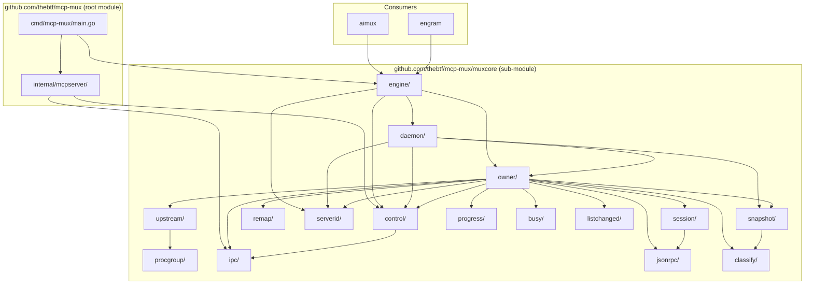

# Architecture: muxcore as Reusable Library (Monorepo)

**Created:** 2026-04-14
**Status:** Proposal

## Problem

`internal/muxcore/` contains a self-contained multiplexer engine with 16 packages
and zero dependencies on non-muxcore internals. But Go's `internal/` convention
makes it impossible for external modules to import. aimux and engram cannot use it.

## Approach: Go Sub-Module in Same Repo

Go supports multiple modules in one repository. Create a **sub-module** at
`muxcore/` (repo root level) alongside the existing root module.

```
github.com/thebtf/mcp-mux/           ← root module (binary)
github.com/thebtf/mcp-mux/muxcore    ← sub-module (library)
```

Consumers import:
```go
import "github.com/thebtf/mcp-mux/muxcore/engine"
```

This is idiomatic Go monorepo. stdlib does it (`golang.org/x/tools` has sub-modules).
No separate repo needed.

## Architecture Diagram



## File Structure (After)

```
mcp-mux/
├── go.mod                          # module github.com/thebtf/mcp-mux
├── go.sum
├── cmd/mcp-mux/                    # binary entry point
│   ├── main.go                     # imports muxcore/engine
│   └── daemon.go
├── internal/
│   └── mcpserver/                  # mcp-mux-specific MCP tools (stays internal)
├── muxcore/                        # NEW: sub-module root
│   ├── go.mod                      # module github.com/thebtf/mcp-mux/muxcore
│   ├── go.sum
│   ├── engine/engine.go            # public entry point
│   ├── owner/owner.go
│   ├── daemon/daemon.go
│   ├── session/session.go
│   ├── upstream/process.go
│   ├── procgroup/process.go
│   ├── control/...
│   ├── ipc/...
│   ├── jsonrpc/...
│   ├── classify/...
│   ├── remap/...
│   ├── serverid/...
│   ├── snapshot/...
│   ├── progress/...
│   ├── busy/...
│   └── listchanged/...
└── testdata/                       # shared test fixtures
```

## Migration Steps

1. `mkdir muxcore/` at repo root
2. `git mv internal/muxcore/* muxcore/` — move all 16 packages
3. Create `muxcore/go.mod`:
   ```
   module github.com/thebtf/mcp-mux/muxcore

   go 1.25.4

   require (
       github.com/thejerf/suture/v4 v4.0.6
       golang.org/x/sys v0.43.0
       github.com/google/uuid v1.6.0
   )
   ```
4. Update ALL import paths: `internal/muxcore/X` → `muxcore/X` (within muxcore)
5. Root module `go.mod` adds:
   ```
   require github.com/thebtf/mcp-mux/muxcore v0.0.0
   replace github.com/thebtf/mcp-mux/muxcore => ./muxcore
   ```
6. `cmd/mcp-mux/` and `internal/mcpserver/` imports: `internal/muxcore/X` → `github.com/thebtf/mcp-mux/muxcore/X`
7. `rmdir internal/muxcore/` (now empty)
8. `go build ./...` + `go test ./...`

## Consumer Usage

```go
// go.mod
require github.com/thebtf/mcp-mux/muxcore v0.15.0

// main.go
import "github.com/thebtf/mcp-mux/muxcore/engine"

func main() {
    e, _ := engine.New(engine.Config{
        Name:    "aimux",
        Handler: myMCPHandler,
    })
    e.Run(context.Background())
}
```

## Public API Surface

Only `engine` package is the intended consumer entry point.
Other packages are technically importable but should be considered internal.

| Package | Stability | Consumer-facing |
|---------|-----------|-----------------|
| engine | Stable | YES — primary API |
| procgroup | Stable | Maybe — standalone tree-kill utility |
| serverid | Stable | Maybe — server ID computation |
| All others | Internal | No — implementation detail |

To enforce: add `doc.go` with `// Package X is an internal implementation detail` warnings.
True enforcement requires a separate repo (Go has no `internal/` equivalent for sub-modules).

## Component Map

| Component | Responsibility | Layer |
|-----------|---------------|-------|
| engine | Mode detection, daemon lifecycle, client bridging | Entry |
| daemon | Multi-owner management, reaper, supervisor | Orchestration |
| owner | MCP request routing, progress, dedup, caching | Core |
| session | Per-CC-session state, notification queue | Core |
| upstream | Process stdio management (wraps procgroup) | Infrastructure |
| procgroup | OS-level process group + tree kill | Infrastructure |
| control | IPC control protocol (spawn, status, stop) | Protocol |
| ipc | Unix domain socket transport | Transport |
| jsonrpc | JSON-RPC 2.0 parse/serialize | Protocol |
| remap | Request ID remapping for multi-session | Protocol |
| serverid | Deterministic server identity hashing | Utility |
| classify | Server sharing mode auto-detection | Utility |
| snapshot | Owner state serialize/deserialize | Persistence |
| progress | Synthetic progress notification builder + dedup tracker | Feature |
| busy | Busy/idle protocol parsing | Feature |
| listchanged | Capability injection for list_changed | Feature |

## ADRs

### ADR-001: Sub-Module vs Separate Repo
**Status:** Accepted
**Context:** muxcore needs to be importable by aimux/engram. Two options: (a) separate repo `github.com/thebtf/muxcore`, (b) sub-module `github.com/thebtf/mcp-mux/muxcore`.
**Decision:** Sub-module. Same repo = atomic commits, shared testdata, no version sync headaches.
**Consequences:** Consumers depend on mcp-mux repo (but only pull muxcore sub-module). Version tags need `muxcore/v0.X.Y` prefix per Go convention.
**Reversibility:** REVERSIBLE — can split into separate repo later with `go-import` redirect.

### ADR-002: No internal/ Within Sub-Module
**Status:** Accepted
**Context:** Sub-modules don't support `internal/` for cross-module visibility control.
**Decision:** All packages public. Document intended API surface (engine only). Other packages are technically importable but marked as implementation detail.
**Consequences:** Consumers CAN import `muxcore/owner` directly. This is acceptable — if they break on API changes, that's their choice.
**Reversibility:** REVERSIBLE — can add wrapper packages or reorganize later.

### ADR-003: replace Directive for Local Development
**Status:** Accepted
**Context:** Root module imports sub-module. During development, sub-module changes must be visible immediately without publishing.
**Decision:** `replace github.com/thebtf/mcp-mux/muxcore => ./muxcore` in root go.mod.
**Consequences:** `go build` always uses local source. CI and consumers use published version.
**Reversibility:** REVERSIBLE — standard Go pattern.

### ADR-004: Version Tagging Convention
**Status:** Accepted
**Context:** Go sub-modules require prefixed tags: `muxcore/v0.15.0` not `v0.15.0`.
**Decision:** Root module keeps `v0.X.Y` tags. Sub-module gets `muxcore/v0.X.Y` tags. Both can be tagged from same commit.
**Consequences:** Two tag series to maintain. `go get` works correctly with prefixed tags.
**Reversibility:** N/A — Go convention, not a choice.

## Risks

| Risk | Mitigation |
|------|-----------|
| Testdata relative paths break again | Use `testProjectRoot()` helper (already exists from T019) |
| suture/v4 version drift between modules | Pin same version in both go.mod files |
| Consumer imports internal packages | Document engine as only stable API; accept the risk |
| CI needs to test both modules | `go test ./...` from root with replace directive covers both |

## Open Questions

None — this is a well-understood Go pattern with clear precedent.
