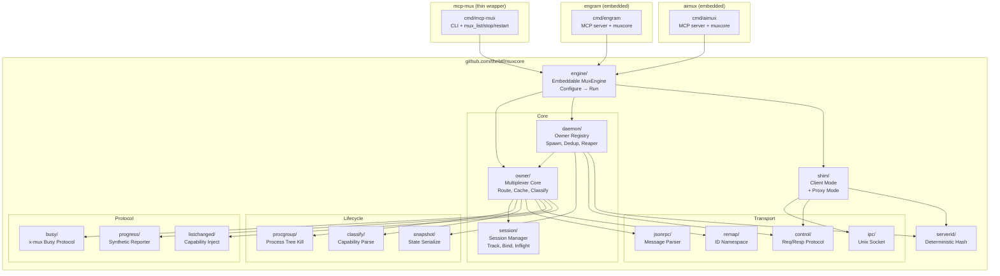

# Architecture: muxcore — Embeddable MCP Multiplexer Engine

**Type:** Go Library/SDK
**Module:** `github.com/thebtf/muxcore`
**Created:** 2026-04-13
**Status:** Draft (v2 — revised after user input)

> **Provenance:** Designed by claude-opus-4-6 on 2026-04-13.
> Evidence from: 3 codebase explorations (mcp-mux, aimux, engram), Go module research (go.dev),
> hashicorp/go-plugin patterns, user architectural requirements (4 key facts).
> Confidence: Architecture PROPOSED, individual components VERIFIED against source.

## Core Insight

muxcore is NOT a utility library. It is the **full multiplexer engine** extracted from mcp-mux,
embeddable into ANY MCP stdio server. Every MCP server becomes "its own mcp-mux" — running a
daemon that serves all local CC sessions through a single upstream process.

**Why:** Distribute MCP servers via Claude Code plugins WITHOUT requiring mcp-mux installed.
Each server self-multiplexes. When mcp-mux IS present, it becomes the master and the embedded
muxcore acts as a cooperative proxy.

## User Requirements (verbatim)

1. All three projects (mcp-mux, aimux, engram) need multi-session daemon mode
2. Servers must work standalone via plugins on systems without mcp-mux
3. Each stdio server = "self-mux": one daemon per server handles all CC sessions
4. When behind mcp-mux: mcp-mux = master, server's muxcore = proxy through it

## Architecture Diagram



## Two Operating Modes

### Mode 1: Standalone (self-mux)

Server IS the daemon. No external mcp-mux needed.

```
CC Session 1 ──stdio──→ engram (shim) ──IPC──┐
CC Session 2 ──stdio──→ engram (shim) ──IPC──┤──→ engram (daemon+owner) ──→ MCP logic
CC Session 3 ──stdio──→ engram (shim) ──IPC──┘
```

First invocation: becomes daemon (spawns MCP logic, listens IPC).
Subsequent invocations: become shims (connect to existing daemon via IPC).

### Mode 2: Behind mcp-mux (proxy)

mcp-mux is the master daemon. Server's muxcore detects mcp-mux and becomes a proxy.

```
CC Session 1 ──stdio──→ mcp-mux (shim) ──IPC──→ mcp-mux (daemon)
CC Session 2 ──stdio──→ mcp-mux (shim) ──IPC──┘       │
                                                       │ spawns
                                                       ▼
                                              engram (proxy mode)
                                              └── MCP logic (single process)
                                              └── sessions routed by mcp-mux
```

Detection: if `MCP_MUX_SESSION_ID` env var is set → running behind mcp-mux → proxy mode.
In proxy mode: muxcore does NOT start its own daemon, delegates session management to parent mcp-mux.

### Mode Selection Logic

```go
func (e *MuxEngine) Run(ctx context.Context) error {
    if e.detectParentMux() {
        return e.runProxyMode(ctx)    // behind mcp-mux
    }
    if e.detectExistingDaemon() {
        return e.runClientMode(ctx)   // connect to own daemon
    }
    return e.runDaemonMode(ctx)       // become daemon
}
```

## Component Map

| Package | Responsibility | From mcp-mux | New Code |
|---------|---------------|-------------|----------|
| `engine` | Embeddable entry point: Configure → detect mode → Run | NEW | ~200 LOC |
| `owner` | Multiplexer core: IPC listener, upstream routing, caching, classification, progress | `internal/mux/owner.go` + related | Refactor |
| `session` | Session tracking: inflight, token preregister, bind | `internal/mux/session*.go` | Refactor |
| `daemon` | Owner registry: spawn, dedup, reaper, idle sweep | `internal/daemon/` | Refactor |
| `procgroup` | Process lifecycle: spawn in group, tree kill, graceful phases | `internal/upstream/` | Rewrite (add Job Objects + pgid) |
| `snapshot` | State serialize/restore for graceful restart | `internal/daemon/snapshot.go` | Extract |
| `classify` | Parse x-mux capabilities from init response | `internal/classify/` | As-is |
| `ipc` | Unix socket listen/dial/available | `internal/ipc/` | As-is |
| `control` | Request/response protocol over IPC | `internal/control/` | As-is |
| `jsonrpc` | JSON-RPC message parse + ID rewrite | `internal/jsonrpc/` | As-is |
| `remap` | Per-session request ID namespace | `internal/remap/` | As-is |
| `serverid` | Deterministic hash + socket path gen | `internal/serverid/` | Add configurable BaseDir |
| `shim` | Client mode (connect to daemon) + proxy mode (behind parent mux) | `internal/mux/resilient_client.go` + `cmd/mcp-mux/daemon.go` | Extract + add proxy |
| `busy` | x-mux busy declaration protocol | `internal/mux/busy_protocol.go` | As-is |
| `progress` | Synthetic progress reporter | NEW (Sprint 1 tasks) | ~100 LOC |
| `listchanged` | Capability injection + notification emit | `internal/mux/listchanged_inject.go` | As-is |

## Embedding API

```go
package main

import "github.com/thebtf/muxcore/engine"

func main() {
    mux := engine.New(engine.Config{
        // Server identity
        Name:    "engram",
        Command: os.Args[0],  // self — the MCP server binary
        Args:    os.Args[1:],

        // MCP handler — your server logic
        Handler: myMCPHandler, // func(ctx, stdin io.Reader, stdout io.Writer) error

        // Optional overrides
        IdleTimeout:      10 * time.Minute,
        ProgressInterval: 5 * time.Second,
        Persistent:       true,  // survive CC disconnect
    })

    if err := mux.Run(context.Background()); err != nil {
        log.Fatal(err)
    }
}
```

That's it. One import, one struct, one call. The engine handles:
- Daemon/client/proxy mode detection
- Multi-session multiplexing
- Process lifecycle (self-restart on crash)
- Progress reporting
- Graceful restart with snapshot
- Activity-aware reaping

## Layer Boundaries

```
┌─────────────────────────────────────────────────┐
│  Consumer: MCP server logic (engram, aimux, etc) │
├─────────────────────────────────────────────────┤
│  engine: mode detection, lifecycle orchestration │
├─────────────────────────────────────────────────┤
│  daemon: owner registry, spawn dedup, reaper     │
│  owner: multiplexer core, routing, caching       │
│  session: tracking, inflight, namespace          │
├─────────────────────────────────────────────────┤
│  protocol: busy, progress, listchanged           │
│  classify: capability parsing                    │
│  remap: ID namespace                             │
│  jsonrpc: message parsing                        │
├─────────────────────────────────────────────────┤
│  transport: ipc, control                         │
│  lifecycle: procgroup, snapshot                   │
│  identity: serverid                              │
└─────────────────────────────────────────────────┘
```

## Data Flow

### Standalone: first CC session starts engram

```
1. CC spawns `engram` via stdio
2. engine.Run() detects: no existing daemon, no parent mux
3. → Daemon mode:
   a. Create serverid from command+args
   b. Listen on IPC socket (serverid path)
   c. Start MCP handler (engram logic) as "upstream"
   d. Create Owner, wire upstream ↔ IPC
   e. Accept this session as first client
   f. Bridge stdin/stdout ↔ Owner
4. CC sends initialize → Owner caches → forwards to engram logic → response cached
5. CC sends tools/call → Owner tracks inflight → forwards → response routed back
```

### Standalone: second CC session connects

```
1. CC spawns `engram` via stdio (new process)
2. engine.Run() detects: existing daemon (IPC socket available)
3. → Client mode:
   a. Connect to IPC socket
   b. Bridge stdin/stdout ↔ IPC connection
4. Owner recognizes new session, serves cached init response instantly
```

### Behind mcp-mux

```
1. mcp-mux daemon spawns `engram` with MCP_MUX_SESSION_ID env
2. engine.Run() detects: MCP_MUX_SESSION_ID present
3. → Proxy mode:
   a. engram runs as simple stdio server (no daemon, no IPC)
   b. All multiplexing handled by mcp-mux
   c. engram still gets session info via _meta.muxSessionId
   d. All muxcore features (progress, busy, classify) available via parent
```

### Hierarchical: mcp-mux as master

```
CC1 ──stdio──→ mcp-mux shim ──IPC──→ mcp-mux daemon
CC2 ──stdio──→ mcp-mux shim ──IPC──┘     │
                                          │ manages
                                          ▼
                                   engram (proxy mode, one process)
                                   aimux (proxy mode, one process)
                                   serena (pass-through, no muxcore)
```

When mcp-mux is present: single daemon, single engram process, single aimux process.
When mcp-mux absent: each server has its own daemon. Still works, just N daemons instead of 1.

## Migration Plan

### Phase 0: internal/muxcore inside mcp-mux (FIRST)
- Create `internal/muxcore/` directory inside mcp-mux repo
- All extraction work happens HERE, not in a separate repo
- Stabilize API through real usage in mcp-mux
- Promote to `github.com/thebtf/muxcore` standalone repo AFTER v1 API freeze

### Phase 1: Extract leaf packages into internal/muxcore
- Move `ipc`, `jsonrpc`, `remap`, `serverid`, `classify` into `internal/muxcore/`
- mcp-mux imports from `internal/muxcore/` instead of `internal/`
- **Deliverable:** mcp-mux works identically, leaf packages consolidated

### Phase 2: Extract core (owner + session + daemon)
- Move `owner`, `session`, `daemon`, `snapshot`, `control` to muxcore
- Add `engine` package with mode detection
- mcp-mux becomes thin CLI wrapper around muxcore/engine
- **Deliverable:** mcp-mux is <500 LOC of CLI + muxcore

### Phase 3: Build procgroup (new code)
- Create `procgroup` with proper tree kill (Job Objects + pgid)
- Replace `internal/upstream` in muxcore with procgroup
- **Deliverable:** process tree kill works correctly on both platforms

### Phase 4: Extract protocol packages
- Move `busy`, `progress`, `listchanged` to muxcore
- Build synthetic progress reporter (Sprint 1 tasks already specced)
- **Deliverable:** full protocol suite in library

### Phase 5: Build proxy mode (new code)
- Add `MCP_MUX_SESSION_ID` detection in engine
- Implement proxy mode (skip daemon, run as simple stdio server)
- mcp-mux sets env var when spawning upstream
- **Deliverable:** hierarchical mode works

### Phase 6: Embed in consumers
- engram: add muxcore/engine to cmd/engram, wrap MCP handler
- aimux: add muxcore/engine to cmd/aimux, wrap MCP handler + replace ProcessManager with procgroup
- **Deliverable:** all three servers self-multiplex standalone, proxy behind mcp-mux

## ADR List

### ADR-001: Single module, multi-package
**Status:** Accepted
**Context:** 16 packages with coordinated releases.
**Decision:** Single `go.mod` at repo root.
**Consequences:** One tag = all packages. Simpler CI. Consumer gets full module but linker eliminates unused.
**Reversibility:** REVERSIBLE

### ADR-002: Engine as single entry point
**Status:** Proposed
**Context:** Consumers should not need to understand muxcore internals.
**Decision:** `engine.New(Config).Run(ctx)` — one struct, one call. Mode detection automatic.
**Consequences:** Low barrier to embed. Hides complexity. Less flexibility for custom wiring.
**Reversibility:** PARTIALLY REVERSIBLE — changing engine API after consumers adopt it requires migration.

### ADR-003: Three operating modes (daemon/client/proxy)
**Status:** Proposed
**Context:** Servers must work standalone AND behind mcp-mux.
**Decision:** Automatic mode detection: `MCP_MUX_SESSION_ID` → proxy, existing socket → client, otherwise → daemon.
**Consequences:** Zero-config for consumers. Hierarchical composition works automatically.
**Reversibility:** REVERSIBLE — modes are additive.

### ADR-004: Proxy mode via env var detection
**Status:** Proposed
**Context:** Need to detect "running behind mcp-mux" without protocol negotiation.
**Decision:** mcp-mux sets `MCP_MUX_SESSION_ID` when spawning upstream. muxcore reads it.
**Consequences:** Simple, no handshake needed. But env vars can be set accidentally.
Alternative: control socket probe (more reliable, more complex).
**Reversibility:** REVERSIBLE — can add control socket probe later as fallback.

### ADR-005: No global process singleton
**Status:** Accepted
**Context:** aimux uses SharedPM global. Causes cross-consumer entanglement.
**Decision:** procgroup.Spawn() is standalone. No global registry.
**Consequences:** Each consumer tracks own processes. Clean isolation.
**Reversibility:** REVERSIBLE

### ADR-006: Job Objects, NOT CREATE_NEW_PROCESS_GROUP
**Status:** Accepted (carried from mcp-mux)
**Context:** CREATE_NEW_PROCESS_GROUP breaks dotnet build console handles.
**Decision:** Windows uses Job Objects with KILL_ON_JOB_CLOSE.
**Consequences:** Correct tree kill. Requires Win32 API calls.
**Reversibility:** IRREVERSIBLE — dotnet consumers depend on this.

### ADR-007: suture supervisor included in library
**Status:** Proposed
**Context:** mcp-mux Owner implements suture.Service for crash recovery + exponential backoff.
**Decision:** Include suture/v4 as dependency. Owner in muxcore implements suture.Service.
**Consequences:** Consumers get OTP-style supervision for free. Adds external dependency.
Alternative: make supervision optional via interface.
**Reversibility:** PARTIALLY REVERSIBLE — removing suture after consumers depend on supervision semantics requires migration.

### ADR-008: remap included (all consumers are MCP servers)
**Status:** Accepted
**Context:** User stated "all projects are MCP servers, they all need everything mcp-mux can do."
**Decision:** remap (per-session ID namespace) is part of muxcore, not mcp-mux-specific.
**Consequences:** Any MCP server embedding muxcore gets correct multi-session ID isolation.
**Reversibility:** REVERSIBLE

## What Stays in mcp-mux (NOT in muxcore)

| Component | Why it stays |
|-----------|-------------|
| `cmd/mcp-mux/main.go` | CLI entry point (upgrade, status, stop subcommands) |
| `internal/mcpserver/` | Control-plane MCP tools (mux_list, mux_stop, mux_restart) — mcp-mux-specific management |
| Plugin distribution config | .mcp.json wrapper patterns |

mcp-mux becomes ~500 LOC: CLI parsing + muxcore/engine + management MCP server.

## Open Questions

1. **Handler interface**: should muxcore define `Handler func(ctx, io.Reader, io.Writer) error` or a richer MCP-aware interface? Simpler = more flexible, richer = better defaults.
2. **Self-spawn**: in daemon mode, does the binary re-exec itself for the daemon process (like mcp-mux does today), or does it fork-like (goroutine)? Re-exec is cleaner for crash isolation but requires the binary to be self-aware.
3. **Version negotiation**: when a muxcore-enabled server connects to mcp-mux, should they negotiate muxcore version compatibility? Prevents mismatched features.
