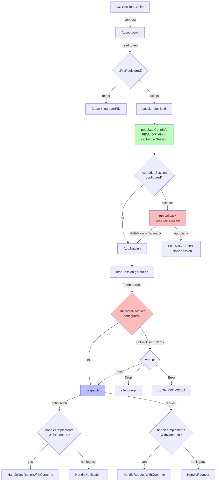

# Architecture — muxcore Multi-Tenant Extensions (v0.24.0)

**Slug:** `muxcore-multi-tenant-extensions`
**Closes GH issues:** #109 (NotificationHandler ConnInfo) · #110 (SessionHandler ConnInfo) · #111 (AuthorizeSession callback) · #112 (OnFrameReceived hook)
**Downstream consumer:** aimux AIMUX-12 multi-tenant isolation
**Project type:** Library/SDK (Go module `github.com/thebtf/mcp-mux/muxcore`)

## 1. Project type detection

Signals: `go.mod`, `muxcore/handler.go` (public interfaces), existing additive-API releases (v0.22.0, v0.23.0). Existing codebase, additive extension, NOT legacy replacement (Strangler Fig skipped — old `SessionHandler`/`NotificationHandler` remain working).

## 2. Architecture diagram



## 3. Component map

| Component | Responsibility | Dependencies | Layer |
|-----------|---------------|--------------|-------|
| `muxcore.ConnInfo` | OS-level peer identity value object: `PeerPid int, PeerUid int, Platform string` (OS facts ONLY — see ADR-004 revised) | — | Domain (value type) |
| `muxcore.SessionMeta` | Session metadata combining `Conn ConnInfo, TenantID string, AuthorizedAt time.Time`. Discriminator `AuthorizedAt.IsZero()` signals "not authorized". | `ConnInfo` | Domain (value type) |
| `muxcore.NotificationHandlerWithSessionMeta` | Optional interface — extends `NotificationHandler` with SessionMeta arg | `NotificationHandler`, `SessionMeta` | Adapter |
| `muxcore.SessionHandlerWithSessionMeta` | Optional interface — extends `SessionHandler` with SessionMeta arg | `SessionHandler`, `SessionMeta` | Adapter |
| `muxcore.SessionAuth` | Authorize verdict: `Decision AuthDecision, TenantID string, Reason string` | `ConnInfo` | Domain |
| `muxcore.FrameAction` | Per-frame verdict: `FramePass / FrameDrop / FrameError` | — | Domain |
| `engine.Config.AuthorizeSession` | Optional callback `func(ctx, ConnInfo, ProjectContext) SessionAuth` | `ConnInfo`, `SessionAuth` | Use case |
| `engine.Config.OnFrameReceived` | Optional callback `func(sessionID, frameSize, method) FrameAction` | `FrameAction` | Use case |
| `owner.peerCreds(conn)` | Cross-platform peer-credential extractor — populates `ConnInfo` at accept time | `peer_pid_*.go`, `peer_uid_*.go` | Infrastructure |
| `owner/peer_pid_windows.go` | **NEW REAL IMPL** — `GetNamedPipeClientProcessId` via `winio` raw HANDLE | `Microsoft/go-winio` | Infrastructure |
| `owner/peer_pid_darwin.go` | **NEW REAL IMPL** — `getsockopt(LOCAL_PEERPID)` via `syscall` | stdlib `syscall` | Infrastructure |
| `owner/peer_uid_unix.go` | UID via `SO_PEERCRED` (Linux) / `getpeereid` (Darwin) | stdlib | Infrastructure |
| `owner.acceptLoop` (modified) | After Bind: populate ConnInfo, run AuthorizeSession, cache verdict | existing + new | Entry |
| `owner.handleDownstreamMessage` (modified) | Pre-dispatch OnFrameReceived hook | existing + new | Entry |
| `owner.dispatchToSessionHandler` (modified) | Type-assert `*WithConnInfo`, fall through to legacy if absent | existing + new | Use case |
| `owner.Session.meta` (new field) | Cached SessionMeta (Conn + TenantID + AuthorizedAt) for session lifetime — populated at accept, mutated once on AuthAllow, immutable after | `SessionMeta`, `SessionAuth` | State |

## 4. Layer boundaries

- **Entry** — `acceptLoop` (token + ConnInfo + AuthorizeSession), `readSession` + `handleDownstreamMessage` (OnFrameReceived hook)
- **Use case** — `dispatchToSessionHandler` (interface-upgrade dispatch), engine Config callbacks
- **Domain** — `ConnInfo`, `SessionAuth`, `FrameAction` value types — pure, no I/O
- **Infrastructure** — platform-specific `peer_pid_*.go` / `peer_uid_*.go` syscalls

Dependency rule: domain types (`ConnInfo`) знают о NULL зависимостях. Engine callbacks работают через эти типы. Owner orchestrates без знания о consumer policy.

## 5. Data flow

### Happy path — request

```
1. CC connects → owner.acceptLoop accepts conn
2. readToken(conn) → token extracted, IsPreRegistered checked
3. NewSession(reader, conn); sessionMgr.Bind(token, ownerKey, s)  [s.Cwd, s.Env populated]
4. peerCreds(conn) → ConnInfo{PeerPid, PeerUid, Platform}; cached in s.connInfo
5. if cfg.AuthorizeSession != nil:
     verdict := cfg.AuthorizeSession(ctx, s.connInfo, project)
     if verdict.Decision == AuthDeny:
         write -32000 JSON-RPC error; close conn; return  [STOP — no AddSession, no upstream spawn]
     s.connInfo.TenantID = verdict.TenantID; cached
6. AddSession(s); readSession goroutine started
7. Message arrives → handleDownstreamMessage(s, msg)
8. if cfg.OnFrameReceived != nil:
     action := cfg.OnFrameReceived(s.ID, len(msg.Raw), msg.Method)  [bounded ≤1ms; timeout = FramePass]
     switch action:
       FramePass:  fall through to dispatch
       FrameDrop:  return  [silent]
       FrameError: write -32004 JSON-RPC error; return
9. msg.IsRequest() → dispatchToSessionHandler(s, msg)
10. if h, ok := o.sessionHandler.(SessionHandlerWithConnInfo); ok:
       resp = h.HandleRequestWithConnInfo(ctx, project, s.connInfo, msg.Raw)
    else:
       resp = o.sessionHandler.HandleRequest(ctx, project, msg.Raw)  [legacy fallback]
11. s.WriteRaw(resp)
```

### Error paths

- **AuthorizeSession deny** → JSON-RPC `{"error":{"code":-32000,"message":"<verdict.Reason>"}}` written, conn closed, no upstream spawn, no session in map
- **OnFrameReceived FrameError** → JSON-RPC `{"error":{"code":-32004,"message":"rate limited"}}` written, no dispatch
- **OnFrameReceived timeout >1ms** → fail-open to `FramePass`, log marker `frame_hook_timeout sid=N method=X`
- **AuthorizeSession panic** → recover, treat as `AuthDeny{Reason:"authorize panic"}`, log marker `authorize_panic sid=N`
- **peerCreds error** → ConnInfo zero-value (PeerPid=0, PeerUid=0); AuthorizeSession still runs (consumer decides whether zero ConnInfo passes policy)

### Primary data store

None. ConnInfo + SessionAuth verdict live в памяти на Session (`s.connInfo`). Без persistence — авторизация повторно отрабатывает на каждом fresh accept (новый token = новый authorize).

### Client/server boundary

Client = mcp-mux shim (downstream CC session). Server = mcp-mux daemon (Owner). Граница — IPC accept (Unix socket / Windows named pipe). ConnInfo вычисляется ровно на этой границе, до любого dispatch.

## 6. Deployment strategy

- Library shipped as Go module: `go get github.com/thebtf/mcp-mux/muxcore@v0.24.0`
- Binary `mcp-mux` rebuilt с новой версией muxcore — deploy командой `mcp-mux upgrade --restart`
- Backward compat: `cfg.AuthorizeSession == nil` + `cfg.OnFrameReceived == nil` + handler без `*WithSessionMeta` interface = байт-идентичное поведение pre-v0.24
- Downstream adoption: aimux migration ~50 LOC (wire AuthorizeSession + OnFrameReceived + upgrade handler interface). engram = no-op.

## 7. ADR list

### ADR-001: Interface upgrade pattern (Option A) для ConnInfo

**Status:** Accepted
**Context:** GH #109/#110 предлагают 2 опции — interface upgrade (A) или поле в `ProjectContext` (B). `ProjectContext` — value object с deterministic-from-CWD hash; добавление per-connection ConnInfo загрязнит его и сломает `compare by ID` инвариант.
**Decision:** Option A. `NotificationHandlerWithConnInfo` + `SessionHandlerWithConnInfo` как optional interfaces, type-assert в Owner. Соответствует существующему шаблону (`NotificationHandler`, `ProjectLifecycle`, `NotifierAware` — все упгрейды).
**Consequences:** + Compile-time opt-in, type-safe, zero-cost для legacy consumers. + Симметрия со всем остальным API. − Два пути dispatch (legacy + new) — но oba проверены через простой type-assert, no runtime cost.
**Reversibility:** REVERSIBLE — interfaces additive, можно убрать в v0.25 deprecation cycle если ошибка.

### ADR-002: ConnInfo populated once at accept, cached on Session

**Status:** Accepted
**Context:** PID/UID требуют syscall. Извлекать per-frame = N×syscall на каждое сообщение. Также TOCTOU — conn может закрыться между accept и dispatch.
**Decision:** Вычисляем `peerCreds(conn)` один раз в `acceptLoop` сразу после `Bind`. Кэшируем в `Session.connInfo`. Все dispatch'и читают cached value. Платформенные данные стабильны на время сессии.
**Consequences:** + Zero per-frame overhead. + No TOCTOU — конн уже мёртв к моменту чтения, ConnInfo всё равно валиден (peer был при accept). + AuthorizeSession и handlers видят одно и то же значение. − Если pid/uid реально меняется (process re-exec) — мы не заметим. Это acceptable: тенант определяется при connect, не per-frame.
**Reversibility:** REVERSIBLE.

### ADR-003: AuthorizeSession single-shot per session, verdict cached

**Status:** Accepted
**Context:** GH #111 требует pre-dispatch gate. Re-running на каждый frame избыточно (аутентификация peer не меняется в рамках сессии) и создаёт конкурентность.
**Decision:** AuthorizeSession вызывается ровно один раз в `acceptLoop` после Bind, до AddSession. SessionAuth.TenantID копируется в `s.connInfo.TenantID`. Last-write-wins нет — single-write.
**Consequences:** + Простая модель. + Никаких race conditions. + Deny path — отсутствие записи в `o.sessions`, никакого upstream spawn'а, никакой нагрузки. − Re-authorization невозможна без disconnect/reconnect — acceptable для multi-tenant модели.
**Reversibility:** REVERSIBLE.

### ADR-004 (REVISED 2026-04-29 by nvmd-clarify C1): SessionMeta with embedded ConnInfo

**Status:** Accepted (revised — initial draft was Option A `ConnInfo.TenantID`, replaced with Option C `SessionMeta`)
**Context:** Куда положить `TenantID` + future Roles/AuthorizedAt/Claims? (a) ConnInfo (смешивает OS facts + consumer policy); (b) ProjectContext (нарушает его CWD-hash invariant); (c) новый struct `SessionMeta` с embedded ConnInfo.
**Decision:** Option C — `SessionMeta` с embedded `ConnInfo`.
```go
type ConnInfo struct {                 // OS facts ONLY
    PeerPid  int
    PeerUid  int
    Platform string
}

type SessionMeta struct {
    Conn         ConnInfo               // embedded by value
    TenantID     string                 // "" if AuthorizeSession not configured
    AuthorizedAt time.Time              // zero if not authorized — discriminator
}
```
Handler signatures: `HandleRequestWithSessionMeta(ctx, project, meta SessionMeta, req []byte)` + `HandleNotificationWithSessionMeta(ctx, project, meta SessionMeta, notif []byte)`. AuthorizeSession callback receives `ConnInfo` (not SessionMeta) — at authorize time TenantID is what the callback PRODUCES.
**Consequences:**
- ✅ Clean separation — ConnInfo = OS, SessionMeta = policy + auth metadata.
- ✅ Extensibility — v0.25+ can add `Roles []string`, `Claims map[string]any`, `AuthExpiry time.Time` to SessionMeta without breaking ConnInfo or handler signatures.
- ✅ Discriminator — `meta.AuthorizedAt.IsZero()` явно сигналит "session was never authorized" (no magic empty-TenantID check). Hyrum's-Law trap closed.
- ✅ Issue spec compatibility — #111 wording "extend ProjectContext OR include in ConnInfo" is design preference, not invariant. SessionMeta satisfies both intents (carries ConnInfo by embedding, adds tenant identity).
- ❌ Two structs instead of one — consumer reads `meta.Conn.PeerPid` instead of `conn.PeerPid`. Tradeoff accepted for clarity.
- ❌ Two interface types — `*WithSessionMeta` (not `*WithConnInfo`).
**Reversibility:** REVERSIBLE during v0.24.0 dev cycle; once v0.24.0 ships locked in until v0.25+.

### ADR-005: OnFrameReceived sync на reader goroutine, fail-open ≤1ms

**Status:** Accepted
**Context:** GH #112 требует pre-dispatch hook. Async = nарушение ordering. Sync без bound = риск reader stall (один медленный consumer стопает всю сессию).
**Decision:** Sync вызов на reader goroutine. Граница — 1ms (бюджет atomic token bucket aimux'а). Превышение = log marker + fail-open `FramePass`. FrameDrop silent; FrameError → JSON-RPC -32004 + продолжить читать. Method extraction — best-effort (`msg.Method` уже есть из `jsonrpc.Parse`, нулевая стоимость).
**Consequences:** + Ordering сохранён. + Bounded latency. + Reader не stall'ится при бажном callback. − Fail-open означает что плохой rate-limiter пропустит трафик — это явный contract, документировать.
**Reversibility:** REVERSIBLE.

### ADR-006: Реальная кросс-платформенная peer-credential реализация

**Status:** Accepted
**Context:** Текущий `peer_pid_windows.go` + `peer_pid_darwin.go` возвращают `-1`. Без них ConnInfo на Windows/macOS остаётся zero — FR-12 aimux не сможет работать. Это **enabler** для всего arc, не optional.
**Decision:**
- Windows: `GetNamedPipeClientProcessId` через winio raw HANDLE access. winio уже dependency (`Microsoft/go-winio` для handoff).
- Darwin: `syscall.GetsockoptInt(fd, SOL_LOCAL, LOCAL_PEERPID)` для PID; `unix.Getpeereid` для UID.
- Linux: уже работает (SO_PEERCRED). Добавить UID extraction через тот же ucred.
- Новый shared `peerCreds(conn) ConnInfo` consolidates.
**Consequences:** + Все 3 платформы работают идентично с consumer'ом aimux. + Старые `readPeerPID` остаются (используются в rejection logger). − +~50 LOC платформенного кода. − Новый winio surface area — но уже dep, риск низкий.
**Reversibility:** REVERSIBLE.

### ADR-007: Все 4 issue — один arc

**Status:** Accepted
**Context:** GH #109/#110/#111/#112 — единый downstream consumer (aimux AIMUX-12). #111 зависит от #109+#110. #112 номинально независим, но решает ту же multi-tenant цель.
**Decision:** Один SpecKit arc + один PR + один tag (v0.24.0). 3 фазы реализации:
- Phase 1: ConnInfo type + peer-creds кросс-платформенно + #109/#110 interfaces (фундамент)
- Phase 2: AuthorizeSession (#111) — depends Phase 1
- Phase 3: OnFrameReceived (#112) — параллельно Phase 2
**Consequences:** + Один review cycle, симметрия API налагается на дизайн с самого начала. + One release tag — cleaner adoption story у aimux. − Больший PR (~600 LOC). Mitigation — TDD ordered tasks с GATEs между фазами.
**Reversibility:** REVERSIBLE — можно откатить tag и сделать 4 отдельных, но тратит cycle'ы на ревью.

## 8. Selected patterns + rationale

| Pattern | Where | Why |
|---------|-------|-----|
| **Interface upgrade (optional capability)** | `*WithConnInfo` interfaces | Уже доминирующий шаблон в muxcore (`NotificationHandler`, `ProjectLifecycle`, `NotifierAware`). Compile-time opt-in. Zero-cost для legacy. |
| **Value object** | `ConnInfo`, `SessionAuth`, `FrameAction` | Pure data, safe to copy/compare. Нет behavior — поведение в callbacks. |
| **Callback hook (Strategy)** | `engine.Config.AuthorizeSession`, `OnFrameReceived` | Consumer-defined policy, library-provided wiring. Standard Go config-callback idiom (`http.Server.ConnState`). |
| **Cache at accept** | `Session.connInfo` populated in acceptLoop | Avoid per-frame syscall + TOCTOU. |
| **Fail-open on hook timeout** | OnFrameReceived ≤1ms budget | Library не должна block на bad consumer. Документированный contract. |
| **Single-shot authorization** | AuthorizeSession runs once | Auth result стабилен в рамках сессии — re-running избыточен. |

## 9. Reusability Awareness

No reusable library candidates emitted from this architecture. Components are muxcore-engine-specific API surface. Cross-platform peer-credential helpers (`peer_pid_*.go`, `peer_uid_*.go`) are intra-module consolidation, not extraction candidates — they remain in `muxcore/owner/`.

Wrapper: `try_detect(phase="architect")` evaluated each component (ConnInfo, SessionAuth, FrameAction, AuthorizeSession callback, OnFrameReceived callback, peerCreds extractor) — none match library-extraction criteria (Rule of Three not satisfied; consumer set = single — aimux).

## 10. Domain Modeling

DDD evaluated — not needed (rationale: extension of single existing bounded context — muxcore engine session lifecycle. No new sub-domains, no aggregate roots, no ubiquitous language shift. Hybrid with consumer-owned tenant policy, but tenant ownership lives in aimux, not muxcore — muxcore exposes the hook, aimux owns the model).

## 11. Open questions

- **Q1:** Should `AuthorizeSession` see ProjectContext or only ConnInfo? Decision: **both** — `func(ctx, ConnInfo, ProjectContext) SessionAuth` — ProjectContext provides Cwd/Env which may inform tenant resolution alongside peer creds.
- **Q2:** OnFrameReceived signature — should it receive `ConnInfo` too? Risk: hot-path call, struct copy cost. Decision: **no** — pass `sessionID` only; consumer maintains `sessionID → tenantID` lookup populated at AuthorizeSession time. Keeps the hook minimal-cost.
- **Q3:** Versioning — v0.24.0 (specified by author in #109 acceptance) — confirmed.

## 12. Verification

- [x] Mermaid diagram renders (Phase 1-3 flow + dispatch fork)
- [x] Every component in §3 appears in diagram (or is infra layer hidden in `peerCreds`)
- [x] 7 ADRs recorded for non-obvious decisions
- [x] Data flow identifies primary "store" (in-memory Session) and IPC client/server boundary
- [x] Project type confirmed (Go module library, additive API extension)
- [x] Reusability + Domain Modeling subsections present (both empty/short-form with rationale)

---

**Handoff:** `Skill("nvmd-platform:nvmd-specify", "muxcore multi-tenant extensions per .agent/specs/muxcore-multi-tenant-extensions/architecture.md — closes #109, #110, #111, #112")`
