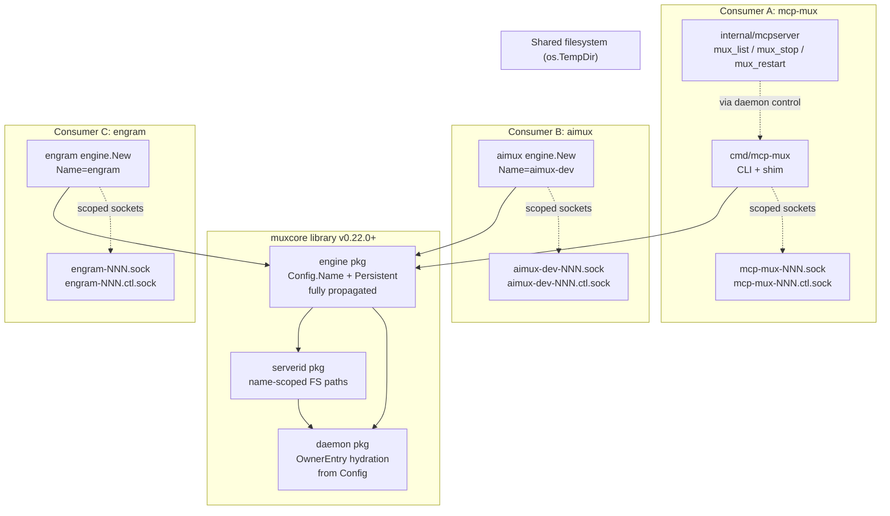

# Architecture — muxcore Multi-Tenant FS Isolation

**Slug:** `muxcore-multi-tenant-isolation`
**Date:** 2026-04-27
**Author:** orchestrator (in-session)
**Replaces / amends:** N/A (new arc covering issues #102 + #103)

## 1. Project Type

Go monorepo: **library/SDK + CLI consumer + control-plane MCP server**.

Detected signals:
- `go.mod` at root (Go module)
- `muxcore/` submodule (library, semver-tagged independently as `muxcore/vX.Y.Z`)
- `cmd/mcp-mux/` (CLI binary)
- `internal/mcpserver/` (control-plane MCP server bundled with the binary)
- External consumers: aimux, engram, third-party (open-source library)

Type confirmation: `muxcore` is a public Go library imported by multiple downstream binaries; `mcp-mux` is one consumer among several. Architecture must treat muxcore as a **multi-tenant library** where each consumer instance shares the same host filesystem.

## 2. Problem Statement (verbatim from triage)

`muxcore/serverid/serverid.go:189-201` hardcodes the literal string `"mcp-mux-"` as the prefix for owner IPC, control, and lock socket files:

```go
func IPCPath(id, baseDir string) string  → "mcp-mux-{id}.sock"
func ControlPath(id, baseDir string) string  → "mcp-mux-{id}.ctl.sock"
func LockPath(id, baseDir string) string  → "mcp-mux-{id}.lock"
```

Every muxcore consumer (mcp-mux, aimux, engram, future third-party) creates owner sockets under this shared prefix in `os.TempDir()`. Two failure modes follow:

- **Issue #102** — `mcp-mux serve`'s `mux_list` scans `TEMP/mcp-mux-*.ctl.sock` and finds aimux daemon's owner sockets, presents them to the operator as mcp-mux-managed. `mux_restart` on a foreign socket-id kills the wrong process.
- **Issue #103** — `engine.Config.Persistent` is declared but never propagated into `OwnerEntry`. SessionHandler-only topology (aimux's `engine.New(Config{Persistent: true, SessionHandler: ...})`) gets reaped after `IdleTimeout` despite the documented contract.

Both surface in the same SessionHandler-only topology where muxcore is embedded inside another binary. Both are class symptoms of one root: **muxcore does not isolate per-engine state when multiple engine instances coexist on one host.**

## 3. Architecture Diagram



Key invariant: **socket file prefix = engine.Name**. Three coexisting consumers produce three disjoint FS namespaces. `mux_list` in mcp-mux only enumerates `mcp-mux-*` sockets and therefore cannot see aimux/engram owners.

## 4. Component Map

| Component | Responsibility | Dependencies | Layer | Change |
|-----------|---------------|-------------|-------|--------|
| `muxcore/serverid` | FS path primitives for sockets/locks. Deterministic hashes for server identity. | stdlib only | L0 (FS namespace) | **Breaking — add `name` parameter to `IPCPath/ControlPath/LockPath`** |
| `muxcore/daemon` | Owner registry, Spawn, Reaper, snapshot. | `serverid`, `owner`, `control`, `session` | L1 (orchestration) | Hydrate `OwnerEntry` from engine `Config.Persistent`; pass `Name` through to FS path calls |
| `muxcore/engine` | Public consumer entry — Config, Run, Mode, Ready. | `daemon`, `serverid`, `control`, `ipc` | L2 (consumer API) | Propagate `Config.Name` to all `serverid.*Path` calls; propagate `Config.Persistent` into daemon Config |
| `muxcore/owner` | Per-upstream lifecycle, IPC accept loop, init cache. | `serverid`, `ipc`, `control` | L1 | Adopt new `serverid.*Path` signatures |
| `cmd/mcp-mux/main.go` | CLI shim, daemon spawn, status/stop/upgrade. | `muxcore/*` | L3 (consumer) | Replace hardcoded `"mcp-mux-"` filters with calls querying the daemon's owner registry |
| `cmd/mcp-mux/daemon.go` | Daemon process bootstrap. | `muxcore/daemon`, `muxcore/engine` | L3 | Pass `Name="mcp-mux"` to engine Config explicitly |
| `internal/mcpserver` | MCP server exposing `mux_list`/`mux_stop`/`mux_restart` to CC agents. | `muxcore/control`, `muxcore/ipc` | L3 | **Stop scanning TEMP**. Query the local mcp-mux daemon's `list_owners` control RPC. Filter is now ownership-based, not pattern-based. |
| aimux (`engine.New(Config{Name: "aimux-dev", ...})`) | External consumer | muxcore | L3 | Bump muxcore dep to v0.22.0; verify `Persistent: true` survives reaper after IdleTimeout |
| engram (`engine.New(Config{Name: "engram", ...})`) | External consumer | muxcore | L3 | Bump muxcore dep to v0.22.0 |

## 5. Layer Boundaries

- **L0 (serverid):** pure functions, no I/O. Owns the FS namespace contract. No engine/daemon imports. After change, every path-producing function takes the engine name explicitly — no defaulting to `"mcp-mux"` inside L0 (defaulting is L2's responsibility).
- **L1 (daemon, owner):** in-memory state for the live process. Crosses to FS via `serverid` only. Adopts new signatures.
- **L2 (engine):** consumer-facing facade. Owns `Config` validation: empty `Name` returns a hard error from `engine.New` (resolved in Q1, see clarifications/2026-04-27-auto.md and FR-2). No silent defaulting. Does NOT leak `serverid` into the consumer API.
- **L3 (consumers):** import `muxcore` at the engine level, never reach into `serverid` directly. Existing direct calls in `cmd/mcp-mux/daemon.go` (`serverid.DaemonControlPath("", "")`) are L3-violations and get refactored: pass an explicit `Name="mcp-mux"`.

## 6. Data Flow

### 6.1 Owner socket creation (post-change)

```
engine.New(Config{Name: "aimux-dev"})
  → engine.runDaemon
      → daemon.New(Config{Name: "aimux-dev", ...})
          → daemon.Spawn(req)
              → serverid.IPCPath(baseDir, "aimux-dev", sid)
                  → "aimux-dev-{sid}.sock"
              → serverid.ControlPath(baseDir, "aimux-dev", sid)
                  → "aimux-dev-{sid}.ctl.sock"
```

### 6.2 mux_list (post-change)

```
CC agent → tools/call mux_list
  → mcpserver.toolMuxList
      → control.Send(mcp-mux-muxd.ctl.sock, Cmd: "list_owners")
          → daemon.HandleListOwners
              → iterate d.owners (in-memory)
              → return [{ServerID, Command, Args, Cwd, Sessions, ...}, ...]
      → format result, return to CC
```

No FS scan. Result is authoritative — the daemon returns owners IT manages. Foreign engine instances on the same host are invisible.

### 6.3 Persistent propagation (#103 path)

```
engine.New(Config{Name: "aimux", Persistent: true, SessionHandler: ...})
  → engine.runDaemon
      → daemon.New(Config{Name: "aimux", Persistent: true, ...})
          → daemon.Spawn (SessionHandler topology)
              → OwnerEntry{Persistent: cfg.Persistent, ...}
                  → reaper.go:151 sees entry.Persistent=true
                  → reaper.go:232 returns evictionDecision{} (skip evict)
```

Reaper now respects the documented contract for in-process handlers.

### 6.4 Error paths

- Unknown engine name (`Config.Name == ""`) → engine.Run returns hard error. No silent default. (Choice in ADR-002.)
- Pre-v0.22 stale sockets on disk after a v0.21 → v0.22 upgrade → `daemon.cleanStaleSockets` only removes sockets matching this engine's prefix (`{cfg.Name}-*`), leaves foreign-prefix sockets alone.
- aimux v5.0.2 (still on v0.21.x muxcore) running concurrently with mcp-mux v0.22 → no collision. Each daemon's `cleanStaleSockets` ignores foreign prefixes; FS namespace is partitioned.

## 7. Deployment Strategy

Three rollout phases:

### Phase 1 — muxcore/v0.22.0 (breaking lib release)
- New `serverid.{IPC,Control,Lock}Path(baseDir, name, id)` signatures.
- New `daemon.Config.Name string` field, propagated from engine.
- `OwnerEntry` hydrated from `engine.Config.Persistent` (#103 fix folded in).
- `cleanStaleSockets` parameterized by daemon name.
- `daemon.HandleListOwners` new control RPC for ownership-authoritative enumeration.

### Phase 2 — mcp-mux v0.22.0 (consumer adoption + tools refactor)
- Adopts muxcore v0.22.0.
- `internal/mcpserver` switches `mux_list/mux_stop/mux_restart` from FS scan to daemon `list_owners` RPC.
- `cmd/mcp-mux` keeps the `"mcp-mux-"` filter only inside its OWN `cleanStaleSockets`-equivalent fallback; primary path uses daemon RPC.

### Phase 3 — aimux + engram adoption
- aimux: `go get muxcore@v0.22.0`; `engine.New(Config{Name: "aimux-dev", Persistent: true})` now actually persists. Verify with mcp-launcher persist mode — ought to PASS where it currently FAILs.
- engram: `go get muxcore@v0.22.0`. No code changes expected (already passes Name).
- Document migration in muxcore release notes + AGENTS.md.

Migration safety: phases 2 and 3 are independently deployable. A v0.21.x consumer continues to work after the muxcore upgrade *only if* it never adopts v0.22 — but if it stays on v0.21, it cannot be a consumer of v0.22. Pinning is honoured by Go modules.

Cross-version coexistence on a single host: an old aimux still on v0.21 produces `mcp-mux-*` sockets. New mcp-mux v0.22 ignores them (its `cleanStaleSockets` is now scoped). Until aimux upgrades, the operator sees orphan-looking sockets in TEMP — cosmetic, not functional.

## 8. ADR List

### ADR-010: Breaking change to `serverid` path signatures
**Status:** Accepted
**Context:** `serverid.{IPC,Control,Lock}Path` hardcodes `"mcp-mux-"` prefix. Multi-consumer host (aimux, engram, mcp-mux all on one machine) shares one FS namespace. mcp-mux's `mux_list` and `cleanStaleSockets` cannot distinguish own vs. foreign sockets, leading to misleading UI (#102) and risk of killing foreign processes via `mux_restart`. The same root pattern (Config field not propagated to FS / OwnerEntry layer) causes #103 (Persistent dead).
**Decision:** Add `name string` parameter to `IPCPath`, `ControlPath`, `LockPath`. New format: `{name}-{id}.{sock|ctl.sock|lock}`. Empty `name` is REJECTED at L2 (engine), not silently defaulted at L0 (serverid). muxcore version bump: **v0.22.0** (breaking).
**Consequences:**
- *Positive:* FS namespace becomes engine-scoped. mcp-mux, aimux, engram coexist cleanly on one host. Future third-party consumers automatically isolated.
- *Negative:* All call sites of the three functions must be updated. Internal call sites (~10 in this repo) are mechanical. External consumers (aimux, engram) need version-pin bump.
- *Migration:* Clean break, not deprecation cycle — `serverid` is library-internal in spirit (consumers should go through engine). The few L3 violations in `cmd/mcp-mux` (`serverid.DaemonControlPath("", "")`) are repaired in this same release.

**Reversibility:** `IRREVERSIBLE` once shipped — public Go signature change. User confirmation required before tagging.

### ADR-011: `daemon.Config.Name` field added; engine propagates `cfg.Name`
**Status:** Accepted
**Context:** Daemon currently receives only `ControlPath` from engine. Owner sockets are created via `serverid.{IPC,Control}Path(sid, "")` — no name awareness. To honour ADR-010 the daemon needs the name explicitly.
**Decision:** Add `Name string` to `daemon.Config`. `engine.runDaemon` passes `cfg.Name`. Daemon stores it on `*Daemon` and uses it in every `serverid.*Path` call internally (Spawn, snapshot.go restore, cleanStaleSockets, owner spawn).
**Consequences:** Additive on `daemon.Config` — non-breaking field add. Internal daemon code touched in ~5 places.
**Reversibility:** `REVERSIBLE` — additive field; could be defaulted to `"mcp-mux"` if rolled back, restoring v0.21 behaviour.

### ADR-012: `mux_list/mux_stop/mux_restart` query daemon, do not FS-scan
**Status:** Accepted
**Context:** Even after ADR-010, `internal/mcpserver/server.go` keeps a `strings.HasPrefix(name, "mcp-mux-")` FS scan in toolMuxList/toolMuxStop/toolMuxRestart. The scan is fundamentally less authoritative than asking the daemon — daemon knows its owner set; FS only knows what files happen to exist. Two daemons in the same project (test fixture leftover, half-restarted upgrade) would still confuse the FS scan even after ADR-010.
**Decision:** Add `daemon.HandleListOwners` control RPC returning `[{ServerID, Command, Args, Cwd, Sessions, ClassMode, MuxVersion, ...}]`. `toolMuxList` calls `control.Send(daemonCtl, "list_owners")` and trusts the response. `toolMuxStop`/`toolMuxRestart` resolve `server_id` to a target via the same RPC, then dispatch.
**Consequences:**
- *Positive:* mux tools are ownership-authoritative. No way for a foreign socket on disk to be misclassified.
- *Negative:* Tools fail closed if the local mcp-mux daemon is down (instead of returning partial via FS scan). Acceptable: when the daemon is down there are no mcp-mux-managed servers anyway.
- *Negative:* New control RPC — addition to muxcore daemon API surface. Documented as part of v0.22.0.
**Reversibility:** `PARTIALLY REVERSIBLE` — RPC can be removed in a later release if a different design wins; the `internal/mcpserver` switch is a one-way change in mcp-mux.

### ADR-013: `OwnerEntry.Persistent` hydrated from `engine.Config.Persistent`
**Status:** Accepted
**Context:** Issue #103 — `engine.Config.Persistent` is declared but `grep -rn Persistent muxcore/engine/` shows zero reads. `OwnerEntry.Persistent` is consulted by reaper but never set in SessionHandler topology. Documented contract violated.
**Decision:** `daemon.Config` already carries `Name` (ADR-011); add `Persistent bool` to it. Engine passes `cfg.Persistent`. Daemon stores it; in `Spawn` (or wherever `OwnerEntry` is constructed for SessionHandler topology) the new `OwnerEntry` is initialized with `Persistent: d.cfg.Persistent`. Subprocess topology continues to honour the existing `x-mux.persistent` capability path (`classify.ParsePersistent`); the two paths converge — engine.Config wins for in-process handlers, capability wins for subprocess handlers, both end up in `OwnerEntry.Persistent` before the reaper reads it.
**Consequences:**
- *Positive:* Documented contract honoured. aimux and any other in-process daemon get correct persistence.
- *Negative:* None — additive code path. Existing subprocess tests unchanged.
**Reversibility:** `REVERSIBLE` — additive.

### ADR-014: One spec arc, two issues, single muxcore release
**Status:** Accepted
**Context:** #102 and #103 are independently filed but share root: muxcore-side propagation gap from Config to FS / OwnerEntry. Splitting into two PRs duplicates the daemon.Config / engine.runDaemon edits.
**Decision:** Single spec arc `muxcore-multi-tenant-isolation`. Single muxcore release `v0.22.0` ships both fixes plus mux_list refactor. mcp-mux v0.22.0 adopts in same arc.
**Consequences:** Larger blast radius per release; offset by smaller total churn (one bump for downstream consumers instead of two).
**Reversibility:** `REVERSIBLE` — could split if later needed.

## 9. Reusability Awareness

Components evaluated for library extraction:

- **`serverid` after refactor** — already a stable, dependency-free library inside muxcore. After the rename it remains a thin pure-function pkg. Not a candidate for extraction to a separate repo (rule of three not met — only one consumer of socket-naming patterns: muxcore itself).
- **`daemon.HandleListOwners` RPC contract** — single-consumer (mcp-mux's `internal/mcpserver`) at this time. Not a library candidate. Re-evaluate if a third consumer surfaces.
- **OwnerEntry Config-hydration pattern** — internal to daemon. Not extractable.

No reusability candidates emitted from this arc. (Empty list IS valid evidence per FR-1; the library-boundary question was asked for every component.)

## 10. Domain Modeling

DDD evaluated — not needed. muxcore is infrastructure code; entities are stateless FS primitives and process-lifecycle records, not domain objects with invariants. No bounded contexts beyond the existing `serverid` / `daemon` / `engine` / `owner` packages, which are already correct partitioning. Rationale: <3 project-owned domain entities; no aggregate roots; contexts are purely technical.

## 11. Patterns Selected

- **Namespace-per-tenant** — engine.Name as the FS-namespace tenant key. Standard multi-tenant SaaS pattern adapted to single-host filesystem.
- **Authoritative state via owner not scanner** — `mux_list` consults the daemon's owner registry rather than scanning FS, mirroring `kubectl get pods` over `ls /var/lib/kubelet/pods`. Inverts the data-flow direction toward the source of truth.
- **Config hydration through layered facade** — `engine.Config → daemon.Config → OwnerEntry`, no field disappears at any boundary. Closes the propagation gap that produced #103.

## 12. Verification (acceptance gates for the arc)

- [ ] Every internal call site of `serverid.{IPC,Control,Lock}Path` updated to pass `name`.
- [ ] No occurrence of `"mcp-mux-"` literal outside (a) `serverid` defaulting logic, (b) tests that explicitly validate the mcp-mux engine name.
- [ ] `daemon.Config.Name` and `daemon.Config.Persistent` round-trip through `engine.Config` with regression tests (R1 from #103 issue body).
- [ ] Reaper does not evict `Persistent: true` SessionHandler-topology owners past IdleTimeout (R2 from #103).
- [ ] mcp-launcher persist regression (R3 from #103) PASSes against a binary built on muxcore v0.22.0.
- [ ] `mux_list` against a host with both mcp-mux and aimux daemons running shows ONLY mcp-mux-managed servers (#102 acceptance).
- [ ] `mux_restart <foreign-id>` returns "not found" instead of killing the process (#102 acceptance).

## 13. Open Questions

- **Q1:** Should empty `Config.Name` hard-error or default to `"mcp-mux"` for backward compatibility? Current ADR-010 says hard-error at L2. Backward-compat default is tempting but reintroduces the bug for any consumer that forgot to set Name. Recommend hard-error + clear message naming the field. Confirm before nvmd-tasks.
- **Q2:** Should `cleanStaleSockets` v0.22 also clean orphan `mcp-mux-*` sockets left by a previous v0.21 mcp-mux daemon if no v0.21 daemon is alive? Default: yes — they are unambiguously stale-pre-upgrade. Risk: a v0.21 aimux running concurrently produces sockets the v0.22 mcp-mux would prematurely clean. Mitigation: probe each `mcp-mux-*.ctl.sock` for liveness before removing; only remove unreachable ones. (This is the existing logic — works correctly post-rename.)
- **Q3:** mux_list compatibility with consumer's daemon down — return empty list or surface an error to the CC agent? Recommend empty + a one-line note in the result text ("local mcp-mux daemon not running"). Avoids the agent hallucinating servers.

## 14. Handoff

Next: `/nvmd-specify` to convert this architecture into a feature contract (functional/non-functional requirements + acceptance scenarios). The spec ingests this doc as Phase-0 input; questions Q1-Q3 above become clarification candidates for `/nvmd-clarify`.
