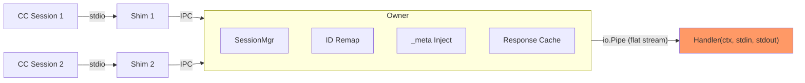
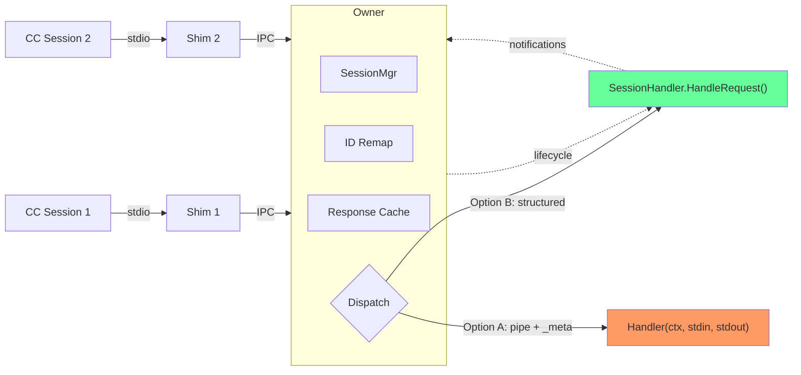

# Architecture: Session-Aware Handler API for muxcore

**Type:** Library/SDK (Go sub-module)
**Scope:** muxcore in-process handler session awareness

## Problem

muxcore multiplexes N CC sessions through one in-process Handler. The Handler
sees a flat byte stream (io.Pipe) where all sessions are interleaved after
JSON-RPC ID remapping. The Handler cannot:

| # | Capability | Status |
|---|-----------|--------|
| 1 | Know WHICH CC session sent a request | v0.17.1: via `_meta` (requires JSON parsing) |
| 2 | Know WHEN a CC session connects | Not available |
| 3 | Know WHEN a CC session disconnects | Not available |
| 4 | Send notification to a SPECIFIC session | Not available |
| 5 | Send notification to ALL sessions | Works (write to stdout) |

## Current Architecture



**Request flow (current):**
```
CC1 → Shim1 → IPC → Owner:
  1. Parse JSON-RPC
  2. Remap ID: "5" → "s1:n:5"
  3. Inject _meta.muxSessionId (v0.17.1)
  4. Write bytes to Handler stdin pipe
     ↓
Handler reads line from stdin, processes, writes response to stdout
     ↓
Owner reads line from stdout:
  5. Deremap ID: "s1:n:5" → "5"
  6. Route to Session 1 → IPC → Shim1 → CC1
```

**Problem:** Steps 4-5 are async. Handler reads/writes a flat stream. Multiple
requests interleave. Handler matches responses to requests by echoing the ID.
Owner matches responses to sessions by ID prefix. No structured handoff.

## Design Constraints

1. **Backward compatible.** Existing `Handler func(ctx, stdin, stdout)` must keep working.
2. **No muxcore protocol changes.** Shims, IPC, daemon — unchanged.
3. **Concurrency.** Multiple CC sessions send requests concurrently. Handler must handle concurrent calls.
4. **Notifications.** Handler may emit unsolicited notifications (progress, logging) to specific or all sessions.
5. **Go idioms.** Interface segregation, context propagation.

## Proposed Architecture



**Key change:** Owner has two dispatch paths. Legacy Handler uses pipe + `_meta`
injection. New SessionHandler gets structured calls with ProjectContext.

## API

```go
package muxcore

// ProjectContext identifies a CC session and its environment.
// Value object — safe to copy, store, compare.
type ProjectContext struct {
    // ID is a deterministic hash of the worktree root. Same worktree = same ID
    // across CC restarts. Different worktree of the same repo = different ID.
    // Worktree root: directory containing .git (dir or file). Linked worktrees
    // are NOT resolved to main repo — each worktree is a separate session.
    // CWD subdirectories within a worktree produce the same ID.
    // Safe to use as a persistent key for jobs, state, rate counters.
    ID  string

    // Cwd is the raw working directory of the CC session (may be a subdirectory).
    // Use ID for session grouping; Cwd for file-relative operations.
    Cwd string

    // Env contains per-session environment variables that differ from the
    // daemon process. Typically: API keys, config paths injected by CC.
    Env map[string]string
}

// SessionHandler processes MCP requests with session context.
// Owner calls HandleRequest concurrently from multiple goroutines.
// Implementations must be safe for concurrent use.
type SessionHandler interface {
    // HandleRequest processes one MCP JSON-RPC request and returns the response.
    //
    // request contains the ORIGINAL JSON-RPC (not remapped). The ID is the
    // client's original ID — muxcore handles remapping transparently.
    //
    // The response must be a valid JSON-RPC response with the same ID as
    // the request. Returning an error fails the request with a JSON-RPC
    // internal error.
    //
    // ctx is cancelled when the CC session disconnects or the owner shuts down.
    HandleRequest(ctx context.Context, session ProjectContext, request []byte) (response []byte, err error)
}

// ProjectLifecycle is optionally implemented by SessionHandler.
type ProjectLifecycle interface {
    OnProjectConnect(session ProjectContext)
    OnProjectDisconnect(sessionID string)
}

// Notifier allows the handler to push notifications to sessions.
type Notifier interface {
    // Notify sends a JSON-RPC notification to a specific CC session.
    Notify(sessionID string, notification []byte) error
    // Broadcast sends a JSON-RPC notification to ALL connected sessions.
    Broadcast(notification []byte)
}

// NotifierAware is optionally implemented by SessionHandler.
// Owner calls SetNotifier once before the first HandleRequest.
type NotifierAware interface {
    SetNotifier(n Notifier)
}
```

## engine.Config

```go
type Config struct {
    Name    string
    // ... existing fields ...

    // Handler is the legacy flat handler (pipe-based, _meta injection).
    Handler func(ctx context.Context, stdin io.Reader, stdout io.Writer) error

    // SessionHandler is the structured session-aware handler.
    // If both Handler and SessionHandler are set, SessionHandler takes priority.
    SessionHandler SessionHandler
}
```

## Owner Dispatch Logic

```go
func (o *Owner) handleSessionRequest(s *Session, msg *jsonrpc.Message) error {
    // ... cache replay, dead check (unchanged) ...

    if o.sessionHandler != nil {
        // STRUCTURED PATH: call HandleRequest directly
        return o.dispatchToSessionHandler(s, msg)
    }

    // LEGACY PATH: remap + _meta inject + write to pipe (unchanged)
    return o.dispatchToPipe(s, msg)
}

func (o *Owner) dispatchToSessionHandler(s *Session, msg *jsonrpc.Message) error {
    // No ID remapping needed — handler gets original ID.
    // No _meta injection needed — handler gets ProjectContext struct.
    session := ProjectContext{
        ID:  s.MuxSessionID,
        Cwd: s.Cwd,
        Env: s.Env,
    }

    // Call concurrently — don't block the session read loop.
    go func() {
        ctx, cancel := context.WithCancel(o.supervisorCtx)
        defer cancel()

        // Cancel ctx when session disconnects
        go func() {
            select {
            case <-s.Done():
                cancel()
            case <-ctx.Done():
            }
        }()

        resp, err := o.sessionHandler.HandleRequest(ctx, session, msg.Raw)
        if err != nil {
            resp = jsonrpc.ErrorResponse(msg.ID, -32603, err.Error())
        }

        s.WriteRaw(resp)
        o.pendingRequests.Add(-1)
    }()

    o.pendingRequests.Add(1)
    return nil
}
```

## Data Flow Comparison

### Legacy (pipe):
```
CC → Shim → IPC → Owner:
  remap("5" → "s1:n:5") →
  inject(_meta) →
  write(pipe.stdin)
                          Handler reads stdin, writes stdout
Owner reads pipe.stdout:
  deremap("s1:n:5" → "5") →
  route(session 1) → IPC → Shim → CC
```

### SessionHandler (structured):
```
CC → Shim → IPC → Owner:
  build ProjectContext{ID, Cwd, Env} →
  go handler.HandleRequest(ctx, session, originalRequest)
    → returns response with original ID
  route(session 1) → IPC → Shim → CC
```

**Difference:** No ID remapping. No _meta injection. No pipe. No async ID matching.
Owner calls handler synchronously (in a goroutine), gets response back directly.

## Lifecycle Events

```
CC1 connects via IPC →
  Owner registers session →
    if handler.(ProjectLifecycle) != nil:
      handler.OnProjectConnect(ProjectContext{...})

CC1 disconnects →
  Owner removes session →
    if handler.(ProjectLifecycle) != nil:
      handler.OnProjectDisconnect(sessionID)
```

Integration points in Owner:
- `OnProjectConnect`: after successful IPC handshake in session accept loop
- `OnProjectDisconnect`: in session cleanup (existing `o.removeSession`)

## Notifications (handler → session)

```go
// Handler stores notifier at startup:
func (h *AimuxHandler) SetNotifier(n muxcore.Notifier) {
    h.notifier = n
}

// Later, during request processing:
func (h *AimuxHandler) HandleRequest(ctx context.Context, s ProjectContext, req []byte) ([]byte, error) {
    // ... processing ...
    // Send progress to the requesting session:
    h.notifier.Notify(s.ID, progressNotification)
    // ... more processing ...
    return response, nil
}
```

Owner implements Notifier:
- `Notify(sessionID, data)`: lookup session by muxSessionID → write to IPC
- `Broadcast(data)`: write to all sessions

## Component Map

| Component | Responsibility | Package | Phase |
|-----------|---------------|---------|-------|
| `ProjectContext` | Session identity value object | `muxcore` | 1 |
| `SessionHandler` | Core request handling interface | `muxcore` | 1 |
| `ProjectLifecycle` | Connect/disconnect hooks | `muxcore` | 2 |
| `Notifier` | Push notifications to sessions | `muxcore` | 3 |
| `NotifierAware` | Handler receives notifier | `muxcore` | 3 |
| `dispatchToSessionHandler` | Owner → SessionHandler adapter | `muxcore/owner` | 1 |
| `ownerNotifier` | Owner implements Notifier | `muxcore/owner` | 3 |
| `MetaExtractor` | Helper: parse _meta from legacy pipe | `muxcore/jsonrpc` | 0 (done) |

## Phased Delivery

### Phase 0: `_meta` injection (DONE — v0.17.1)
- `_meta.muxSessionId`, `_meta.muxCwd`, `_meta.muxEnv` in every request
- Handler parses manually
- Zero API changes

### Phase 1: SessionHandler + dispatch
- Define `ProjectContext`, `SessionHandler` in `muxcore/handler.go`
- Add `SessionHandler` to `engine.Config`
- Owner: if SessionHandler set, use `dispatchToSessionHandler`
- No ID remapping needed on this path
- Tests: unit test dispatch with mock SessionHandler
- **aimux migration:** replace `StdioHandler()` with `SessionHandler` impl

### Phase 2: ProjectLifecycle
- Define `ProjectLifecycle` interface
- Owner calls `OnProjectConnect` / `OnProjectDisconnect`
- **aimux usage:** create per-CC-session registries, clean up on disconnect

### Phase 3: Notifier
- Define `Notifier`, `NotifierAware` interfaces
- Owner implements `Notifier`
- **aimux usage:** route progress notifications to originating CC session

## ADRs

### ADR-001: Interface segregation
**Status:** Accepted
**Context:** One big interface vs separate optional interfaces.
**Decision:** Core = `SessionHandler` (one method). Lifecycle and notifications = separate interfaces checked via Go type assertion.
**Consequences:** Simple handlers implement one method. Complex handlers add interfaces as needed. Owner does `if lc, ok := handler.(ProjectLifecycle); ok { ... }`.
**Reversibility:** REVERSIBLE

### ADR-002: Handler gets original IDs
**Status:** Accepted
**Context:** Current pipe model remaps IDs to "s1:n:5" format. Handler should not see mux internals.
**Decision:** `dispatchToSessionHandler` passes original request bytes (no remap). Owner routes response by call context (goroutine), not by ID prefix.
**Consequences:** Handler code is clean. Owner is slightly more complex (response routing via goroutine, not ID prefix). No ID collision risk — each goroutine knows its session.
**Reversibility:** REVERSIBLE

### ADR-003: Concurrent HandleRequest
**Status:** Accepted
**Context:** Multiple CC sessions send requests simultaneously. Should Owner serialize or parallelize?
**Decision:** Owner calls HandleRequest in separate goroutines. Handler must be concurrent-safe.
**Consequences:** Same concurrency model as current pipe (handler reads from stdin concurrently). Natural for Go. Handler uses sync primitives as needed.
**Reversibility:** REVERSIBLE

### ADR-004: Dual dispatch in Owner
**Status:** Accepted
**Context:** Can't break existing `Handler func(ctx, stdin, stdout)`.
**Decision:** Owner checks `sessionHandler != nil` first, falls back to pipe dispatch. Both paths coexist.
**Consequences:** Clean migration. Legacy handlers unchanged. ~10 lines of branching in Owner. SessionHandler path skips remap/inject/pipe overhead.
**Reversibility:** REVERSIBLE — can deprecate pipe path in v1.0

### ADR-005: ProjectContext is a value, not a reference
**Status:** Accepted
**Context:** Should handler get a live session object or a snapshot?
**Decision:** `ProjectContext` is a plain struct. No methods, no mutation. To send a notification, handler uses `Notifier` with session ID — not a method on ProjectContext.
**Consequences:** Thread-safe by construction. No hidden state. Cannot accidentally mutate session from handler. Slight indirection for notifications (ID lookup).
**Reversibility:** REVERSIBLE

## Open Questions

1. **Streaming responses.** `HandleRequest` returns complete response. For streaming (SSE, chunked), need `HandleRequestStream(ctx, session, request) <-chan []byte`. Defer to Phase 4.

2. **Initialize/handshake.** Should SessionHandler receive `initialize` requests? Currently Owner handles init + caching. Probably: Owner caches init, handler never sees it. Handler sees tools/call, prompts/get etc.

3. **Notifications FROM client.** CC sends `notifications/cancelled`. Should handler get these via HandleRequest (method != request)? Or separate `HandleNotification`? Probably: HandleRequest with notification bytes — handler checks method.

## What This Enables for aimux

| Problem (from analysis) | Solution with SessionHandler |
|-------------------------|------------------------------|
| No isolation between CC sessions | `HandleRequest` receives `ProjectContext.ID` → group by session |
| CWD per-request, not per-session | `ProjectContext.Cwd` always present |
| No "cancel all my jobs" | `OnProjectDisconnect(id)` → cancel jobs where session matches |
| Rate limiter shared | Per-session rate limiter keyed by `ProjectContext.ID` |
| Agent discovery grows forever | `OnProjectDisconnect` → remove session's agents from registry |
