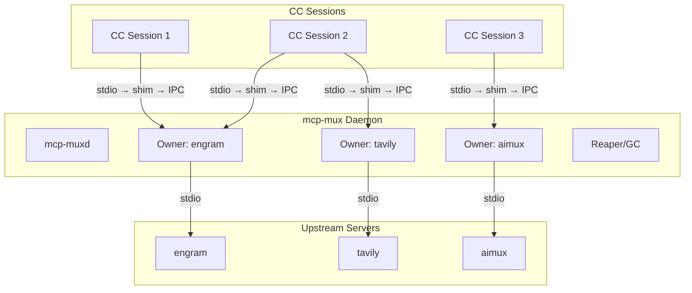
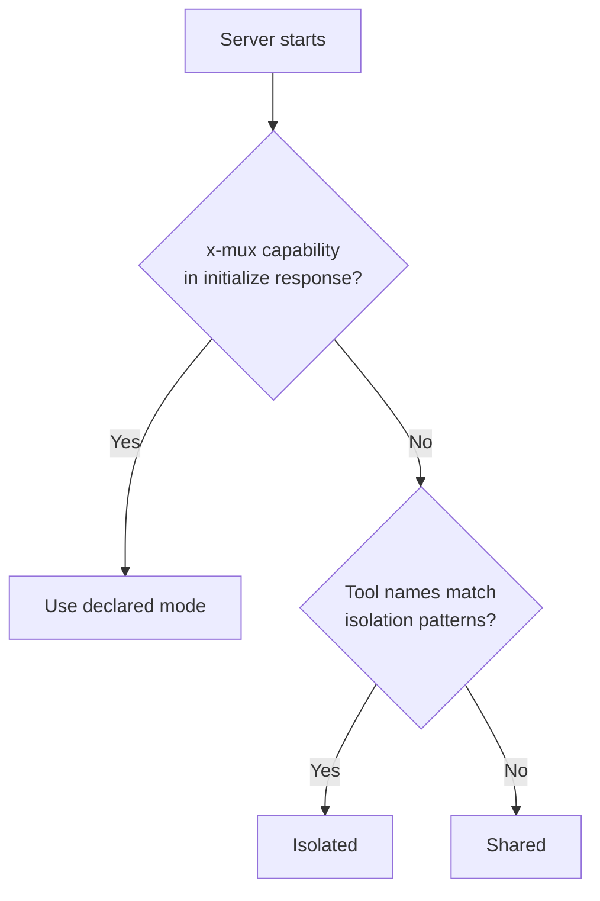

[English](README.md) | [Русский](README.ru.md)


# mcp-mux

Transparent stdio multiplexer that lets multiple Claude Code sessions share a single MCP server process.

One line change in `.mcp.json` — no other configuration required.

## The Problem

Each Claude Code session spawns its own copy of every configured MCP server (stdio transport). With
4 parallel sessions and 12 servers, that is 48 node/Python processes consuming roughly 4.8 GB of RAM.
Most MCP servers are stateless — they don't need per-session isolation.

## Architecture

mcp-mux consists of two components: a thin **shim** (the binary CC invokes) and a long-lived **daemon**
that owns upstream processes. Shims connect to the daemon via IPC; the daemon spawns and manages
upstream servers on behalf of all shims.



Each shim connects to the daemon owner for its upstream. If no daemon is running, the shim
auto-starts one. If no owner exists for a given server, the daemon spawns it.

Result: one upstream process per server instead of N — approximately 3x memory reduction.

## Quick Start

**1. Build**

```sh
# Linux / macOS
go build -o mcp-mux ./cmd/mcp-mux

# Windows
go build -o mcp-mux.exe ./cmd/mcp-mux
```

Place the binary somewhere on your PATH, or reference it by absolute path in `.mcp.json`.

**2. Configure**

Take any MCP server entry in `.mcp.json` and move the `command` into `args[0]`, replacing
`command` with `mcp-mux`:

Before:
```json
{
  "mcpServers": {
    "engram": {
      "command": "uvx",
      "args": ["engram-mcp-server", "--db", "/data/engram.db"]
    }
  }
}
```

After:
```json
{
  "mcpServers": {
    "engram": {
      "command": "mcp-mux",
      "args": ["uvx", "engram-mcp-server", "--db", "/data/engram.db"]
    }
  }
}
```

**3. Verify**

```sh
mcp-mux status
```

On the next CC session start, mcp-mux intercepts the stdio channel, connects to (or starts) the
daemon, and proxies all MCP traffic transparently.

## Sharing Modes

| Mode | Behavior | Use When |
|------|----------|----------|
| `shared` (default) | One upstream serves all sessions. Responses to `initialize`, `tools/list`, `prompts/list`, and `resources/list` are cached and replayed without a round-trip. | Stateless servers: search, docs, LLM proxy. |
| `isolated` | Each session gets its own upstream process. | Per-session state: browser automation, SSH, editor buffers. |
| `session-aware` | One upstream; sessions identified by injected `_meta.muxSessionId`. | Stateful servers that can partition in-process state by session key. |

Override mode for a specific server:

```sh
# Force isolation for one invocation
MCP_MUX_ISOLATED=1 mcp-mux uvx my-server

# CLI flag (equivalent)
mcp-mux --isolated uvx my-server
```

## Auto-Classification

When no explicit mode is set, mcp-mux classifies each server automatically using this priority order:

1. **`x-mux` capability** (highest) — server declares `x-mux.sharing` in its `initialize` response.
   Authoritative; overrides all heuristics.
2. **Tool-name heuristics** — tools with names matching browser, session, editor, navigate, page,
   tab, process, document, or snapshot patterns trigger isolation.
3. **Default** — `shared`.



If your server is stateless but has tool names that match isolation patterns, add
`"x-mux": { "sharing": "shared" }` to your `initialize` capabilities to fix the classification.

## Response Caching

In shared mode, the owner intercepts and caches the first response for each of these methods:

- `initialize`
- `tools/list`
- `prompts/list`
- `resources/list`
- `resources/templates/list`

Subsequent sessions receive the cached response immediately without a round-trip to the upstream.
Cache entries are invalidated when the upstream sends the corresponding `*_changed` notification
(`notifications/tools/list_changed`, `notifications/prompts/list_changed`,
`notifications/resources/list_changed`).

For `initialize`, the cache is keyed on `protocolVersion`. A new client using a different protocol
version bypasses the cache and goes to the upstream directly.

## Proactive Init

When a new owner is created, mcp-mux sends a synthetic `initialize` request to the upstream
immediately — before any CC session connects. This pre-populates the response cache so the first
session gets an instant cached replay instead of waiting for the upstream to start.

For slow-starting servers (serena via uvx ~3s, tavily via npx ~5s), this eliminates the CC
"failed" status that occurred when the upstream couldn't respond within CC's startup timeout.

The proactive init also sends `notifications/initialized` and `tools/list` to warm the full
cache and trigger auto-classification.

## Daemon Mode

The daemon is enabled by default. It starts automatically when the first mcp-mux shim connects and
no daemon is running.

**Lifecycle:**

- Shim connects → daemon starts or is reused.
- A non-persistent initialized shim with no requests or queued work parks its
  daemon IPC session after 10 minutes without host traffic. New host demand
  reconnects to the exact owner.
- If no demand arrives for another 30 seconds, the stable launcher parks the
  engine process too. The next host frame starts the current active engine,
  replays the cached `initialize` handshake, and forwards that demand once.
- When the last session disconnects, a disposable owner is eligible for the
  existing 30-second safety-gated zero-session cleanup. The general owner idle
  timeout remains 10 minutes; isolated owners use their shorter lifecycle rule.
- Servers declaring `x-mux.persistent: true` do not suspend or reap while idle;
  they stay alive until explicitly stopped or until the daemon exits.
- Daemon auto-exits after 5 minutes with no owners and no connected sessions.

`MCPMUX_SHIM_IDLE_TIMEOUT` and `MCPMUX_SHIM_DORMANT_GRACE` override the
10-minute and 30-second product-shim stages with Go duration strings. Zero or a
negative value disables that stage; invalid values keep the default. These are
separate from owner cleanup and daemon auto-exit settings.

Serena's web dashboard is configured separately from mux lifecycle. To prevent
it opening automatically, pass `--open-web-dashboard false` to Serena's
`start-mcp-server` command or set `web_dashboard_open_on_launch: false` in
`serena_config.yml`; this leaves the dashboard active. Set
`web_dashboard: false` only when the dashboard itself must be disabled; see the
[Serena dashboard documentation](https://oraios.github.io/serena/02-usage/060_dashboard.html).

**Disable daemon mode** (legacy per-session owner behavior):

```sh
MCP_MUX_NO_DAEMON=1 mcp-mux uvx my-server
```

## Resilient Shim

mcp-mux shims automatically reconnect when the daemon restarts. This means:

- `mcp-mux upgrade` switches the active versioned engine without dropping connections
- `mcp-mux stop --force` triggers automatic reconnect within seconds
- Daemon crashes are recovered transparently

During reconnect, the shim:
1. Detects IPC connection loss (daemon shutdown)
2. Drains orphaned in-flight requests — sends spec-compliant JSON-RPC error responses so CC sees
   explicit failures for pending requests instead of silence (silence on a pending request is
   what CC's stdio transport tears the connection down over)
3. Tries the planned reconnect path first, including reconnect-token refresh
4. Starts or waits for the replacement daemon when needed
5. Replays cached `initialize` request to warm the replacement owner
6. Sends `notifications/tools/list_changed` so the host can refresh discovery
7. Flushes any still-valid buffered requests and resumes normal proxy

Reconnect is transport continuity, not request replay. A request already sent
to the lost owner receives one explicit JSON-RPC error with its original id and
is never sent to the successor. Only the cached `initialize` handshake is
replayed to warm the replacement connection; host frames accepted afterward
are forwarded once.

Reconnect timeout: 30 seconds. If reconnect is still unavailable after that
window and a reconnect path exists, the shim does **not** exit. It enters
degraded retry: new client requests receive JSON-RPC errors by their original
ids, the parent stdio transport stays open, and normal proxying resumes on that
same transport after backend recovery. The shim exits only when the MCP host
closes stdin/stdout or when no reconnect path was configured.

> **Note on keepalives:** Earlier versions emitted synthetic `notifications/progress` with a
> `mux-reconnect` progress token every 5 s as a keep-alive. That violated the MCP spec
> (progress tokens must reference a client-issued `_meta.progressToken`), and Claude Code tore
> down the stdio transport on the first unknown token — destroying the connection the shim was
> trying to preserve. The keep-alive was removed in muxcore v0.19.6; `drainOrphanedInflight` is
> the spec-compliant replacement.

## Session Transport Layer

mcp-mux v0.4.0 introduces a session transport layer that replaces the old `lastActiveSessionID`
heuristic with deterministic, per-session routing.

### Token handshake

When CC spawns a shim, the daemon generates a cryptographic token tied to that spawn's working
directory. The shim sends this token as the first line on the IPC connection:

```
CC → shim → [token\n] → Owner (SessionManager) → upstream
```

The Owner reads the token, looks up the corresponding `Session.Cwd`, and binds the IPC connection
to that session. From this point the session identity is authoritative — no heuristics required.

**Handshake enforcement (v0.9.10+).** The Owner rejects IPC connections with an empty or
unregistered token when daemon mode is active. Rejections are logged at owner level with the peer
PID (no token value) and rate-limited to 10 entries per minute per owner with a suppressed-count
summary. Pre-registered tokens are preserved on rejection, so a legitimate client that closes
mid-handshake can reconnect without forcing the daemon to re-issue a new token. Tokens are 128-bit
(16 random bytes from `crypto/rand`); entropy failure is fatal.

### Deterministic callback routing

The `SessionManager` tracks inflight requests per session. When exactly one session has pending
requests outstanding, response routing is deterministic without needing to inspect message content.
This eliminates spurious mis-routing in high-concurrency scenarios.

### roots/list forwarding

`roots/list` requests from the upstream are forwarded to the active CC session (the one with
pending requests), so the server receives the real workspace roots for that session rather than a
static fallback.

## Security Model

mcp-mux is designed for a **single-user local trust boundary**: any process running as the same OS
user is implicitly trusted. Two layered defenses protect against same-machine impersonation on
shared Unix hosts:

### Application-layer: handshake enforcement

The Owner `acceptLoop` rejects IPC connections with an empty or unregistered token (daemon mode).
Combined with 128-bit `crypto/rand` tokens and single-use `Bind` semantics, this closes the only
application-layer impersonation gap on the data socket.

### OS-layer: 0600 socket permissions (Unix)

All Unix domain sockets created by `ipc.Listen` and the daemon control socket go through the
`muxcore/sockperm` package, which applies `syscall.Umask(0177)` under a package-level mutex — the
socket file lands with mode `0600` and is only accessible to the owner UID. On Windows, AF_UNIX
sockets inherit the creating process's default DACL (owner + LocalSystem), so no umask equivalent
is needed and the package is a documented no-op.

### What mcp-mux does NOT protect against

- **Malware running under the same user account.** A process with your UID can still connect to
  your 0600 control socket and issue its own `spawn` request to obtain a fresh pre-registered
  token. Treat the control socket as trusted to everything running as you.
- **Network-level adversaries.** mcp-mux uses Unix sockets / Windows AF_UNIX only — there is no
  TCP listener. Remote attack surface is zero.
- **Upstream MCP servers themselves.** mcp-mux is a transparent proxy; if an upstream server runs
  `exec.Command` on attacker-controlled input, mcp-mux doesn't rewrite or sanitize that.

### Multi-user deployment

For shared-machine Unix hosts (multiple login users), mcp-mux v0.9.10 and later is safe for the
cross-user boundary — the 0600 permission prevents a different user from `connect()`-ing, and the
token handshake rejects same-user probe attempts that haven't received a pre-registered token from
the daemon.

## Commands

```sh
# Show all running upstream instances (PID, sessions, classification, cache state)
mcp-mux status

# Stop all running instances and the daemon
mcp-mux stop [--drain-timeout 30s] [--force]

# Versioned engine upgrade (see section below)
mcp-mux upgrade

# Start a detached daemon process (normally auto-started by shims)
mcp-mux daemon

# Run as control-plane MCP server (exposes mux_list / mux_stop / mux_restart tools)
mcp-mux serve
```

## Versioned Engine Upgrade with Safe Restart

Upgrading the mcp-mux binary while sessions are active is safe and fast, but
ordinary upgrades do not force live host transports through a daemon restart.
The configured `mcp-mux` executable is a stable launcher and stdio anchor; the
runtime code lives behind the versioned engine pointer.

This section describes the `mcp-mux` product updater. If you embed `muxcore`
in another product, start from `muxcore/README.md` and choose that product's
own launcher, engine path, staging name, and status/update surface instead of
copying the `mcp-mux.exe~` / `mcp-mux.versions` layout blindly.

```sh
# One-command upgrade with safe restart/defer semantics
go build -o mcp-mux.exe~ ./cmd/mcp-mux && mcp-mux upgrade --restart
```

**What happens:**

1. The stable `mcp-mux` launcher is left in place; it is not renamed while live shims hold it.
2. The pending `mcp-mux.exe~` engine is copied or moved into
   `mcp-mux.versions/<hash>/mcp-mux-engine.exe`.
3. `mcp-mux.versions/active.txt` is switched to the new engine path.
4. If the daemon has live sessions, the daemon restart is deferred. Existing
   host stdio transports stay attached to their current daemon/engine boundary,
   and new shims use the new active engine pointer.
5. If zero live sessions can be proven, `--restart` may perform graceful restart:
   the daemon serializes state snapshot (cached init/tools/prompts/resources
   responses, classification, session metadata), shuts down, and starts the
   successor daemon from the new engine.
6. Current-generation shims reconnect to the successor, refresh reconnect
   tokens, and resume against restored owners with pre-populated caches.

The launcher indirection is intentional on Windows: live `mcp-mux.exe` shim and daemon
processes keep the executable image locked, so a self-rename of the configured binary is
not a reliable update primitive. Versioned engines avoid that lock; old processes keep
running from their old engine path while new shims use the active engine pointer.

This has one bootstrap boundary: processes that were already launched by an
older, pre-supervisor `mcp-mux serve` cannot be retrofitted in-place. Move the
host configuration onto the stable launcher once; after that, ordinary engine
updates preserve the host-facing stdio boundary by keeping the launcher stable
and deferring daemon restart when live sessions are present.

**Without `--restart`** (active pointer switch only):

```sh
mcp-mux upgrade
```

The daemon keeps running with its current engine. New shim processes use the new
active engine. The daemon updates on next natural restart.

**When a same-protocol graceful restart is safe and actually runs, it preserves:**

- **The upstream process tree** — a same-v2 handoff retains it after successor adoption; a restart with live sessions is deferred instead
- Cached MCP responses (init, tools, prompts, resources)
- Server classification (shared/isolated/session-aware)
- Session metadata (cwd, env)
- Reconnect-token history, so live shims can refresh without fallback-spawning
  an owner during planned restart.

**Only the daemon restarts** — upstreams are reattached via FD passing (Unix SCM_RIGHTS, Windows DuplicateHandle). See the next section for the lifecycle contract.

## Upstream Lifecycle — Transactional Restart and Full-Tree Cleanup

Handoff protocol v2 keeps an upstream process tree alive across a planned
same-v2 daemon restart only after the successor adopts both stdio and the
tree authority. Ordinary reconnect after an owner loss preserves the host
transport but does not replay already-sent requests.

### The contract

| Trigger | Pre-v0.21.0 | v0.27.0 contract |
|---|---|---|
| `mcp-mux upgrade --restart` with live sessions | Upstream killed + respawned, in-flight requests dropped | Daemon restart deferred; existing stdio transports remain on the current daemon while new shims use the new engine pointer |
| `mcp-mux upgrade --restart` with zero live sessions | Upstream killed + respawned, in-flight requests dropped | Same-v2 handoff retains the upstream tree; the first v1-to-v2 restart takes one snapshot-backed respawn |
| Daemon/owner loss | Upstream lifecycle was leader-oriented | Recovery is demand-driven; abandoned generations are cleaned as full trees and already-sent requests receive explicit errors instead of replay |
| `mux_restart <sid>` (operator-initiated) | Hard kill — unchanged | Hard kill — unchanged (explicit operator intent) |
| Reaper idle-eviction | Hard SIGKILL | Soft-close: 30s stdin drain → SIGTERM only after timeout |

### How it works

**Unix (Linux, macOS, *BSD):**

- Upstream spawns with `Setpgid=true` — the kernel places the child in its own process group.
- Planned restart: old daemon opens a Unix domain socket, successor daemon connects with a 128-bit
  shared token, FDs (stdin, stdout, stderr) transfer via the SCM_RIGHTS ancillary control message.
- Cleanup targets the process group, including descendants that outlive the
  leader or inherit its stdio. Planned v2 handoff retains the PGID authority
  until the successor's final adoption acknowledgment.

**Windows:**

- Each upstream starts suspended and is placed in its own anonymous Job Object
  with `JOB_OBJECT_LIMIT_KILL_ON_JOB_CLOSE` before it can execute.
- Planned restart: successor is spawned with a named-pipe address; handles are duplicated via
  `DuplicateHandle` with `DUPLICATE_SAME_ACCESS`, including the Job authority.
- The predecessor retains its Job lease until the successor commits adoption;
  abort or final authority loss terminates the whole tree.

### Handoff protocol

Old daemon → successor handshake is JSON-over-socket with a mandatory `protocol_version: 2`
field on every message:

```
Hello ──(token, source_pid)──>
       <──(protocol_version check, refs list)── Ready
FdTransfer ──(server_id, stdio + tree-authority metadata)──>
             <──(SCM_RIGHTS / DuplicateHandle)── AckTransfer (ok/aborted)
       ...repeat per upstream...
Done   ──(transferred, aborted lists)──>
       <──(accepted + aborted partition)── HandoffAck
```

- **Token auth (FR-11):** constant-time compare, 128-bit random, 0600 file.
- **Per-upstream atomicity (FR-7):** receipt does not detach the predecessor.
  Each tree commits only if the final acknowledgment accepts its server id;
  every other prepared tree aborts and is eligible for snapshot respawn.
- **30s accept + total timeout** on both sides.
- **Version skew (FR-3):** negotiation happens before any owner detaches. A
  mismatched `protocol_version`, including the first v1-to-v2 restart, takes
  one bounded snapshot-backed shutdown+respawn path (FR-8).

### FR-8 degraded fallback

If any of the following happens, the daemon automatically falls back to the
bounded snapshot-backed shutdown-and-respawn path:

- Platform unsupported (socket bind failure on an exotic OS)
- Successor spawn failure
- Handoff socket accept timeout exceeded
- Shared token mismatch (`ErrTokenMismatch`)
- Protocol version mismatch (`ErrProtocolVersionMismatch`)
- Any other `performHandoff` error

All paths log `handoff.fallback reason=…` — search `mcp-muxd-debug.log` for operator diagnostics.
After fallback the successor daemon respawns upstreams from snapshot;
`drainOrphanedInflight` returns JSON-RPC errors by original id to in-flight
callers. It does not replay those requests.

### Operator visibility

New counters in `mux_list` / `HandleStatus`:

| Counter | Meaning |
|---|---|
| `handoff_attempted` | Total `HandleGracefulRestart` invocations that entered the handoff path |
| `handoff_transferred` | Successfully handed-off upstreams across all handoffs |
| `handoff_aborted` | Upstreams that fell back per-upstream (FR-7) while siblings succeeded |
| `handoff_fallback` | Whole-handoff failures that took the FR-8 respawn path |

Structured log markers: `handoff.start`, `handoff.upstream.transferred`, `handoff.complete`,
`handoff.fallback`, `handoff.receive.{start,complete,fail}`.

### Migration to v0.27.0

No consumer code change is required. The first restart from a v1 handoff binary
to v0.27.0 rejects live transfer before detach and uses one bounded
snapshot-backed respawn. Subsequent v2-to-v2 planned restarts retain stdio and
tree authority transactionally. Rollback across the same v2/v1 boundary uses
the bounded respawn again; do not force mixed-version live handoff.

Snapshot back-compat: v0.20.x `OwnerSnapshot` files load without errors; new fields
(`UpstreamPID`, `HandoffSocketPath`, `SpawnPgid`) are `omitempty` and default to zero on
old snapshots.

### Known limitations

- **Protocol transition boundary:** the first handoff v1 → v2 restart, and a
  rollback across that same boundary, reject live transfer before owner detach
  and take one bounded snapshot-backed shutdown-and-respawn path. Same-v2
  restarts retain stdio and full-tree authority only after final successor
  adoption.
- **Per-upstream 30s transfer bound:** upstreams that don't drain within 30s fall back to
  respawn for that entry only.
- **macOS launchd cross-parentage:** verified via CI; spawns outside the mcp-mux process
  tree inherit correctly.
- **Windows process tree:** each upstream is governed by a Job Object with
  `JOB_OBJECT_LIMIT_KILL_ON_JOB_CLOSE`; final authority loss intentionally
  terminates descendants, including those that outlive their leader.

### Post-deploy verification

```sh
# Unix
scripts/verify-handoff.sh

# Windows
scripts\verify-handoff.ps1
```

The script spawns a test daemon, triggers `upgrade --restart`, asserts all upstream PIDs
survive across the restart, and reports any dropped FDs.

### muxcore library integration

Developers embedding `muxcore` in another Go MCP server should start with
`muxcore/README.md`. The recommended integration path is `engine.New` +
`engine.Run`: muxcore then owns daemon/client/proxy mode selection, token
handshake, reconnect, session routing, snapshot restore, and graceful restart.

The lower-level handoff functions in `muxcore/daemon` remain public for custom
daemon supervisors, but ordinary consumers should not build their own shim or
connect directly to owner IPC paths. Doing so bypasses the daemon-minted session
token path and will be rejected by daemon-managed owners.

See `muxcore/README.md` for the consumer checklist, required `engine.Config`
fields, upgrade/launcher contract, guardrails, and low-level handoff API. The
guide also states the muxcore API design rule: infer safe behavior in `engine`
when possible, and fail early with an actionable error when the consumer wiring
is ambiguous.

### Reference

- Spec: `.agent/specs/upstream-survives-daemon-restart/spec.md`
- Engram: `#109` (arc resolution), `#130` (public API export for aimux-class consumers)

## Configuration

All configuration is via environment variables. No config file is required.

| Variable | Default | Description |
|----------|---------|-------------|
| `MCP_MUX_NO_DAEMON` | `0` | Set to `1` to disable daemon mode (legacy per-session owner) |
| `MCP_MUX_ISOLATED` | `0` | Set to `1` to force isolated mode for this invocation |
| `MCP_MUX_STATELESS` | `0` | Set to `1` to ignore cwd in server identity hash (enables global deduplication) |
| `MCPMUX_SHIM_IDLE_TIMEOUT` | `10m` | Safe host-idle period before a non-persistent shim parks its daemon IPC session; zero or negative disables |
| `MCPMUX_SHIM_DORMANT_GRACE` | `30s` | Exact-owner reconnect window before a supervised launcher becomes dormant; zero or negative disables |
| `MCPMUX_LAUNCHER_DORMANT_LEASE` | disabled | Explicit opt-in to exit a dormant launcher after this additional no-demand lease. Use only with a host proven to relaunch after transport closure. |
| `MCP_MUX_OWNER_IDLE` | `10m` | General owner idle timeout; overridden per owner by `x-mux.idleTimeout` |
| `MCP_MUX_GRACE` | `10m` | Legacy alias used only when `MCP_MUX_OWNER_IDLE` is unset |
| `MCP_MUX_IDLE_TIMEOUT` | `5m` | Daemon auto-exit after this period with no activity |

### Transport lifecycle and host boundary

MCP stdio has no standard logical-completion signal: the host owns termination by
closing child stdin, while a server may send notifications or requests during an
otherwise silent interval. `mcp-mux` therefore exits on host EOF but does not
kill a silent live stdio transport by default. A capable launcher parks its
engine after the shim idle/grace sequence and retains a small launcher stub for
later demand. `MCPMUX_LAUNCHER_DORMANT_LEASE` bounds the complete disposable
launcher/engine tree only as an explicit host-compatibility opt-in.

Private dormant frames require a PID-bound direct-launcher advertisement and an
active-engine-pointer proof. Old-launcher sessions stay fail-closed; a verified
child may bootstrap the stable launcher for future invocations with the
rollback-capable two-rename swap. Customer-mode proof remains required for host
relaunch behavior and live Windows executable swapping.

## Control Plane MCP Server

`mcp-mux serve` exposes an MCP server on stdio with management tools. Add it to `.mcp.json` like
any other server:

```json
{
  "mcpServers": {
    "mcp-mux": {
      "command": "mcp-mux",
      "args": ["serve"]
    }
  }
}
```

**Tools:**

| Tool | Description |
|------|-------------|
| `mux_engines` | Lists opted-in native muxcore daemon engines registered on this host. Each descriptor is advisory and is verified by daemon `status` before being marked healthy. Stale or mismatched descriptors are labeled instead of mixed into owner lists. `duplicate` means more than one healthy descriptor advertises the same engine name; stale leftovers do not make a healthy daemon duplicate. |
| `mux_prune_engines` | Dry-run by default. Lists or removes stale / invalid native muxcore registry descriptor files after the same verification used by `mux_engines`. This is registry garbage collection only: it never stops processes, owners, daemon control sockets, or live native muxcore products. |
| `mux_list` | Returns running instances for the **current project** inside this `mcp-mux` daemon namespace (filtered by caller's cwd). Pass `all: true` to list this daemon's instances across all projects. Pass exact `engine_name` from `mux_engines` to query one verified native muxcore engine explicitly. Includes server ID, engine name, PID, downstream session count, pending requests, classification, and cache status. With `verbose: true`, includes classification source/reason and inflight request details when present. |
| `mux_stop` | Gracefully drains and stops an instance by `server_id`. Use `force: true` for immediate kill. CR-001 scope is current `mcp-mux` daemon namespace only; it does not stop native registered engines. |
| `mux_restart` | Stops an instance and spawns a fresh daemon owner with the same command. When called without arguments, resolves to the instance belonging to the caller's session (e.g. `mux_restart(name: "aimux")` restarts this project's aimux if it was launched through this `mcp-mux` daemon, not a native `aimux` engine). CR-001 scope is current namespace only; cross-engine restart is a future opt-in management feature. |

**Session-scoped control plane:**

The control plane is session-aware. Each tool call is resolved in the context of the calling
session's working directory:

- `mux_list` — shows only servers owned by the current project by default.
  Use `mux_list(all: true)` for a full view across all projects in this
  `mcp-mux` daemon.
- `mux_engines` — shows native muxcore products only when they explicitly opt
  into daemon registry advertisement.
- `mux_prune_engines` — shows prune candidates with `dry_run: true` by default.
  Pass `dry_run: false` only after reviewing candidates; it removes stale /
  invalid registry descriptors, not daemon processes.
- `mux_list(engine_name: "aimux")` — queries exactly one registered engine after
  verifying that the descriptor's control socket returns matching
  `engine_name` from daemon `status`.
- `mux_restart(name: "aimux")` — resolves to the aimux instance started from this project's
  directory, not a same-named server from a different project.

This prevents accidental cross-project interference when multiple projects use the same server
name.

The `sessions` count in `mux_list` is a downstream MCP client/shim count, not a
count of visible terminal windows or top-level agent sessions. Some clients run
hidden stdio app-server processes; each one may attach to mcp-mux as a separate
downstream session.

Native muxcore products such as `aimux` or `engram` run under their own engine
namespaces when they embed muxcore directly. They do not appear in default
`mux_list` unless they were launched through the `mcp-mux` product daemon. If a
native product opts into muxcore daemon registry advertisement, `mux_engines`
can discover it and `mux_list(engine_name: "...")` can list that one engine's
owners. Product-native health, sessions, upgrade, and restart surfaces remain
authoritative unless that product later opts into explicit cross-engine
management capabilities.

**Prompts:**

| Prompt | Description |
|--------|-------------|
| `mux-guide` | Full reference on architecture, classification, caching, and troubleshooting. |
| `mux-status-summary` | Calls `mux_list` and returns a human-readable summary. |

## For MCP Server Authors

Declare your server's sharing preference in the `initialize` response capabilities:

```json
{
  "protocolVersion": "2025-11-25",
  "capabilities": {
    "tools": {},
    "x-mux": {
      "sharing": "shared"
    }
  }
}
```

For stateless servers that don't depend on the client's working directory, add `"stateless": true`
to enable global deduplication — one upstream instance regardless of which directory CC is opened
from:

```json
{ "x-mux": { "sharing": "shared", "stateless": true } }
```

For session-aware servers, mcp-mux injects into every request:

- `_meta.muxSessionId` — unique session identifier (format: `sess_` + 8 hex chars)
- `_meta.muxCwd` — the CC session's project directory (for `--project-from-cwd` servers)
- `_meta.muxEnv` — per-session environment variable diff (API keys, config paths)

```json
{ "x-mux": { "sharing": "session-aware" } }
```

For servers that must stay alive across all session disconnects (e.g., expensive initialization,
background indexing), declare persistence:

```json
{ "x-mux": { "sharing": "shared", "persistent": true } }
```

Full protocol specification including implementation examples (TypeScript, Python, Go) and
migration path: [`docs/mux-protocol.md`](docs/mux-protocol.md).

## Smoke Testing

mcp-mux includes a smoke test that validates mux-specific behavior with real upstream servers:

```sh
# Basic: verify serena works through mux
SMOKE_CWD=D:/Dev/my-project SMOKE_EXPECT=isolated \
  go run testdata/smoke_isolated.go uvx --from git+https://github.com/oraios/serena \
  serena start-mcp-server --project-from-cwd

# Isolation check: two projects get separate owners
SMOKE_CWD=D:/Dev/project-a SMOKE_CWD2=D:/Dev/project-b SMOKE_EXPECT=isolated \
  go run testdata/smoke_isolated.go uvx --from serena ...

# With tool call
SMOKE_CWD=D:/Dev/my-project SMOKE_TOOL=activate_project \
  go run testdata/smoke_isolated.go uvx --from serena ...
```

**What it validates** (mux behavior, not upstream correctness):

- Spawn via daemon with proactive init
- Classification matches expected mode
- Session isolation: different cwds → different owners for isolated servers
- Init response forwarded correctly through mux
- Optional: tool call forwarded and response returned

## Contributing

```sh
# Run tests
go test ./...

# Run vet
go vet ./...

# Build
go build ./cmd/mcp-mux
```

Pull requests are welcome. Please ensure `go test ./...` and `go vet ./...` pass before submitting.
For significant changes, open an issue first to discuss the approach.

## License

MIT
