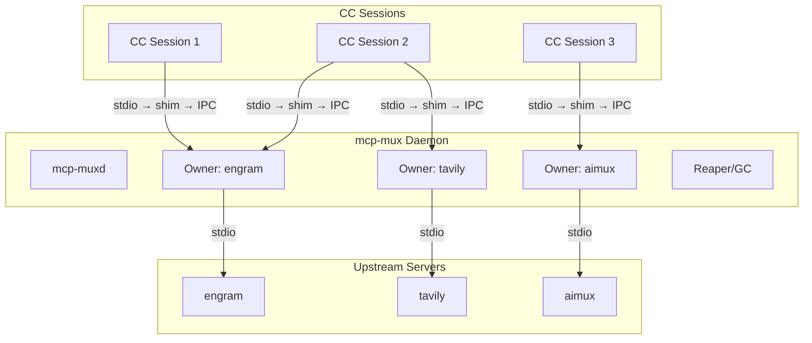
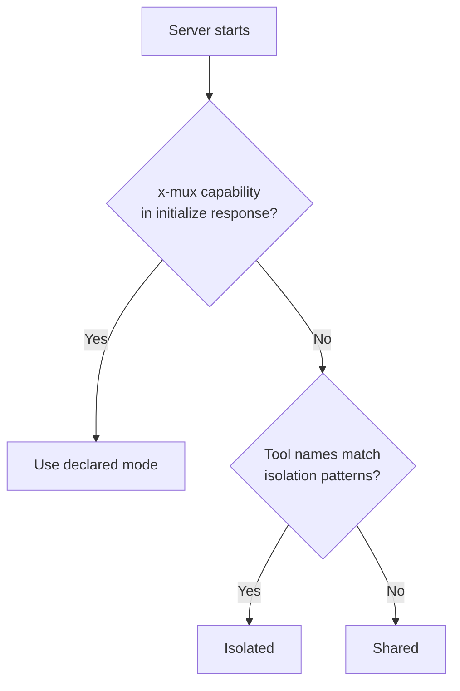

[English](README.md) | [Русский](README.ru.md)


# mcp-mux

Transparent stdio multiplexer that lets multiple Claude Code sessions share a single MCP server process.

One line change in `.mcp.json` — no other configuration required.

## The Problem

Each Claude Code session spawns its own copy of every configured MCP server (stdio transport). With
4 parallel sessions and 12 servers, that is 48 node/Python processes consuming roughly 4.8 GB of RAM.
Most MCP servers are stateless — they don't need per-session isolation.

## Architecture

mcp-mux consists of two components: a thin **shim** (the binary CC invokes) and a long-lived **daemon**
that owns upstream processes. Shims connect to the daemon via IPC; the daemon spawns and manages
upstream servers on behalf of all shims.



Each shim connects to the daemon owner for its upstream. If no daemon is running, the shim
auto-starts one. If no owner exists for a given server, the daemon spawns it.

Result: one upstream process per server instead of N — approximately 3x memory reduction.

## Quick Start

**1. Build**

```sh
# Linux / macOS
go build -o mcp-mux ./cmd/mcp-mux

# Windows
go build -o mcp-mux.exe ./cmd/mcp-mux
```

Place the binary somewhere on your PATH, or reference it by absolute path in `.mcp.json`.

**2. Configure**

Take any MCP server entry in `.mcp.json` and move the `command` into `args[0]`, replacing
`command` with `mcp-mux`:

Before:
```json
{
  "mcpServers": {
    "engram": {
      "command": "uvx",
      "args": ["engram-mcp-server", "--db", "/data/engram.db"]
    }
  }
}
```

After:
```json
{
  "mcpServers": {
    "engram": {
      "command": "mcp-mux",
      "args": ["uvx", "engram-mcp-server", "--db", "/data/engram.db"]
    }
  }
}
```

**3. Verify**

```sh
mcp-mux status
```

On the next CC session start, mcp-mux intercepts the stdio channel, connects to (or starts) the
daemon, and proxies all MCP traffic transparently.

## Sharing Modes

| Mode | Behavior | Use When |
|------|----------|----------|
| `shared` (default) | One upstream serves all sessions. Responses to `initialize`, `tools/list`, `prompts/list`, and `resources/list` are cached and replayed without a round-trip. | Stateless servers: search, docs, LLM proxy. |
| `isolated` | Each session gets its own upstream process. | Per-session state: browser automation, SSH, editor buffers. |
| `session-aware` | One upstream; sessions identified by injected `_meta.muxSessionId`. | Stateful servers that can partition in-process state by session key. |

Override mode for a specific server:

```sh
# Force isolation for one invocation
MCP_MUX_ISOLATED=1 mcp-mux uvx my-server

# CLI flag (equivalent)
mcp-mux --isolated uvx my-server
```

## Auto-Classification

When no explicit mode is set, mcp-mux classifies each server automatically using this priority order:

1. **`x-mux` capability** (highest) — server declares `x-mux.sharing` in its `initialize` response.
   Authoritative; overrides all heuristics.
2. **Tool-name heuristics** — tools with names matching browser, session, editor, navigate, page,
   tab, process, document, or snapshot patterns trigger isolation.
3. **Default** — `shared`.



If your server is stateless but has tool names that match isolation patterns, add
`"x-mux": { "sharing": "shared" }` to your `initialize` capabilities to fix the classification.

## Response Caching

In shared mode, the owner intercepts and caches the first response for each of these methods:

- `initialize`
- `tools/list`
- `prompts/list`
- `resources/list`
- `resources/templates/list`

Subsequent sessions receive the cached response immediately without a round-trip to the upstream.
Cache entries are invalidated when the upstream sends the corresponding `*_changed` notification
(`notifications/tools/list_changed`, `notifications/prompts/list_changed`,
`notifications/resources/list_changed`).

For `initialize`, the cache is keyed on `protocolVersion`. A new client using a different protocol
version bypasses the cache and goes to the upstream directly.

## Proactive Init

When a new owner is created, mcp-mux sends a synthetic `initialize` request to the upstream
immediately — before any CC session connects. This pre-populates the response cache so the first
session gets an instant cached replay instead of waiting for the upstream to start.

For slow-starting servers (serena via uvx ~3s, tavily via npx ~5s), this eliminates the CC
"failed" status that occurred when the upstream couldn't respond within CC's startup timeout.

The proactive init also sends `notifications/initialized` and `tools/list` to warm the full
cache and trigger auto-classification.

## Daemon Mode

The daemon is enabled by default. It starts automatically when the first mcp-mux shim connects and
no daemon is running.

**Lifecycle:**

- Shim connects → daemon starts or is reused.
- CC session exits → grace period begins (default 30 s).
- If no new session reconnects within the grace period → daemon stops the upstream process.
- Servers declaring `x-mux.persistent: true` skip the grace period; they stay alive indefinitely
  until explicitly stopped or until the daemon exits.
- Daemon auto-exits after 5 minutes with no owners and no connected sessions.

**Disable daemon mode** (legacy per-session owner behavior):

```sh
MCP_MUX_NO_DAEMON=1 mcp-mux uvx my-server
```

## Resilient Shim

mcp-mux shims automatically reconnect when the daemon restarts. This means:

- `mcp-mux upgrade` swaps the binary without dropping connections
- `mcp-mux stop --force` triggers automatic reconnect within seconds
- Daemon crashes are recovered transparently

During reconnect, the shim:
1. Detects IPC connection loss (daemon shutdown)
2. Drains orphaned in-flight requests — sends spec-compliant JSON-RPC error responses so CC sees
   explicit failures for pending requests instead of silence (silence on a pending request is
   what CC's stdio transport tears the connection down over)
3. Buffers incoming CC requests (up to 1000 messages)
4. Starts a new daemon via `ensureDaemon()`
5. Re-spawns the upstream server via `spawnViaDaemon()`
6. Replays cached `initialize` request to warm the new owner
7. Flushes buffered requests and resumes normal proxy

Reconnect timeout: 30 seconds. If reconnect fails, the shim exits and CC restarts it.

> **Note on keepalives:** Earlier versions emitted synthetic `notifications/progress` with a
> `mux-reconnect` progress token every 5 s as a keep-alive. That violated the MCP spec
> (progress tokens must reference a client-issued `_meta.progressToken`), and Claude Code tore
> down the stdio transport on the first unknown token — destroying the connection the shim was
> trying to preserve. The keep-alive was removed in muxcore v0.19.6; `drainOrphanedInflight` is
> the spec-compliant replacement.

## Session Transport Layer

mcp-mux v0.4.0 introduces a session transport layer that replaces the old `lastActiveSessionID`
heuristic with deterministic, per-session routing.

### Token handshake

When CC spawns a shim, the daemon generates a cryptographic token tied to that spawn's working
directory. The shim sends this token as the first line on the IPC connection:

```
CC → shim → [token\n] → Owner (SessionManager) → upstream
```

The Owner reads the token, looks up the corresponding `Session.Cwd`, and binds the IPC connection
to that session. From this point the session identity is authoritative — no heuristics required.

**Handshake enforcement (v0.9.10+).** The Owner rejects IPC connections with an empty or
unregistered token when daemon mode is active. Rejections are logged at owner level with the peer
PID (no token value) and rate-limited to 10 entries per minute per owner with a suppressed-count
summary. Pre-registered tokens are preserved on rejection, so a legitimate client that closes
mid-handshake can reconnect without forcing the daemon to re-issue a new token. Tokens are 128-bit
(16 random bytes from `crypto/rand`); entropy failure is fatal.

### Deterministic callback routing

The `SessionManager` tracks inflight requests per session. When exactly one session has pending
requests outstanding, response routing is deterministic without needing to inspect message content.
This eliminates spurious mis-routing in high-concurrency scenarios.

### roots/list forwarding

`roots/list` requests from the upstream are forwarded to the active CC session (the one with
pending requests), so the server receives the real workspace roots for that session rather than a
static fallback.

## Security Model

mcp-mux is designed for a **single-user local trust boundary**: any process running as the same OS
user is implicitly trusted. Two layered defenses protect against same-machine impersonation on
shared Unix hosts:

### Application-layer: handshake enforcement

The Owner `acceptLoop` rejects IPC connections with an empty or unregistered token (daemon mode).
Combined with 128-bit `crypto/rand` tokens and single-use `Bind` semantics, this closes the only
application-layer impersonation gap on the data socket.

### OS-layer: 0600 socket permissions (Unix)

All Unix domain sockets created by `ipc.Listen` and the daemon control socket go through the
`muxcore/sockperm` package, which applies `syscall.Umask(0177)` under a package-level mutex — the
socket file lands with mode `0600` and is only accessible to the owner UID. On Windows, AF_UNIX
sockets inherit the creating process's default DACL (owner + LocalSystem), so no umask equivalent
is needed and the package is a documented no-op.

### What mcp-mux does NOT protect against

- **Malware running under the same user account.** A process with your UID can still connect to
  your 0600 control socket and issue its own `spawn` request to obtain a fresh pre-registered
  token. Treat the control socket as trusted to everything running as you.
- **Network-level adversaries.** mcp-mux uses Unix sockets / Windows AF_UNIX only — there is no
  TCP listener. Remote attack surface is zero.
- **Upstream MCP servers themselves.** mcp-mux is a transparent proxy; if an upstream server runs
  `exec.Command` on attacker-controlled input, mcp-mux doesn't rewrite or sanitize that.

### Multi-user deployment

For shared-machine Unix hosts (multiple login users), mcp-mux v0.9.10 and later is safe for the
cross-user boundary — the 0600 permission prevents a different user from `connect()`-ing, and the
token handshake rejects same-user probe attempts that haven't received a pre-registered token from
the daemon.

## Commands

```sh
# Show all running upstream instances (PID, sessions, classification, cache state)
mcp-mux status

# Stop all running instances and the daemon
mcp-mux stop [--drain-timeout 30s] [--force]

# Atomic binary upgrade (see section below)
mcp-mux upgrade

# Start a detached daemon process (normally auto-started by shims)
mcp-mux daemon

# Run as control-plane MCP server (exposes mux_list / mux_stop / mux_restart tools)
mcp-mux serve
```

## Atomic Upgrade with Graceful Restart

Upgrading the mcp-mux binary while sessions are active is safe and fast:

```sh
# One-command upgrade with graceful restart
go build -o mcp-mux.exe~ ./cmd/mcp-mux && mcp-mux upgrade --restart
```

**What happens:**

1. Binary swap: `current` → `.old`, `pending~` → `current` (atomic rename)
2. Graceful restart: daemon serializes state snapshot (cached init/tools/prompts/resources
   responses, classification, session metadata) to a JSON file
3. Daemon shuts down, shims detect IPC EOF
4. Shims auto-reconnect, starting a new daemon from the updated binary
5. New daemon loads snapshot → owners restored with pre-populated caches
6. Shims get instant cached replay (~1 second reconnect vs 5-15 second cold start)

**Without `--restart`** (hot swap only):

```sh
mcp-mux upgrade
```

The daemon keeps running with the old binary. New shim processes use the new binary.
The daemon updates on next natural restart.

**Graceful restart preserves (v0.21.0+):**

- **Upstream processes themselves** — they keep running across the daemon restart, with in-flight requests intact
- Cached MCP responses (init, tools, prompts, resources)
- Server classification (shared/isolated/session-aware)
- Session metadata (cwd, env)

**Only the daemon restarts** — upstreams are reattached via FD passing (Unix SCM_RIGHTS, Windows DuplicateHandle). See the next section for the lifecycle contract.

## Upstream Lifecycle — Survives Daemon Restart (v0.21.0+)

Starting in v0.21.0, an upstream MCP server process **survives daemon restart without losing
in-flight requests**. This restores the "drop-in MCP process manager" contract: behavioural
equivalence to running the server as a direct child of the stdio client (the CC baseline).

### The contract

| Trigger | Pre-v0.21.0 | v0.21.0+ |
|---|---|---|
| `mcp-mux upgrade --restart` | Upstream killed + respawned, in-flight requests dropped | Upstream keeps running, new daemon reattaches FDs |
| Daemon crash (SIGKILL) | Upstream killed with daemon | Upstream survives (Unix: own process group; Windows: Job Object without KILL_ON_JOB_CLOSE) |
| `mux_restart <sid>` (operator-initiated) | Hard kill — unchanged | Hard kill — unchanged (explicit operator intent) |
| Reaper idle-eviction | Hard SIGKILL | Soft-close: 30s stdin drain → SIGTERM only after timeout |

### How it works

**Unix (Linux, macOS, *BSD):**

- Upstream spawns with `Setpgid=true` — the kernel places the child in its own process group.
- Planned restart: old daemon opens a Unix domain socket, successor daemon connects with a 128-bit
  shared token, FDs (stdin, stdout) transfer via the SCM_RIGHTS ancillary control message.
- Crash: absence of a shared process group means SIGHUP/SIGTERM to the daemon doesn't cascade.

**Windows:**

- Each upstream gets its own anonymous Job Object with `JOB_OBJECT_LIMIT_BREAKAWAY_OK` but
  **no** `KILL_ON_JOB_CLOSE`. The child survives daemon exit.
- Planned restart: successor is spawned with a named-pipe address; handles are duplicated via
  `DuplicateHandle` with `DUPLICATE_SAME_ACCESS`.
- Crash: absence of `KILL_ON_JOB_CLOSE` plus the child not being a daemon descendant =
  survives.

### Handoff protocol

Old daemon → successor handshake is JSON-over-socket with a mandatory `protocol_version: 1`
field on every message:

```
Hello ──(token, source_pid)──>
       <──(protocol_version check, refs list)── Ready
FdTransfer ──(server_id, handle_meta)──>
             <──(SCM_RIGHTS / DuplicateHandle)── AckTransfer (ok/aborted)
       ...repeat per upstream...
Done   ──(transferred, aborted lists)──>
       <──(accepted)── HandoffAck
```

- **Token auth (FR-11):** constant-time compare, 128-bit random, 0600 file.
- **Per-upstream atomicity (FR-7):** each transfer either succeeds or falls back to respawn
  for that one upstream — other upstreams are unaffected.
- **30s accept + total timeout** on both sides.
- **Version skew (FR-3):** mismatched `protocol_version` → old daemon falls back to legacy
  shutdown+respawn (FR-8).

### FR-8 degraded fallback

If any of the following happens, the daemon automatically falls back to the pre-v0.21.0
kill-and-respawn path — **no upstream is lost, zero-deployment-impact guarantee (FR-9):**

- Platform unsupported (socket bind failure on an exotic OS)
- Successor spawn failure
- Handoff socket accept timeout exceeded
- Shared token mismatch (`ErrTokenMismatch`)
- Protocol version mismatch (`ErrProtocolVersionMismatch`)
- Any other `performHandoff` error

All paths log `handoff.fallback reason=…` — search `mcp-mux.log` for operator diagnostics.
After fallback the successor daemon respawns upstreams from snapshot; `drainOrphanedInflight`
returns JSON-RPC errors to in-flight callers (same as v0.20.x).

### Operator visibility

New counters in `mux_list` / `HandleStatus`:

| Counter | Meaning |
|---|---|
| `handoff_attempted` | Total `HandleGracefulRestart` invocations that entered the handoff path |
| `handoff_transferred` | Successfully handed-off upstreams across all handoffs |
| `handoff_aborted` | Upstreams that fell back per-upstream (FR-7) while siblings succeeded |
| `handoff_fallback` | Whole-handoff failures that took the FR-8 respawn path |

Structured log markers: `handoff.start`, `handoff.upstream.transferred`, `handoff.complete`,
`handoff.fallback`, `handoff.receive.{start,complete,fail}`.

### Migration from v0.20.x

No code changes. Run `mcp-mux upgrade --restart` once — the first restart still goes through
the legacy path (the old daemon has no handoff code). From the second restart onward,
in-flight requests survive.

Snapshot back-compat: v0.20.x `OwnerSnapshot` files load without errors; new fields
(`UpstreamPID`, `HandoffSocketPath`, `SpawnPgid`) are `omitempty` and default to zero on
old snapshots.

### Known limitations

- **First restart after v0.20.x → v0.21.0:** legacy path, in-flight requests dropped once.
  Subsequent restarts use handoff.
- **Per-upstream 30s transfer bound:** upstreams that don't drain within 30s fall back to
  respawn for that entry only.
- **macOS launchd cross-parentage:** verified via CI; spawns outside the mcp-mux process
  tree inherit correctly.
- **Windows `JOB_OBJECT_LIMIT_BREAKAWAY_OK` requires `CREATE_BREAKAWAY_FROM_JOB` on
  grandchildren:** upstreams that spawn language servers without that flag will still be
  killed by `TerminateJobObject` in the explicit-kill path.

### Post-deploy verification

```sh
# Unix
scripts/verify-handoff.sh

# Windows
scripts\verify-handoff.ps1
```

The script spawns a test daemon, triggers `upgrade --restart`, asserts all upstream PIDs
survive across the restart, and reports any dropped FDs.

### Public API (muxcore library)

Consumers of the `muxcore` Go library — e.g. `aimux` — can drive the handoff protocol
directly:

```go
import "github.com/thebtf/mcp-mux/muxcore/daemon"

// Old daemon side
result, err := daemon.PerformHandoff(ctx, conn, token, upstreams)

// Successor side
upstreams, err := daemon.ReceiveHandoff(ctx, conn, token)

// Token lifecycle
token, path, err := daemon.WriteHandoffToken(dir)
token, err = daemon.ReadHandoffToken(path)
defer daemon.DeleteHandoffToken(path)
```

See `muxcore/README.md` for full API docs, platform constraints, and error handling.

### Reference

- Spec: `.agent/specs/upstream-survives-daemon-restart/spec.md`
- Engram: `#109` (arc resolution), `#130` (public API export for aimux-class consumers)

## Configuration

All configuration is via environment variables. No config file is required.

| Variable | Default | Description |
|----------|---------|-------------|
| `MCP_MUX_NO_DAEMON` | `0` | Set to `1` to disable daemon mode (legacy per-session owner) |
| `MCP_MUX_ISOLATED` | `0` | Set to `1` to force isolated mode for this invocation |
| `MCP_MUX_STATELESS` | `0` | Set to `1` to ignore cwd in server identity hash (enables global deduplication) |
| `MCP_MUX_GRACE` | `30s` | Grace period before an idle owner stops its upstream |
| `MCP_MUX_IDLE_TIMEOUT` | `5m` | Daemon auto-exit after this period with no activity |

## Control Plane MCP Server

`mcp-mux serve` exposes an MCP server on stdio with management tools. Add it to `.mcp.json` like
any other server:

```json
{
  "mcpServers": {
    "mcp-mux": {
      "command": "mcp-mux",
      "args": ["serve"]
    }
  }
}
```

**Tools:**

| Tool | Description |
|------|-------------|
| `mux_list` | Returns running instances for the **current project** (filtered by caller's cwd). Pass `all: true` to list instances across all projects. Includes server ID, PID, session count, pending requests, classification, and cache status. With `verbose: true`, includes inflight request details: method, tool name, session, elapsed time. |
| `mux_stop` | Gracefully drains and stops an instance by `server_id`. Use `force: true` for immediate kill. |
| `mux_restart` | Stops an instance and spawns a fresh daemon owner with the same command. When called without arguments, resolves to the instance belonging to the caller's session (e.g. `mux_restart(name: "aimux")` restarts this project's aimux, not another project's). Connected sessions reconnect automatically on their next tool call. |

**Session-scoped control plane:**

The control plane is session-aware. Each tool call is resolved in the context of the calling
session's working directory:

- `mux_list` — shows only servers owned by the current project by default.
  Use `mux_list(all: true)` for a full view across all projects.
- `mux_restart(name: "aimux")` — resolves to the aimux instance started from this project's
  directory, not a same-named server from a different project.

This prevents accidental cross-project interference when multiple projects use the same server
name.

**Prompts:**

| Prompt | Description |
|--------|-------------|
| `mux-guide` | Full reference on architecture, classification, caching, and troubleshooting. |
| `mux-status-summary` | Calls `mux_list` and returns a human-readable summary. |

## For MCP Server Authors

Declare your server's sharing preference in the `initialize` response capabilities:

```json
{
  "protocolVersion": "2025-11-25",
  "capabilities": {
    "tools": {},
    "x-mux": {
      "sharing": "shared"
    }
  }
}
```

For stateless servers that don't depend on the client's working directory, add `"stateless": true`
to enable global deduplication — one upstream instance regardless of which directory CC is opened
from:

```json
{ "x-mux": { "sharing": "shared", "stateless": true } }
```

For session-aware servers, mcp-mux injects into every request:

- `_meta.muxSessionId` — unique session identifier (format: `sess_` + 8 hex chars)
- `_meta.muxCwd` — the CC session's project directory (for `--project-from-cwd` servers)
- `_meta.muxEnv` — per-session environment variable diff (API keys, config paths)

```json
{ "x-mux": { "sharing": "session-aware" } }
```

For servers that must stay alive across all session disconnects (e.g., expensive initialization,
background indexing), declare persistence:

```json
{ "x-mux": { "sharing": "shared", "persistent": true } }
```

Full protocol specification including implementation examples (TypeScript, Python, Go) and
migration path: [`docs/mux-protocol.md`](docs/mux-protocol.md).

## Smoke Testing

mcp-mux includes a smoke test that validates mux-specific behavior with real upstream servers:

```sh
# Basic: verify serena works through mux
SMOKE_CWD=D:/Dev/my-project SMOKE_EXPECT=isolated \
  go run testdata/smoke_isolated.go uvx --from git+https://github.com/oraios/serena \
  serena start-mcp-server --project-from-cwd

# Isolation check: two projects get separate owners
SMOKE_CWD=D:/Dev/project-a SMOKE_CWD2=D:/Dev/project-b SMOKE_EXPECT=isolated \
  go run testdata/smoke_isolated.go uvx --from serena ...

# With tool call
SMOKE_CWD=D:/Dev/my-project SMOKE_TOOL=activate_project \
  go run testdata/smoke_isolated.go uvx --from serena ...
```

**What it validates** (mux behavior, not upstream correctness):

- Spawn via daemon with proactive init
- Classification matches expected mode
- Session isolation: different cwds → different owners for isolated servers
- Init response forwarded correctly through mux
- Optional: tool call forwarded and response returned

## Contributing

```sh
# Run tests
go test ./...

# Run vet
go vet ./...

# Build
go build ./cmd/mcp-mux
```

Pull requests are welcome. Please ensure `go test ./...` and `go vet ./...` pass before submitting.
For significant changes, open an issue first to discuss the approach.

## License

MIT
