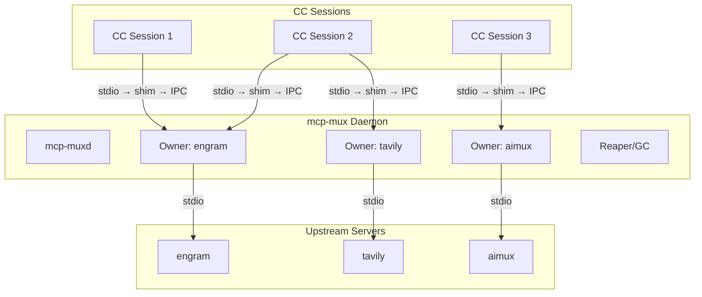
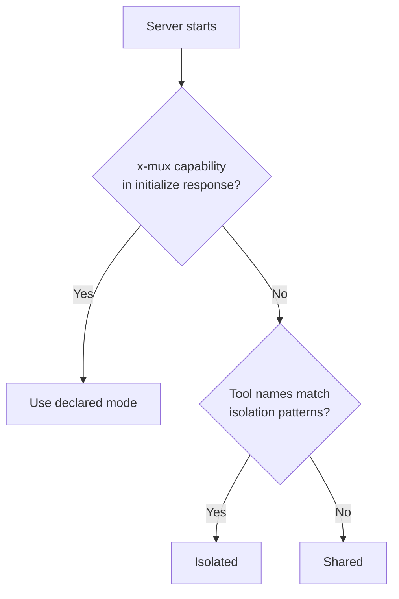

[English](README.md) | [Русский](README.ru.md)


# mcp-mux

Transparent stdio multiplexer that lets multiple Claude Code sessions share a single MCP server process.

One line change in `.mcp.json` — no other configuration required.

## The Problem

Each Claude Code session spawns its own copy of every configured MCP server (stdio transport). With
4 parallel sessions and 12 servers, that is 48 node/Python processes consuming roughly 4.8 GB of RAM.
Most MCP servers are stateless — they don't need per-session isolation.

## Architecture

mcp-mux consists of two components: a thin **shim** (the binary CC invokes) and a long-lived **daemon**
that owns upstream processes. Shims connect to the daemon via IPC; the daemon spawns and manages
upstream servers on behalf of all shims.



Each shim connects to the daemon owner for its upstream. If no daemon is running, the shim
auto-starts one. If no owner exists for a given server, the daemon spawns it.

Result: one upstream process per server instead of N — approximately 3x memory reduction.

## Quick Start

**1. Build**

```sh
# Linux / macOS
go build -o mcp-mux ./cmd/mcp-mux

# Windows
go build -o mcp-mux.exe ./cmd/mcp-mux
```

Place the binary somewhere on your PATH, or reference it by absolute path in `.mcp.json`.

**2. Configure**

Take any MCP server entry in `.mcp.json` and move the `command` into `args[0]`, replacing
`command` with `mcp-mux`:

Before:
```json
{
  "mcpServers": {
    "engram": {
      "command": "uvx",
      "args": ["engram-mcp-server", "--db", "/data/engram.db"]
    }
  }
}
```

After:
```json
{
  "mcpServers": {
    "engram": {
      "command": "mcp-mux",
      "args": ["uvx", "engram-mcp-server", "--db", "/data/engram.db"]
    }
  }
}
```

**3. Verify**

```sh
mcp-mux status
```

On the next CC session start, mcp-mux intercepts the stdio channel, connects to (or starts) the
daemon, and proxies all MCP traffic transparently.

## Sharing Modes

| Mode | Behavior | Use When |
|------|----------|----------|
| `shared` (default) | One upstream serves all sessions. Responses to `initialize`, `tools/list`, `prompts/list`, and `resources/list` are cached and replayed without a round-trip. | Stateless servers: search, docs, LLM proxy. |
| `isolated` | Each session gets its own upstream process. | Per-session state: browser automation, SSH, editor buffers. |
| `session-aware` | One upstream; sessions identified by injected `_meta.muxSessionId`. | Stateful servers that can partition in-process state by session key. |

Override mode for a specific server:

```sh
# Force isolation for one invocation
MCP_MUX_ISOLATED=1 mcp-mux uvx my-server

# CLI flag (equivalent)
mcp-mux --isolated uvx my-server
```

## Auto-Classification

When no explicit mode is set, mcp-mux classifies each server automatically using this priority order:

1. **`x-mux` capability** (highest) — server declares `x-mux.sharing` in its `initialize` response.
   Authoritative; overrides all heuristics.
2. **Tool-name heuristics** — tools with names matching browser, session, editor, navigate, page,
   tab, process, document, or snapshot patterns trigger isolation.
3. **Default** — `shared`.



If your server is stateless but has tool names that match isolation patterns, add
`"x-mux": { "sharing": "shared" }` to your `initialize` capabilities to fix the classification.

## Response Caching

In shared mode, the owner intercepts and caches the first response for each of these methods:

- `initialize`
- `tools/list`
- `prompts/list`
- `resources/list`
- `resources/templates/list`

Subsequent sessions receive the cached response immediately without a round-trip to the upstream.
Cache entries are invalidated when the upstream sends the corresponding `*_changed` notification
(`notifications/tools/list_changed`, `notifications/prompts/list_changed`,
`notifications/resources/list_changed`).

For `initialize`, the cache is keyed on `protocolVersion`. A new client using a different protocol
version bypasses the cache and goes to the upstream directly.

## Daemon Mode

The daemon is enabled by default. It starts automatically when the first mcp-mux shim connects and
no daemon is running.

**Lifecycle:**

- Shim connects → daemon starts or is reused.
- CC session exits → grace period begins (default 30 s).
- If no new session reconnects within the grace period → daemon stops the upstream process.
- Servers declaring `x-mux.persistent: true` skip the grace period; they stay alive indefinitely
  until explicitly stopped or until the daemon exits.
- Daemon auto-exits after 5 minutes with no owners and no connected sessions.

**Disable daemon mode** (legacy per-session owner behavior):

```sh
MCP_MUX_NO_DAEMON=1 mcp-mux uvx my-server
```

## Resilient Shim

mcp-mux shims automatically reconnect when the daemon restarts. This means:

- `mcp-mux upgrade` swaps the binary without dropping connections
- `mcp-mux stop --force` triggers automatic reconnect within seconds
- Daemon crashes are recovered transparently

During reconnect, the shim:
1. Detects IPC connection loss (daemon shutdown)
2. Buffers incoming CC requests (up to 1000 messages)
3. Sends keepalive notifications to prevent CC timeout
4. Starts a new daemon via `ensureDaemon()`
5. Re-spawns the upstream server via `spawnViaDaemon()`
6. Replays cached `initialize` request to warm the new owner
7. Flushes buffered requests and resumes normal proxy

Reconnect timeout: 30 seconds. If reconnect fails, the shim exits and CC restarts it.

## Session Transport Layer

mcp-mux v0.4.0 introduces a session transport layer that replaces the old `lastActiveSessionID`
heuristic with deterministic, per-session routing.

### Token handshake

When CC spawns a shim, the daemon generates a cryptographic token tied to that spawn's working
directory. The shim sends this token as the first line on the IPC connection:

```
CC → shim → [token\n] → Owner (SessionManager) → upstream
```

The Owner reads the token, looks up the corresponding `Session.Cwd`, and binds the IPC connection
to that session. From this point the session identity is authoritative — no heuristics required.

### Deterministic callback routing

The `SessionManager` tracks inflight requests per session. When exactly one session has pending
requests outstanding, response routing is deterministic without needing to inspect message content.
This eliminates spurious mis-routing in high-concurrency scenarios.

### roots/list forwarding

`roots/list` requests from the upstream are forwarded to the active CC session (the one with
pending requests), so the server receives the real workspace roots for that session rather than a
static fallback.

## Commands

```sh
# Show all running upstream instances (PID, sessions, classification, cache state)
mcp-mux status

# Stop all running instances and the daemon
mcp-mux stop [--drain-timeout 30s] [--force]

# Atomic binary upgrade (see section below)
mcp-mux upgrade

# Start a detached daemon process (normally auto-started by shims)
mcp-mux daemon

# Run as control-plane MCP server (exposes mux_list / mux_stop / mux_restart tools)
mcp-mux serve
```

## Atomic Upgrade

Upgrading the mcp-mux binary while sessions are active is safe:

```sh
# 1. Build new binary to a staging path
go build -o mcp-mux.exe~ ./cmd/mcp-mux

# 2. Swap atomically — stops active sessions, replaces binary, leaves upstream processes intact
mcp-mux upgrade
```

`upgrade` performs an atomic file rename using a two-step rename dance
(`current` → `.old`, `pending~` → `current`). If the pending binary is missing or the rename
fails, `upgrade` exits with an error and the existing binary is untouched.

After upgrade, MCP servers restart automatically on the next CC tool call — the shim reconnects
to a new daemon started by the new binary.

## Configuration

All configuration is via environment variables. No config file is required.

| Variable | Default | Description |
|----------|---------|-------------|
| `MCP_MUX_NO_DAEMON` | `0` | Set to `1` to disable daemon mode (legacy per-session owner) |
| `MCP_MUX_ISOLATED` | `0` | Set to `1` to force isolated mode for this invocation |
| `MCP_MUX_STATELESS` | `0` | Set to `1` to ignore cwd in server identity hash (enables global deduplication) |
| `MCP_MUX_GRACE` | `30s` | Grace period before an idle owner stops its upstream |
| `MCP_MUX_IDLE_TIMEOUT` | `5m` | Daemon auto-exit after this period with no activity |

## Control Plane MCP Server

`mcp-mux serve` exposes an MCP server on stdio with management tools. Add it to `.mcp.json` like
any other server:

```json
{
  "mcpServers": {
    "mcp-mux": {
      "command": "mcp-mux",
      "args": ["serve"]
    }
  }
}
```

**Tools:**

| Tool | Description |
|------|-------------|
| `mux_list` | Returns running instances for the **current project** (filtered by caller's cwd). Pass `all: true` to list instances across all projects. Includes server ID, PID, session count, pending requests, classification, and cache status. |
| `mux_stop` | Gracefully drains and stops an instance by `server_id`. Use `force: true` for immediate kill. |
| `mux_restart` | Stops an instance and spawns a fresh daemon owner with the same command. When called without arguments, resolves to the instance belonging to the caller's session (e.g. `mux_restart(name: "aimux")` restarts this project's aimux, not another project's). Connected sessions reconnect automatically on their next tool call. |

**Session-scoped control plane:**

The control plane is session-aware. Each tool call is resolved in the context of the calling
session's working directory:

- `mux_list` — shows only servers owned by the current project by default.
  Use `mux_list(all: true)` for a full view across all projects.
- `mux_restart(name: "aimux")` — resolves to the aimux instance started from this project's
  directory, not a same-named server from a different project.

This prevents accidental cross-project interference when multiple projects use the same server
name.

**Prompts:**

| Prompt | Description |
|--------|-------------|
| `mux-guide` | Full reference on architecture, classification, caching, and troubleshooting. |
| `mux-status-summary` | Calls `mux_list` and returns a human-readable summary. |

## For MCP Server Authors

Declare your server's sharing preference in the `initialize` response capabilities:

```json
{
  "protocolVersion": "2025-11-25",
  "capabilities": {
    "tools": {},
    "x-mux": {
      "sharing": "shared"
    }
  }
}
```

For stateless servers that don't depend on the client's working directory, add `"stateless": true`
to enable global deduplication — one upstream instance regardless of which directory CC is opened
from:

```json
{ "x-mux": { "sharing": "shared", "stateless": true } }
```

For session-aware servers, mcp-mux injects `_meta.muxSessionId` (format: `sess_` + 8 hex chars)
into every request. Use it to partition in-process state by session:

```json
{ "x-mux": { "sharing": "session-aware" } }
```

For servers that must stay alive across all session disconnects (e.g., expensive initialization,
background indexing), declare persistence:

```json
{ "x-mux": { "sharing": "shared", "persistent": true } }
```

Full protocol specification including implementation examples (TypeScript, Python, Go) and
migration path: [`docs/mux-protocol.md`](docs/mux-protocol.md).

## Contributing

```sh
# Run tests
go test ./...

# Run vet
go vet ./...

# Build
go build ./cmd/mcp-mux
```

Pull requests are welcome. Please ensure `go test ./...` and `go vet ./...` pass before submitting.
For significant changes, open an issue first to discuss the approach.

## License

MIT
