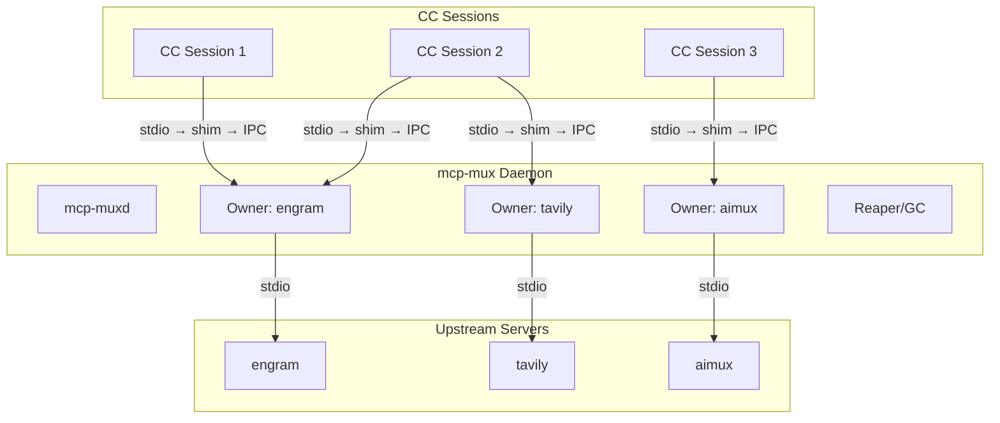
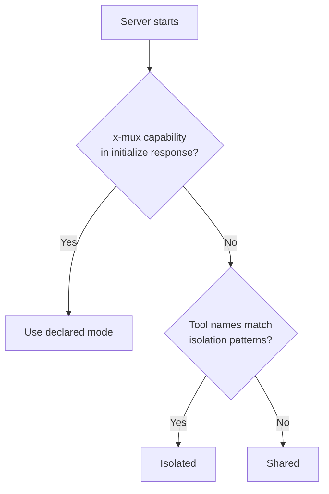

[English](README.md) | **Русский**


# mcp-mux

Прозрачный stdio-мультиплексор, позволяющий нескольким сессиям Claude Code совместно использовать один процесс MCP-сервера.

Одна строка в `.mcp.json` — никакой дополнительной настройки не требуется.

## Проблема

Каждая сессия Claude Code запускает собственную копию каждого настроенного MCP-сервера (stdio transport). При 4 параллельных сессиях и 12 серверах это 48 процессов node/Python, потребляющих около 4,8 ГБ оперативной памяти. Большинство MCP-серверов не хранят состояние — им не нужна изоляция на уровне сессии.

## Архитектура

mcp-mux состоит из двух компонентов: лёгкого **shim** (бинарник, который запускает CC) и долгоживущего **daemon**, владеющего upstream-процессами. Shim-ы подключаются к daemon через IPC; daemon запускает upstream-серверы и управляет ими от имени всех shim-ов.



Каждый shim подключается к daemon-владельцу своего upstream. Если daemon не запущен, shim стартует его автоматически. Если для нужного сервера ещё нет владельца, daemon запускает его.

Результат: один upstream-процесс на сервер вместо N — примерно трёхкратное снижение потребления памяти.

## Быстрый старт

**1. Сборка**

```sh
# Linux / macOS
go build -o mcp-mux ./cmd/mcp-mux

# Windows
go build -o mcp-mux.exe ./cmd/mcp-mux
```

Поместите бинарник в директорию из `PATH`, либо укажите абсолютный путь в `.mcp.json`.

**2. Настройка**

Возьмите любую запись MCP-сервера в `.mcp.json`, перенесите значение `command` в `args[0]`, а в `command` укажите `mcp-mux`:

До:
```json
{
  "mcpServers": {
    "engram": {
      "command": "uvx",
      "args": ["engram-mcp-server", "--db", "/data/engram.db"]
    }
  }
}
```

После:
```json
{
  "mcpServers": {
    "engram": {
      "command": "mcp-mux",
      "args": ["uvx", "engram-mcp-server", "--db", "/data/engram.db"]
    }
  }
}
```

**3. Проверка**

```sh
mcp-mux status
```

При следующем запуске сессии CC mcp-mux перехватит stdio-канал, подключится к daemon (или запустит его) и начнёт прозрачно проксировать весь MCP-трафик.

## Режимы совместного использования

| Режим | Поведение | Когда использовать |
|-------|----------|-------------------|
| `shared` (по умолчанию) | Один upstream обслуживает все сессии. Ответы на `initialize`, `tools/list`, `prompts/list` и `resources/list` кешируются и отдаются без обращения к upstream. | Серверы без состояния: поиск, документация, LLM-прокси. |
| `isolated` | Каждая сессия получает собственный upstream-процесс. | Состояние на уровне сессии: автоматизация браузера, SSH, буферы редактора. |
| `session-aware` | Один upstream; сессии идентифицируются по `_meta.muxSessionId`, который встраивается в каждый запрос. | Серверы с состоянием, способные разделять его внутри процесса по ключу сессии. |

Принудительно задать режим для конкретного сервера:

```sh
# Принудительная изоляция для одного вызова
MCP_MUX_ISOLATED=1 mcp-mux uvx my-server

# CLI-флаг (эквивалентно)
mcp-mux --isolated uvx my-server
```

## Автоматическая классификация

Если режим явно не задан, mcp-mux классифицирует каждый сервер автоматически по следующему приоритету:

1. **Capability `x-mux`** (наивысший приоритет) — сервер объявляет `x-mux.sharing` в ответе на `initialize`. Авторитетный источник; перекрывает все эвристики.
2. **Эвристики по именам инструментов** — инструменты, чьи имена соответствуют шаблонам browser, session, editor, navigate, page, tab, process, document или snapshot, переводят сервер в изолированный режим.
3. **По умолчанию** — `shared`.



Если ваш сервер не хранит состояние, но имена его инструментов совпадают с шаблонами изоляции, добавьте `"x-mux": { "sharing": "shared" }` в capabilities в ответе `initialize`, чтобы исправить классификацию.

## Кеширование ответов

В режиме `shared` владелец перехватывает и кеширует первый ответ для каждого из следующих методов:

- `initialize`
- `tools/list`
- `prompts/list`
- `resources/list`
- `resources/templates/list`

Последующие сессии получают кешированный ответ немедленно, без обращения к upstream. Кеш инвалидируется, когда upstream присылает уведомление `*_changed` (`notifications/tools/list_changed`, `notifications/prompts/list_changed`, `notifications/resources/list_changed`).

Для `initialize` кеш индексируется по `protocolVersion`. Клиент с другой версией протокола обходит кеш и обращается к upstream напрямую.

## Cache-only запуск и отложенная материализация

При первом запуске команды в новом security context mcp-mux создаёт upstream
и отправляет синтетические `initialize`, `notifications/initialized` и
`tools/list`. Так owner определяет sharing mode и публикует совместимый шаблон
discovery-кеша.

После удаления этого owner следующая совместимая сессия может создать
**cache-only owner** без процесса upstream:

- кешированные `initialize`, `tools/list` и сохранённые prompt/resource-ответы
  возвращаются без запуска процесса;
- `notifications/initialized` подавляется, пока upstream отсутствует;
- первый запрос без кешированного ответа запускает ровно одно поколение
  upstream и передаётся с исходным JSON-RPC id по тому же открытому transport;
- `mcp-mux status` показывает `materialization_state: "CACHE_ONLY"` и
  `upstream_pid: 0`, а после первого спроса — `READY` и pid процесса.

Повторное использование шаблона работает в fail-closed режиме. Отсутствующий,
устаревший или несовместимый шаблон ведёт к одному ограниченному cold/eager
запуску без воспроизведения чужого кеша. Совместимость требует точного
SHA-256 identity эффективного security-relevant environment; для isolated
шаблонов также нужен точный canonical working directory. Исходные значения
environment не сохраняются в identity и не выводятся в status. Persistent owner
и явно eager-сценарии по-прежнему запускаются без ожидания запроса.

Для медленно запускающихся серверов (Serena через uvx — около 3 секунд, Tavily
через npx — около 5 секунд) cache-only шаблон ускоряет host startup, а стоимость
запуска переносится на момент реального обращения к серверу.

## Daemon-режим

Daemon включён по умолчанию. Он запускается автоматически при подключении первого shim, если ни один daemon ещё не работает.

**Жизненный цикл:**

- Shim подключается → daemon стартует или переиспользуется.
- Инициализированный неперсистентный shim без запросов и очереди через 10 минут
  без трафика от host паркует свою daemon IPC-сессию. При новом запросе host
  shim переподключается к тому же owner.
- Если ещё 30 секунд нет спроса, stable launcher паркует и engine. Следующий
  host frame запускает текущий active engine, воспроизводит кешированный
  `initialize` и передаёт этот frame ровно один раз.
- После отключения последней сессии muxcore может очистить disposable owner
  через 30 секунд после повторной проверки безопасности. Общий таймаут простоя
  owner остаётся равным 10 минутам; isolated owner очищается раньше по
  отдельному таймауту.
- Серверы с `x-mux.persistent: true` не приостанавливаются и не очищаются в
  простое: они работают до явной остановки или завершения daemon.
- Daemon завершает работу автоматически через 5 минут при отсутствии владельцев и подключённых сессий.

`MCPMUX_SHIM_IDLE_TIMEOUT` и `MCPMUX_SHIM_DORMANT_GRACE` переопределяют
10-минутную и 30-секундную стадии shim строками длительности Go. Нуль или
отрицательное значение отключает соответствующую стадию, а неверное оставляет
значение по умолчанию. Эти параметры не заменяют настройки
очистки owner и автозавершения daemon.

Веб-панель Serena настраивается отдельно от жизненного цикла mux. Чтобы
браузер не открывался автоматически, передайте команде Serena
`--open-web-dashboard false` для команды `start-mcp-server` или задайте
`web_dashboard_open_on_launch: false` в `serena_config.yml`; dashboard при
этом остаётся активным. Если dashboard нужно отключить полностью, используйте
`web_dashboard: false`. Подробнее — в
[документации Serena](https://oraios.github.io/serena/02-usage/060_dashboard.html).

**Отключить daemon-режим** (устаревшее поведение с владельцем на уровне сессии):

```sh
MCP_MUX_NO_DAEMON=1 mcp-mux uvx my-server
```

## Устойчивый shim

Shim-ы mcp-mux автоматически переподключаются при перезапуске daemon. Это означает:

- `mcp-mux upgrade` переключает active versioned engine без разрыва соединений
- `mcp-mux stop --force` вызывает автоматическое переподключение в течение нескольких секунд
- После сбоя daemon сохраняется stdio-транспорт; уже отправленные запросы получают явные ошибки

В процессе переподключения shim:
1. Обнаруживает потерю IPC-соединения (завершение daemon)
2. Завершает осиротевшие незавершённые запросы — отправляет CC корректные JSON-RPC ошибки,
   чтобы клиент видел явный отказ по каждому pending-запросу, а не молчание (именно по
   молчанию на pending-запросе stdio-транспорт CC разрывает соединение)
3. Сначала пытается пройти запланированный путь переподключения, включая обновление reconnect-token
4. При необходимости запускает replacement daemon или ждёт его готовности
5. Воспроизводит кешированный запрос `initialize` для прогрева replacement owner
6. Отправляет `notifications/tools/list_changed`, чтобы host обновил discovery
7. Передаёт допустимые буферизованные запросы и возобновляет проксирование

Переподключение сохраняет транспорт, а не воспроизводит запросы. Запрос, уже
отправленный потерянному owner, получает одну JSON-RPC ошибку с исходным id и
никогда не передаётся successor. Повторно отправляется только кешированный
`initialize`, чтобы прогреть replacement connection; принятые после этого host
frames передаются один раз.

Таймаут переподключения — 30 секунд. Если путь переподключения настроен, но
backend недоступен и после этого срока, shim не завершает работу: он переходит
в degraded retry, возвращает новым запросам JSON-RPC ошибки с исходным id и
сохраняет родительский stdio-транспорт. Проксирование возобновляется на том же
транспорте после восстановления backend. Shim завершится, только если MCP host
закроет stdin/stdout или путь переподключения не настроен.

> **О keep-alive.** В ранних версиях shim отправлял синтетические `notifications/progress`
> с токеном `mux-reconnect` каждые 5 секунд как keep-alive. Это нарушало спецификацию MCP
> (progress-токен обязан ссылаться на ранее выданный клиентом `_meta.progressToken`), и
> Claude Code рвал stdio-транспорт на первом неизвестном токене — уничтожая то самое
> соединение, которое shim пытался сохранить. Keep-alive убрали в muxcore v0.19.6;
> `drainOrphanedInflight` — его корректная замена.

## Транспортный уровень сессий

mcp-mux v0.4.0 вводит транспортный уровень сессий, который заменяет старую эвристику
`lastActiveSessionID` детерминированной маршрутизацией с привязкой к конкретной сессии.

### Token-рукопожатие

При запуске shim daemon генерирует криптографический токен, привязанный к рабочей директории
этого запуска. Shim отправляет токен первой строкой при IPC-подключении:

```
CC → shim → [token\n] → Owner (SessionManager) → upstream
```

Owner читает токен, находит соответствующий `Session.Cwd` и привязывает IPC-соединение к
этой сессии. С этого момента идентификатор сессии авторитетен — никаких эвристик не требуется.

**Обязательная проверка handshake (с v0.9.10).** Owner отвергает IPC-соединения с пустым или
незарегистрированным токеном в режиме daemon. Отказы логируются на уровне owner вместе с PID
собеседника (без значения токена), с ограничением 10 записей в минуту на owner и итоговой
строкой о числе подавленных отказов. Предварительно зарегистрированный токен не потребляется
при отказе — это позволяет легитимному клиенту, закрывшему соединение посреди handshake,
переподключиться без повторной выдачи токена демоном. Токены — 128 бит (16 случайных байт из
`crypto/rand`); отсутствие энтропии фатально.

### Детерминированная маршрутизация ответов

`SessionManager` отслеживает незавершённые запросы по каждой сессии. Когда у единственной
сессии есть ожидающие запросы, маршрутизация ответов детерминирована без анализа содержимого
сообщений. Это устраняет ошибочную маршрутизацию в высоконагруженных сценариях.

### Проксирование roots/list

Запросы `roots/list` от upstream перенаправляются в активную CC-сессию (ту, у которой есть
ожидающие запросы), поэтому сервер получает реальные корни рабочего пространства для этой
сессии, а не статический fallback.

## Модель безопасности

mcp-mux рассчитан на **однопользовательскую локальную границу доверия**: любой процесс,
запущенный от того же OS-пользователя, считается доверенным по умолчанию. Два слоя защиты
закрывают межпользовательскую границу на общих Unix-хостах:

### Приложение: обязательный handshake

Owner `acceptLoop` отвергает IPC-соединения с пустым или незарегистрированным токеном (режим
daemon). В сочетании с 128-битными токенами из `crypto/rand` и одноразовой семантикой `Bind`
это закрывает единственную щель для имперсонации на уровне приложения на data-socket.

### ОС: права 0600 на Unix

Все Unix-сокеты, создаваемые через `ipc.Listen`, и control-socket демона проходят через
пакет `muxcore/sockperm`, который применяет `syscall.Umask(0177)` под package-level mutex —
сокет создаётся с правами `0600` и доступен только владельцу UID. На Windows AF_UNIX-сокеты
наследуют DACL создающего процесса по умолчанию (владелец + LocalSystem), поэтому аналог
umask не требуется и пакет — документированный no-op.

### От чего mcp-mux НЕ защищает

- **Вредоносный процесс под тем же пользователем.** Процесс с вашим UID всё равно может
  подключиться к вашему 0600 control-сокету и через собственный `spawn` запрос получить новый
  предварительно зарегистрированный токен. Считайте control-сокет доверенным всему, что
  запущено от вашего имени.
- **Сетевых атакующих.** mcp-mux использует только Unix-сокеты / Windows AF_UNIX — TCP-listener
  отсутствует. Удалённая поверхность атаки равна нулю.
- **Сами upstream MCP-серверы.** mcp-mux — прозрачный прокси; если upstream-сервер запускает
  `exec.Command` над аргументами атакующего, mcp-mux не переписывает и не санитизирует их.

### Многопользовательское развёртывание

Для общих Unix-хостов (несколько login-пользователей) mcp-mux версии v0.9.10 и новее безопасен
на межпользовательской границе: права `0600` запрещают `connect()` от чужого пользователя, а
обязательный handshake отклоняет попытки подключения от того же пользователя без предварительно
выданного демоном токена.

## Команды

```sh
# Показать все запущенные upstream-экземпляры (PID, сессии, классификация, состояние кеша)
mcp-mux status

# Остановить все запущенные экземпляры и daemon
mcp-mux stop [--drain-timeout 30s] [--force]

# Обновление versioned engine (см. раздел ниже)
mcp-mux upgrade

# Запустить отдельный daemon-процесс (обычно запускается автоматически shim-ами)
mcp-mux daemon

# Запустить как MCP-сервер управляющей плоскости (предоставляет инструменты mux_list / mux_stop / mux_restart)
mcp-mux serve
```

## Обновление versioned engine

`mcp-mux upgrade` переключает active versioned engine без разрыва stdio-транспорта.
С `--restart` применяются ограничения жизненного цикла ниже; без него текущий
daemon продолжает работать на прежнем engine до естественного рестарта, а новые
shim-процессы используют active engine.

Этот раздел описывает обновлятор продукта `mcp-mux`. Если вы встраиваете
`muxcore` в другой продукт, начинайте с `muxcore/README.md` и выбирайте для
этого продукта собственные launcher, engine path, имя staged-бинаря и
поверхность status/update, а не копируйте слепо схему
`mcp-mux.exe~` / `mcp-mux.versions`.

```sh
# Обновление с graceful restart
go build -o mcp-mux.exe~ ./cmd/mcp-mux && mcp-mux upgrade --restart
```

`mcp-mux.exe` теперь играет роль стабильного launcher. `upgrade` не переименовывает
запущенный launcher: staged `mcp-mux.exe~` переносится или копируется в
`mcp-mux.versions/<hash>/mcp-mux-engine.exe`, а `mcp-mux.versions/active.txt`
переключается на новую версию engine. Это важно для Windows: живые shim/daemon
процессы держат image lock на настроенном `mcp-mux.exe`, поэтому self-rename
этого файла не является надёжной операцией обновления.

**Без `--restart`** переключается только active pointer:

```sh
mcp-mux upgrade
```

Daemon продолжает работать на текущем engine, а новые shim используют новый
active engine. Daemon обновится при следующем естественном рестарте.

Когда graceful restart с той же версией протокола безопасен, он сохраняет:

- **дерево процессов upstream** — handoff v2 оставляет его живым после
  подтверждения successor; при наличии живых сессий рестарт daemon откладывается;
- кешированные MCP-ответы: `initialize`, tools, prompts и resources;
- классификацию сервера: shared, isolated или session-aware;
- метаданные сессий: cwd и env;
- историю reconnect-token, чтобы живые shim обновляли токен без fallback spawn
  нового owner во время планового рестарта.

Перезапускается только daemon: upstream переподключаются через передачу FD
(SCM_RIGHTS в Unix, `DuplicateHandle` в Windows). Полный контракт жизненного
цикла описан ниже.

## Жизненный цикл upstream — транзакционный рестарт и очистка всего дерева (v0.27.0)

Handoff protocol v2 сохраняет дерево процессов upstream при плановом рестарте
daemon с той же версией протокола только после того, как successor примет stdio
и полномочия над деревом. Переподключение после потери owner сохраняет
stdio-транспорт, но не воспроизводит уже отправленные запросы.

### Контракт

| Триггер | До v0.21.0 | Контракт v0.27.0 |
|---|---|---|
| `mcp-mux upgrade --restart` с живыми сессиями | Upstream убивался и перезапускался, активные запросы терялись | Рестарт daemon откладывается: существующие stdio-транспорты остаются на текущем daemon, а новые shim используют новый указатель engine |
| `mcp-mux upgrade --restart` без живых сессий | Upstream убивался и перезапускался, активные запросы терялись | Handoff v2 сохраняет дерево upstream; первый рестарт с v1 на v2 выполняет один ограниченный snapshot-backed respawn |
| Потеря daemon или owner | Жизненный цикл upstream зависел от лидирующего процесса | Восстановление запускается спросом; заброшенные поколения очищаются как полные деревья, а уже отправленные запросы получают явные ошибки без воспроизведения |
| `mux_restart <sid>` (инициировано оператором) | Жёсткое убийство — без изменений | Жёсткое убийство — без изменений (явное намерение оператора) |
| Idle-вытеснение reaper'ом | Жёсткий SIGKILL | Мягкое закрытие: 30s слив stdin → SIGTERM только по таймауту |

### Как это работает

**Unix (Linux, macOS, \*BSD):**

- Upstream спавнится с `Setpgid=true` — ядро помещает потомка в собственную process group.
- Плановый рестарт: старый daemon открывает Unix domain socket, новый daemon подключается
  с 128-битным общим токеном, FDs (stdin, stdout, stderr) передаются через SCM_RIGHTS ancillary
  control message.
- Очистка нацеливается на process group, включая потомков, которые пережили
  лидера или унаследовали его stdio. При handoff v2 полномочия над PGID сохраняются
  до окончательного подтверждения принятия successor.

**Windows:**

- Каждый upstream запускается приостановленным и до выполнения помещается в
  собственный анонимный Job Object с `JOB_OBJECT_LIMIT_KILL_ON_JOB_CLOSE`.
- При плановом рестарте successor запускается с адресом named pipe; handles,
  включая полномочия Job Object, дублируются через `DuplicateHandle` с
  `DUPLICATE_SAME_ACCESS`.
- Предшественник сохраняет lease Job Object, пока successor не подтвердит
  принятие; при отмене или окончательной потере полномочий завершается всё дерево.

### Протокол handoff

Старый daemon и successor обмениваются JSON-сообщениями через socket; каждое
сообщение содержит `protocol_version: 2`:

```
Hello ──(token, source_pid)──>
       <──(protocol_version check, refs list)── Ready
FdTransfer ──(server_id, stdio + tree-authority metadata)──>
             <──(SCM_RIGHTS / DuplicateHandle)── AckTransfer (ok/aborted)
       ...повтор для каждого upstream...
Done   ──(transferred, aborted lists)──>
       <──(accepted + aborted partition)── HandoffAck
```

- **Аутентификация токеном (FR-11):** сравнение с постоянным временем выполнения,
  128 случайных бит, права файла 0600.
- **Атомарность каждого upstream (FR-7):** получение данных не отсоединяет
  predecessor. Дерево передаётся только после финального подтверждения принятия
  этого `server_id`; все остальные подготовленные деревья отменяются и могут быть
  восстановлены из snapshot.
- **Таймаут accept и общий таймаут — 30 секунд** с обеих сторон.
- **Расхождение версий (FR-3):** согласование завершается до отсоединения
  owner. Несовпадение `protocol_version` или токена, таймаут accept и ошибка
  запуска handoff-successor отменяют рестарт: daemon освобождает restart pin,
  не запускает fallback и оставляет predecessor в рабочем состоянии.

### Деградация по FR-8

Snapshot fallback разрешён только после точного Hello и отсоединения owner.
При последующей ошибке receipt или final ACK daemon подтверждает остановку
неудачного successor, завершает подготовленное дерево, повторно записывает
удержанный snapshot и заранее запускает ровно один чистый snapshot-successor.
Только после этого control-ответ разрешает выключить predecessor.

Рестарт без process-backed owner также заранее запускает один
snapshot-successor. Ошибка до отсоединения логируется как `handoff.abort`;
успешное восстановление после отсоединения — как `handoff.fallback`. Если
нельзя подтвердить остановку successor, записать snapshot или запустить backup,
daemon логирует `handoff.fallback_blocked` и остаётся в fail-closed состоянии.
`drainOrphanedInflight` возвращает незавершённым запросам JSON-RPC-ошибки
с исходным id и не воспроизводит их.

### Видимость для оператора

Новые счётчики в `mux_list` / `HandleStatus`: `handoff_attempted`, `handoff_transferred`,
`handoff_aborted`, `handoff_fallback`. Структурированные маркеры логов: `handoff.start`,
`handoff.abort`, `handoff.upstream.transferred`, `handoff.complete`, `handoff.fallback`,
`handoff.fallback_blocked`, `handoff.receive.{start,complete,fail}`.

### Миграция на v0.27.0

Изменения кода не требуются. Первый рестарт с бинаря с handoff v1 на v0.27.0
отклоняет live transfer до отсоединения и выполняет один ограниченный
snapshot-backed respawn. Последующие плановые рестарты v2-to-v2 транзакционно
сохраняют stdio и полномочия над деревом. Откат через ту же границу v2/v1 снова
выполняет ограниченный respawn; не принуждайте mixed-version live handoff.

### Известные ограничения

- **Граница смены протокола:** первый handoff v1 → v2 и откат через ту же
  границу отклоняют live transfer до отсоединения owner и выполняют один
  ограниченный snapshot-backed shutdown-and-respawn. Рестарты v2 → v2
  сохраняют stdio и полномочия над полным деревом только после финального
  подтверждения successor.
- **Ограничение передачи одного upstream — 30 секунд:** upstream, который не
  завершил drain за 30 секунд, отдельно переходит на respawn.
- **macOS launchd и смена parent:** сценарий проверяется в CI; процессы вне
  дерева mcp-mux корректно наследуются.
- **Дерево процессов Windows:** каждый upstream управляется Job Object с
  `JOB_OBJECT_LIMIT_KILL_ON_JOB_CLOSE`; окончательная потеря полномочий
  намеренно завершает всех потомков, включая переживших лидера.

### Проверка после развёртывания

```sh
# Unix
scripts/verify-handoff.sh

# Windows
scripts\verify-handoff.ps1
```

Скрипт запускает тестовый daemon, выполняет `upgrade --restart`, проверяет,
что все PID upstream сохранились после рестарта, и сообщает о потерянных файловых
дескрипторах.

### Интеграция с библиотекой muxcore

Если вы встраиваете `muxcore` в другой Go MCP-сервер, начинайте с
`muxcore/README.md`. Рекомендуемый путь интеграции — `engine.New` +
`engine.Run`: тогда muxcore сам выбирает режим `daemon`, `client/shim` или
`proxy`, управляет рукопожатием с токеном, переподключением, маршрутизацией
сессий, восстановлением snapshot и graceful restart.

Низкоуровневые handoff-функции из `muxcore/daemon` остаются публичными для
кастомных supervisor-процессов daemon, но обычным потребителям не следует
собирать собственный shim или подключаться напрямую к IPC-пути owner. Такой
обход пропускает сессионный токен, который выдаёт daemon, и owner под
управлением daemon корректно отклонит подключение.

В `muxcore/README.md` описаны чек-лист для потребителей, обязательные поля
`engine.Config`, контракт обновления и launcher, защитные ограничения и
низкоуровневый handoff API. Там же зафиксировано правило дизайна API muxcore:
если безопасное поведение можно вывести внутри `engine`, muxcore должен делать
это сам; если конфигурация неоднозначна, он должен падать рано и с понятной
ошибкой.

### Ссылки

- Спецификация: `.agent/specs/upstream-survives-daemon-restart/spec.md`
- Engram: `#109` (разрешение арки), `#130` (экспорт публичного API для aimux-подобных потребителей)

## Конфигурация

Вся конфигурация задаётся через переменные окружения. Файл конфигурации не требуется.

| Переменная | По умолчанию | Описание |
|------------|-------------|----------|
| `MCP_MUX_NO_DAEMON` | `0` | Установите `1`, чтобы отключить daemon-режим (устаревший владелец на уровне сессии) |
| `MCP_MUX_ISOLATED` | `0` | Установите `1`, чтобы принудительно включить изолированный режим для данного вызова |
| `MCP_MUX_STATELESS` | `0` | Установите `1`, чтобы игнорировать cwd при хешировании идентичности сервера (включает глобальную дедупликацию) |
| `MCPMUX_SHIM_IDLE_TIMEOUT` | `10m` | Период безопасного простоя host до парковки daemon IPC-сессии неpersistent shim; ноль или отрицательное значение отключает стадию |
| `MCPMUX_SHIM_DORMANT_GRACE` | `30s` | Окно ожидания точного owner до парковки engine stable launcher; ноль или отрицательное значение отключает стадию |
| `MCP_MUX_OWNER_IDLE` | `10m` | Общий таймаут простоя owner; для owner его может переопределить `x-mux.idleTimeout` |
| `MCP_MUX_GRACE` | `10m` | Устаревший псевдоним, используется, только если `MCP_MUX_OWNER_IDLE` не задан |
| `MCP_MUX_IDLE_TIMEOUT` | `5m` | Автоматическое завершение daemon по истечении этого периода без активности |

## MCP-сервер управляющей плоскости

`mcp-mux serve` предоставляет MCP-сервер через stdio с инструментами управления. Добавьте его в `.mcp.json` как любой другой сервер:

```json
{
  "mcpServers": {
    "mcp-mux": {
      "command": "mcp-mux",
      "args": ["serve"]
    }
  }
}
```

**Инструменты:**

| Инструмент | Описание |
|-----------|----------|
| `mux_list` | Возвращает запущенные экземпляры **текущего проекта** внутри daemon namespace продукта `mcp-mux` (фильтруется по cwd вызывающей сессии). Передайте `all: true` для получения экземпляров всех проектов в этом daemon. Включает идентификатор сервера, engine name, PID, количество сессий, ожидающие запросы, классификацию и состояние кеша. |
| `mux_stop` | Корректно завершает работу экземпляра по `server_id` после дрейна запросов. Используйте `force: true` для немедленного завершения. |
| `mux_restart` | Останавливает экземпляр и запускает новый daemon-владелец с той же командой. При вызове без явного указания разрешается в экземпляр, принадлежащий текущей сессии (например, `mux_restart(name: "aimux")` перезапускает aimux этого проекта, а не другого). Подключённые сессии переподключаются автоматически при следующем вызове инструмента. |

**Управляющая плоскость с привязкой к сессии:**

Управляющая плоскость — session-aware. Каждый вызов инструмента разрешается в
контексте рабочей директории вызывающей сессии:

- `mux_list` — по умолчанию отображает только серверы текущего проекта.
  Используйте `mux_list(all: true)` для полного представления по всем проектам
  в daemon namespace продукта `mcp-mux`.
- `mux_restart(name: "aimux")` — разрешается в экземпляр aimux, запущенный из директории
  текущего проекта, а не из другого проекта с тем же именем сервера.

Это предотвращает случайное взаимное влияние проектов, когда несколько проектов используют
серверы с одинаковыми именами.

Нативные muxcore-продукты вроде `aimux` или `engram` при прямом встраивании
muxcore работают под собственными engine namespace. Они не появляются в
`mcp-mux serve`, если не были запущены через daemon продукта `mcp-mux`.
Проверяйте и обновляйте такие продукты через их собственные MCP/CLI
health/status/update поверхности или через будущий явный cross-engine registry.

**Промпты:**

| Промпт | Описание |
|--------|----------|
| `mux-guide` | Полный справочник по архитектуре, классификации, кешированию и устранению неполадок. |
| `mux-status-summary` | Вызывает `mux_list` и возвращает читаемую сводку. |

## Для авторов MCP-серверов

Объявите предпочтительный режим совместного использования в capabilities ответа `initialize`:

```json
{
  "protocolVersion": "2025-11-25",
  "capabilities": {
    "tools": {},
    "x-mux": {
      "sharing": "shared"
    }
  }
}
```

Для серверов без состояния, не зависящих от рабочей директории клиента, добавьте `"stateless": true`, чтобы включить глобальную дедупликацию — один upstream-экземпляр независимо от директории, из которой открыт CC:

```json
{ "x-mux": { "sharing": "shared", "stateless": true } }
```

Для session-aware серверов mcp-mux добавляет в каждый запрос:

- `_meta.muxSessionId` — уникальный идентификатор сессии (формат:
  `sess_` + 8 шестнадцатеричных символов);
- `_meta.muxCwd` — каталог проекта сессии CC для серверов с
  `--project-from-cwd`;
- `_meta.muxEnv` — отличающиеся значения переменных окружения сессии: API-ключи
  и пути конфигурации.

```json
{ "x-mux": { "sharing": "session-aware" } }
```

Для серверов, которые должны оставаться активными при отключении всех сессий (например, ресурсоёмкая инициализация, фоновая индексация), объявите персистентность:

```json
{ "x-mux": { "sharing": "shared", "persistent": true } }
```

Полная спецификация протокола с примерами реализации (TypeScript, Python, Go) и путём миграции: [`docs/mux-protocol.md`](docs/mux-protocol.md).

## Smoke-тестирование

mcp-mux содержит smoke-тест поведения mux с реальными upstream-серверами:

```sh
# Базовый сценарий: проверить Serena через mux
SMOKE_CWD=D:/Dev/my-project SMOKE_EXPECT=isolated \
  go run testdata/smoke_isolated.go uvx --from git+https://github.com/oraios/serena \
  serena start-mcp-server --project-from-cwd

# Проверка изоляции: два проекта получают разных owner
SMOKE_CWD=D:/Dev/project-a SMOKE_CWD2=D:/Dev/project-b SMOKE_EXPECT=isolated \
  go run testdata/smoke_isolated.go uvx --from serena ...

# С вызовом инструмента
SMOKE_CWD=D:/Dev/my-project SMOKE_TOOL=activate_project \
  go run testdata/smoke_isolated.go uvx --from serena ...
```

**Что проверяется** (поведение mux, а не корректность upstream):

- запуск через daemon с проактивной инициализацией;
- соответствие классификации ожидаемому режиму;
- изоляция сессий: разные cwd получают разных owner для isolated-серверов;
- корректная передача ответа `initialize` через mux;
- при заданном параметре — передача вызова инструмента и возврат ответа.

## Участие в разработке

```sh
# Запустить тесты
go test ./...

# Запустить vet
go vet ./...

# Сборка
go build ./cmd/mcp-mux
```

Pull-request'ы приветствуются. Перед отправкой убедитесь, что `go test ./...` и `go vet ./...` проходят без ошибок. Для значительных изменений сначала откройте issue, чтобы обсудить подход.

## Лицензия

MIT
