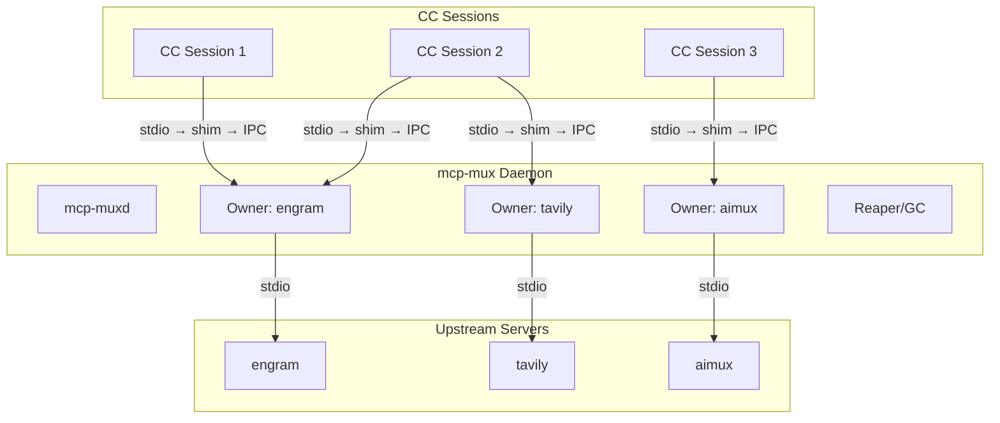
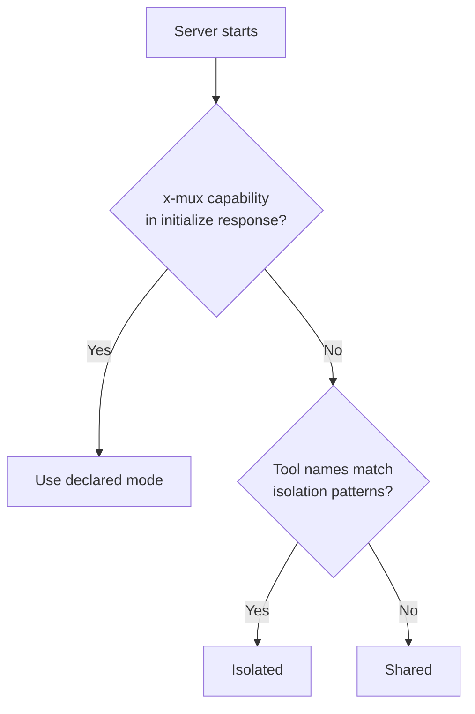

[English](README.md) | **Русский**


# mcp-mux

Прозрачный stdio-мультиплексор, позволяющий нескольким сессиям Claude Code совместно использовать один процесс MCP-сервера.

Одна строка в `.mcp.json` — никакой дополнительной настройки не требуется.

## Проблема

Каждая сессия Claude Code запускает собственную копию каждого настроенного MCP-сервера (stdio transport). При 4 параллельных сессиях и 12 серверах это 48 процессов node/Python, потребляющих около 4,8 ГБ оперативной памяти. Большинство MCP-серверов не хранят состояние — им не нужна изоляция на уровне сессии.

## Архитектура

mcp-mux состоит из двух компонентов: лёгкого **shim** (бинарник, который запускает CC) и долгоживущего **daemon**, владеющего upstream-процессами. Shim-ы подключаются к daemon через IPC; daemon запускает upstream-серверы и управляет ими от имени всех shim-ов.



Каждый shim подключается к daemon-владельцу своего upstream. Если daemon не запущен, shim стартует его автоматически. Если для нужного сервера ещё нет владельца, daemon запускает его.

Результат: один upstream-процесс на сервер вместо N — примерно трёхкратное снижение потребления памяти.

## Быстрый старт

**1. Сборка**

```sh
# Linux / macOS
go build -o mcp-mux ./cmd/mcp-mux

# Windows
go build -o mcp-mux.exe ./cmd/mcp-mux
```

Поместите бинарник в директорию из `PATH`, либо укажите абсолютный путь в `.mcp.json`.

**2. Настройка**

Возьмите любую запись MCP-сервера в `.mcp.json`, перенесите значение `command` в `args[0]`, а в `command` укажите `mcp-mux`:

До:
```json
{
  "mcpServers": {
    "engram": {
      "command": "uvx",
      "args": ["engram-mcp-server", "--db", "/data/engram.db"]
    }
  }
}
```

После:
```json
{
  "mcpServers": {
    "engram": {
      "command": "mcp-mux",
      "args": ["uvx", "engram-mcp-server", "--db", "/data/engram.db"]
    }
  }
}
```

**3. Проверка**

```sh
mcp-mux status
```

При следующем запуске сессии CC mcp-mux перехватит stdio-канал, подключится к daemon (или запустит его) и начнёт прозрачно проксировать весь MCP-трафик.

## Режимы совместного использования

| Режим | Поведение | Когда использовать |
|-------|----------|-------------------|
| `shared` (по умолчанию) | Один upstream обслуживает все сессии. Ответы на `initialize`, `tools/list`, `prompts/list` и `resources/list` кешируются и отдаются без обращения к upstream. | Серверы без состояния: поиск, документация, LLM-прокси. |
| `isolated` | Каждая сессия получает собственный upstream-процесс. | Состояние на уровне сессии: автоматизация браузера, SSH, буферы редактора. |
| `session-aware` | Один upstream; сессии идентифицируются по `_meta.muxSessionId`, который встраивается в каждый запрос. | Серверы с состоянием, способные разделять его внутри процесса по ключу сессии. |

Принудительно задать режим для конкретного сервера:

```sh
# Принудительная изоляция для одного вызова
MCP_MUX_ISOLATED=1 mcp-mux uvx my-server

# CLI-флаг (эквивалентно)
mcp-mux --isolated uvx my-server
```

## Автоматическая классификация

Если режим явно не задан, mcp-mux классифицирует каждый сервер автоматически по следующему приоритету:

1. **Capability `x-mux`** (наивысший приоритет) — сервер объявляет `x-mux.sharing` в ответе на `initialize`. Авторитетный источник; перекрывает все эвристики.
2. **Эвристики по именам инструментов** — инструменты, чьи имена соответствуют шаблонам browser, session, editor, navigate, page, tab, process, document или snapshot, переводят сервер в изолированный режим.
3. **По умолчанию** — `shared`.



Если ваш сервер не хранит состояние, но имена его инструментов совпадают с шаблонами изоляции, добавьте `"x-mux": { "sharing": "shared" }` в capabilities в ответе `initialize`, чтобы исправить классификацию.

## Кеширование ответов

В режиме `shared` владелец перехватывает и кеширует первый ответ для каждого из следующих методов:

- `initialize`
- `tools/list`
- `prompts/list`
- `resources/list`
- `resources/templates/list`

Последующие сессии получают кешированный ответ немедленно, без обращения к upstream. Кеш инвалидируется, когда upstream присылает уведомление `*_changed` (`notifications/tools/list_changed`, `notifications/prompts/list_changed`, `notifications/resources/list_changed`).

Для `initialize` кеш индексируется по `protocolVersion`. Клиент с другой версией протокола обходит кеш и обращается к upstream напрямую.

## Daemon-режим

Daemon включён по умолчанию. Он запускается автоматически при подключении первого shim, если ни один daemon ещё не работает.

**Жизненный цикл:**

- Shim подключается → daemon стартует или переиспользуется.
- Сессия CC завершается → начинается grace period (по умолчанию 30 с).
- Если в течение grace period новая сессия не подключилась → daemon останавливает upstream-процесс.
- Серверы, объявившие `x-mux.persistent: true`, не ждут grace period — они остаются живыми до явной остановки или до завершения daemon.
- Daemon завершает работу автоматически через 5 минут при отсутствии владельцев и подключённых сессий.

**Отключить daemon-режим** (устаревшее поведение с владельцем на уровне сессии):

```sh
MCP_MUX_NO_DAEMON=1 mcp-mux uvx my-server
```

## Устойчивый shim

Shim-ы mcp-mux автоматически переподключаются при перезапуске daemon. Это означает:

- `mcp-mux upgrade` заменяет бинарник без разрыва соединений
- `mcp-mux stop --force` вызывает автоматическое переподключение в течение нескольких секунд
- Сбои daemon восстанавливаются прозрачно

В процессе переподключения shim:
1. Обнаруживает потерю IPC-соединения (завершение daemon)
2. Завершает осиротевшие незавершённые запросы — отправляет CC корректные JSON-RPC ошибки,
   чтобы клиент видел явный отказ по каждому pending-запросу, а не молчание (именно по
   молчанию на pending-запросе stdio-транспорт CC разрывает соединение)
3. Буферизует входящие запросы CC (до 1000 сообщений)
4. Запускает новый daemon через `ensureDaemon()`
5. Повторно запускает upstream-сервер через `spawnViaDaemon()`
6. Воспроизводит кешированный запрос `initialize` для прогрева нового владельца
7. Сбрасывает буферизованные запросы и возобновляет нормальную проксировку

Таймаут переподключения: 30 секунд. Если переподключение не удалось, shim завершает работу и CC перезапускает его.

> **О keep-alive.** В ранних версиях shim отправлял синтетические `notifications/progress`
> с токеном `mux-reconnect` каждые 5 секунд как keep-alive. Это нарушало спецификацию MCP
> (progress-токен обязан ссылаться на ранее выданный клиентом `_meta.progressToken`), и
> Claude Code рвал stdio-транспорт на первом неизвестном токене — уничтожая то самое
> соединение, которое shim пытался сохранить. Keep-alive убрали в muxcore v0.19.6;
> `drainOrphanedInflight` — его корректная замена.

## Транспортный уровень сессий

mcp-mux v0.4.0 вводит транспортный уровень сессий, который заменяет старую эвристику
`lastActiveSessionID` детерминированной маршрутизацией с привязкой к конкретной сессии.

### Token-рукопожатие

При запуске shim daemon генерирует криптографический токен, привязанный к рабочей директории
этого запуска. Shim отправляет токен первой строкой при IPC-подключении:

```
CC → shim → [token\n] → Owner (SessionManager) → upstream
```

Owner читает токен, находит соответствующий `Session.Cwd` и привязывает IPC-соединение к
этой сессии. С этого момента идентификатор сессии авторитетен — никаких эвристик не требуется.

**Обязательная проверка handshake (с v0.9.10).** Owner отвергает IPC-соединения с пустым или
незарегистрированным токеном в режиме daemon. Отказы логируются на уровне owner вместе с PID
собеседника (без значения токена), с ограничением 10 записей в минуту на owner и итоговой
строкой о числе подавленных отказов. Предварительно зарегистрированный токен не потребляется
при отказе — это позволяет легитимному клиенту, закрывшему соединение посреди handshake,
переподключиться без повторной выдачи токена демоном. Токены — 128 бит (16 случайных байт из
`crypto/rand`); отсутствие энтропии фатально.

### Детерминированная маршрутизация ответов

`SessionManager` отслеживает незавершённые запросы по каждой сессии. Когда у единственной
сессии есть ожидающие запросы, маршрутизация ответов детерминирована без анализа содержимого
сообщений. Это устраняет ошибочную маршрутизацию в высоконагруженных сценариях.

### Проксирование roots/list

Запросы `roots/list` от upstream перенаправляются в активную CC-сессию (ту, у которой есть
ожидающие запросы), поэтому сервер получает реальные корни рабочего пространства для этой
сессии, а не статический fallback.

## Модель безопасности

mcp-mux рассчитан на **однопользовательскую локальную границу доверия**: любой процесс,
запущенный от того же OS-пользователя, считается доверенным по умолчанию. Два слоя защиты
закрывают межпользовательскую границу на общих Unix-хостах:

### Приложение: обязательный handshake

Owner `acceptLoop` отвергает IPC-соединения с пустым или незарегистрированным токеном (режим
daemon). В сочетании с 128-битными токенами из `crypto/rand` и одноразовой семантикой `Bind`
это закрывает единственную щель для имперсонации на уровне приложения на data-socket.

### ОС: права 0600 на Unix

Все Unix-сокеты, создаваемые через `ipc.Listen`, и control-socket демона проходят через
пакет `muxcore/sockperm`, который применяет `syscall.Umask(0177)` под package-level mutex —
сокет создаётся с правами `0600` и доступен только владельцу UID. На Windows AF_UNIX-сокеты
наследуют DACL создающего процесса по умолчанию (владелец + LocalSystem), поэтому аналог
umask не требуется и пакет — документированный no-op.

### От чего mcp-mux НЕ защищает

- **Вредоносный процесс под тем же пользователем.** Процесс с вашим UID всё равно может
  подключиться к вашему 0600 control-сокету и через собственный `spawn` запрос получить новый
  предварительно зарегистрированный токен. Считайте control-сокет доверенным всему, что
  запущено от вашего имени.
- **Сетевых атакующих.** mcp-mux использует только Unix-сокеты / Windows AF_UNIX — TCP-listener
  отсутствует. Удалённая поверхность атаки равна нулю.
- **Сами upstream MCP-серверы.** mcp-mux — прозрачный прокси; если upstream-сервер запускает
  `exec.Command` над аргументами атакующего, mcp-mux не переписывает и не санитизирует их.

### Многопользовательское развёртывание

Для общих Unix-хостов (несколько login-пользователей) mcp-mux версии v0.9.10 и новее безопасен
на межпользовательской границе: права `0600` запрещают `connect()` от чужого пользователя, а
обязательный handshake отклоняет попытки подключения от того же пользователя без предварительно
выданного демоном токена.

## Команды

```sh
# Показать все запущенные upstream-экземпляры (PID, сессии, классификация, состояние кеша)
mcp-mux status

# Остановить все запущенные экземпляры и daemon
mcp-mux stop [--drain-timeout 30s] [--force]

# Атомарное обновление бинарника (см. раздел ниже)
mcp-mux upgrade

# Запустить отдельный daemon-процесс (обычно запускается автоматически shim-ами)
mcp-mux daemon

# Запустить как MCP-сервер управляющей плоскости (предоставляет инструменты mux_list / mux_stop / mux_restart)
mcp-mux serve
```

## Атомарное обновление

Обновление бинарника mcp-mux при активных сессиях безопасно:

```sh
# 1. Собрать новый бинарник во временный путь
go build -o mcp-mux.exe~ ./cmd/mcp-mux

# 2. Атомарная замена — останавливает активные сессии, заменяет бинарник, upstream-процессы остаются нетронутыми
mcp-mux upgrade
```

`upgrade` выполняет атомарное переименование файлов в два шага (`current` → `.old`, `pending~` → `current`). Если временный бинарник отсутствует или переименование не удалось, `upgrade` завершается с ошибкой, а существующий бинарник остаётся нетронутым.

После обновления MCP-серверы автоматически перезапустятся при следующем вызове инструмента CC — shim переподключится к новому daemon, запущенному новым бинарником.

## Жизненный цикл upstream — выживание при рестарте daemon (v0.21.0+)

Начиная с v0.21.0, процесс upstream-сервера MCP **переживает рестарт daemon без потери
активных запросов**. Это восстанавливает контракт «drop-in MCP process manager» —
поведенческую эквивалентность запуску сервера как прямого потомка stdio-клиента
(baseline CC).

### Контракт

| Триггер | До v0.21.0 | v0.21.0+ |
|---|---|---|
| `mcp-mux upgrade --restart` | Upstream убивался и перезапускался, активные запросы терялись | Upstream продолжает работать, новый daemon присоединяет FDs |
| Падение daemon (SIGKILL) | Upstream убивался вместе с daemon | Upstream выживает (Unix: собственная process group; Windows: Job Object без KILL_ON_JOB_CLOSE) |
| `mux_restart <sid>` (инициировано оператором) | Жёсткое убийство — без изменений | Жёсткое убийство — без изменений (явное намерение оператора) |
| Idle-вытеснение reaper'ом | Жёсткий SIGKILL | Мягкое закрытие: 30s слив stdin → SIGTERM только по таймауту |

### Как это работает

**Unix (Linux, macOS, \*BSD):**

- Upstream спавнится с `Setpgid=true` — ядро помещает потомка в собственную process group.
- Плановый рестарт: старый daemon открывает Unix domain socket, новый daemon подключается
  с 128-битным общим токеном, FDs (stdin, stdout) передаются через SCM_RIGHTS ancillary
  control message.
- Падение: отсутствие общей process group означает, что SIGHUP/SIGTERM к daemon не
  каскадируется на upstream.

**Windows:**

- Каждый upstream получает собственный анонимный Job Object с
  `JOB_OBJECT_LIMIT_BREAKAWAY_OK`, но **без** `KILL_ON_JOB_CLOSE`. Потомок выживает после
  выхода daemon.
- Плановый рестарт: новый daemon спавнится с именованным pipe-адресом, handles
  дублируются через `DuplicateHandle` с `DUPLICATE_SAME_ACCESS`.

### Деградация по FR-8

Если что-то идёт не так — неподдерживаемая платформа, ошибка спавна нового daemon,
таймаут accept, несоответствие токена (`ErrTokenMismatch`), несоответствие версии
протокола (`ErrProtocolVersionMismatch`) или любая другая ошибка `performHandoff` —
daemon автоматически откатывается на kill-and-respawn путь v0.20.x. **Ни один upstream
не теряется, гарантия нулевого влияния при деплое (FR-9).**

Все пути логируют `handoff.fallback reason=…` — ищите в `mcp-mux.log` для диагностики.

### Видимость для оператора

Новые счётчики в `mux_list` / `HandleStatus`: `handoff_attempted`, `handoff_transferred`,
`handoff_aborted`, `handoff_fallback`. Структурированные маркеры логов: `handoff.start`,
`handoff.upstream.transferred`, `handoff.complete`, `handoff.fallback`,
`handoff.receive.{start,complete,fail}`.

### Миграция с v0.20.x

Изменения кода не требуются. Запустите `mcp-mux upgrade --restart` — первый рестарт
всё ещё пройдёт по legacy-пути (у старого daemon нет handoff-кода). Начиная со второго
рестарта, активные запросы переживают обновление. Snapshot-совместимость сохранена:
старые файлы `OwnerSnapshot` загружаются без ошибок.

### Публичный API библиотеки muxcore

Потребители Go-библиотеки `muxcore` — например, `aimux` — могут управлять handoff-
протоколом напрямую через `daemon.PerformHandoff`, `daemon.ReceiveHandoff`,
`daemon.WriteHandoffToken`, `daemon.ReadHandoffToken`, `daemon.DeleteHandoffToken`.
Полный API и ограничения платформ — в `muxcore/README.md`.

### Ссылки

- Спецификация: `.agent/specs/upstream-survives-daemon-restart/spec.md`
- Engram: `#109` (разрешение арки), `#130` (экспорт публичного API для aimux-подобных потребителей)

## Конфигурация

Вся конфигурация задаётся через переменные окружения. Файл конфигурации не требуется.

| Переменная | По умолчанию | Описание |
|------------|-------------|----------|
| `MCP_MUX_NO_DAEMON` | `0` | Установите `1`, чтобы отключить daemon-режим (устаревший владелец на уровне сессии) |
| `MCP_MUX_ISOLATED` | `0` | Установите `1`, чтобы принудительно включить изолированный режим для данного вызова |
| `MCP_MUX_STATELESS` | `0` | Установите `1`, чтобы игнорировать cwd при хешировании идентичности сервера (включает глобальную дедупликацию) |
| `MCP_MUX_GRACE` | `30s` | Grace period до остановки upstream простаивающим владельцем |
| `MCP_MUX_IDLE_TIMEOUT` | `5m` | Автоматическое завершение daemon по истечении этого периода без активности |

## MCP-сервер управляющей плоскости

`mcp-mux serve` предоставляет MCP-сервер через stdio с инструментами управления. Добавьте его в `.mcp.json` как любой другой сервер:

```json
{
  "mcpServers": {
    "mcp-mux": {
      "command": "mcp-mux",
      "args": ["serve"]
    }
  }
}
```

**Инструменты:**

| Инструмент | Описание |
|-----------|----------|
| `mux_list` | Возвращает запущенные экземпляры **текущего проекта** (фильтруется по cwd вызывающей сессии). Передайте `all: true` для получения экземпляров всех проектов. Включает идентификатор сервера, PID, количество сессий, ожидающие запросы, классификацию и состояние кеша. |
| `mux_stop` | Корректно завершает работу экземпляра по `server_id` после дрейна запросов. Используйте `force: true` для немедленного завершения. |
| `mux_restart` | Останавливает экземпляр и запускает новый daemon-владелец с той же командой. При вызове без явного указания разрешается в экземпляр, принадлежащий текущей сессии (например, `mux_restart(name: "aimux")` перезапускает aimux этого проекта, а не другого). Подключённые сессии переподключаются автоматически при следующем вызове инструмента. |

**Управляющая плоскость с привязкой к сессии:**

Управляющая плоскость — session-aware. Каждый вызов инструмента разрешается в
контексте рабочей директории вызывающей сессии:

- `mux_list` — по умолчанию отображает только серверы текущего проекта.
  Используйте `mux_list(all: true)` для полного представления по всем проектам.
- `mux_restart(name: "aimux")` — разрешается в экземпляр aimux, запущенный из директории
  текущего проекта, а не из другого проекта с тем же именем сервера.

Это предотвращает случайное взаимное влияние проектов, когда несколько проектов используют
серверы с одинаковыми именами.

**Промпты:**

| Промпт | Описание |
|--------|----------|
| `mux-guide` | Полный справочник по архитектуре, классификации, кешированию и устранению неполадок. |
| `mux-status-summary` | Вызывает `mux_list` и возвращает читаемую сводку. |

## Для авторов MCP-серверов

Объявите предпочтительный режим совместного использования в capabilities ответа `initialize`:

```json
{
  "protocolVersion": "2025-11-25",
  "capabilities": {
    "tools": {},
    "x-mux": {
      "sharing": "shared"
    }
  }
}
```

Для серверов без состояния, не зависящих от рабочей директории клиента, добавьте `"stateless": true`, чтобы включить глобальную дедупликацию — один upstream-экземпляр независимо от директории, из которой открыт CC:

```json
{ "x-mux": { "sharing": "shared", "stateless": true } }
```

Для session-aware серверов mcp-mux встраивает `_meta.muxSessionId` (формат: `sess_` + 8 шестнадцатеричных символов) в каждый запрос. Используйте его для разделения состояния внутри процесса по сессии:

```json
{ "x-mux": { "sharing": "session-aware" } }
```

Для серверов, которые должны оставаться активными при отключении всех сессий (например, ресурсоёмкая инициализация, фоновая индексация), объявите персистентность:

```json
{ "x-mux": { "sharing": "shared", "persistent": true } }
```

Полная спецификация протокола с примерами реализации (TypeScript, Python, Go) и путём миграции: [`docs/mux-protocol.md`](docs/mux-protocol.md).

## Участие в разработке

```sh
# Запустить тесты
go test ./...

# Запустить vet
go vet ./...

# Сборка
go build ./cmd/mcp-mux
```

Pull-request'ы приветствуются. Перед отправкой убедитесь, что `go test ./...` и `go vet ./...` проходят без ошибок. Для значительных изменений сначала откройте issue, чтобы обсудить подход.

## Лицензия

MIT
